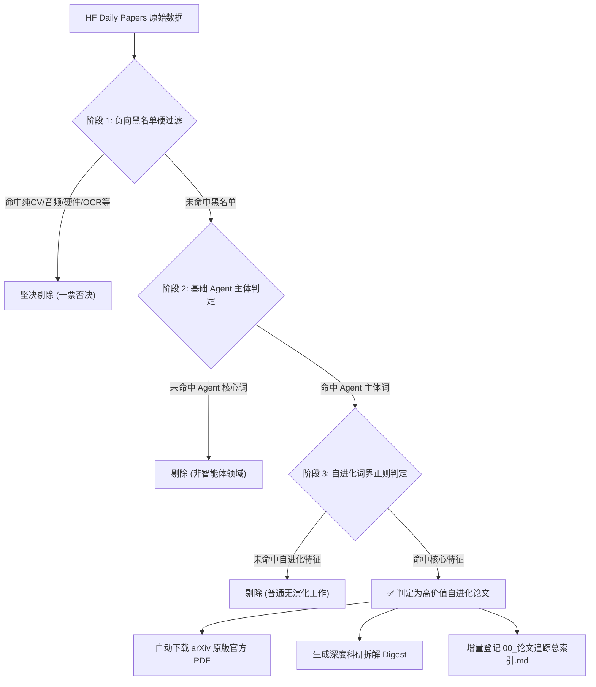

# 自进化智能体前沿论文追踪系统 —— 无 Jev 纯基线交付与全景回滚手册

> **文档性质**：项目纯基线状态（No-Jev Baseline）永久交付文档与一键回退基准  
> **适用场景**：后续任何智能体或开发者在需要**移除 Jev 模型、排查故障、离线降级或复原到初始纯净状态**时，必须以本文档作为唯一绝对基准。  
> **基线确立日期**：2026-09-26  
> **基准运行环境**：Windows / PowerShell 7+ / Python 3.12+ / 零外部模型依赖  

---

## 目录导航 (Table of Contents)

- [1. 纯基线系统定位与核心定义](#1-纯基线系统定位与核心定义)
- [2. 纯基线工作区拓扑与文件清单](#2-纯基线工作区拓扑与文件清单)
- [3. 纯基线核心算法与判定逻辑（三阶段正则机制）](#3-纯基线核心算法与判定逻辑三阶段正则机制)
- [4. 双维分类法标准与精选报告模板](#4-双维分类法标准与精选报告模板)
- [5. 纯基线运行命令与操作速查](#5-纯基线运行命令与操作速查)
- [6. 纯基线状态验证清单 (Health Check)](#6-纯基线状态验证清单-health-check)
- [7. 从 Jev 状态无损回滚至纯基线的操作指南](#7-从-jev-状态无损回滚至纯基线的操作指南)

---

## 1. 纯基线系统定位与核心定义

本仓库的核心使命是**全景追踪自进化智能体（Self-Evolving / Self-Improving Agents）的前沿学术进展**。

在“无 Jev”的纯基线模式下：
1. **完全解耦外部 LLM / 商业 API**：系统不依赖任何商业大模型 API Token、不产生任何 API 成本，仅依靠本地 Python 启发式规则与确定性词界正则运算。
2. **纯粹确定性初筛**：由本地严密的“负向硬过滤黑名单 + Agent主体触发 + 自进化正向词界正则”进行快速三阶段初筛。
3. **闭环原版 PDF 下载**：命中自进化特征的高价值论文，自动使用标准 User-Agent 从 arXiv 下载原版官方 PDF 文件至本地对应日期目录。
4. **结构化深度归档与索引同步**：自动生成当日精选 Markdown 简报（`YYYY-MM-DD_自进化智能体论文精选.md`），并增量更新全局总索引表（`00_论文追踪总索引.md`）。

---

## 2. 纯基线工作区拓扑与文件清单

在纯基线状态下，整个工作区的文件结构严格如下：

```plaintext
f:\LearningNotes\自进化智能体\
├── 01_学习笔记\                                  # 学术研讨、专题推导与知识图谱
│   ├── 00_学习笔记总索引与知识图谱.md
│   ├── 01_理论基石与分类规范\
│   ├── 02_外围架构与Harness演进\
│   ├── 03_强化学习与特权蒸馏\
│   ├── 04_环境交互与因果探索\
│   ├── 05_专题思辨与认知沉淀\
│   └── 自进化智能体初学_系统化学习笔记.md
├── 02_前沿论文追踪\                              # 每日论文追踪归档核心目录
│   ├── 00_论文追踪总索引.md                      # 全局追踪总索引速查表
│   ├── 2026-09-18\                             # 历史归档（含精选 Markdown 与原版 PDF）
│   ├── 2026-09-21\
│   ├── 2026-09-22\
│   ├── 2026-09-23\
│   ├── 2026-09-24\
│   ├── 2026-09-25\
│   └── YYYY-MM-DD\                             # 每日自动生成的专属归档目录
├── scripts\
│   └── fetch_hf_papers.py                      # 纯基线抓取与初筛核心脚本（仅依赖标准库）
├── .gitignore
├── README.md                                   # 项目总览文档
├── 00_DAILY_PAPERS_AGENT_HANDOVER.md           # 智能体通用交接规范
└── 00_BASELINE_NO_JEV_HANDOVER.md              # 【本文件】纯基线交付与回滚规范手册
```

> **基线隔离原则**：在纯基线状态下，`scripts/` 目录下**绝不包含**任何 Jev 相关的执行依赖或调用逻辑。

---

## 3. 纯基线核心算法与判定逻辑（三阶段正则机制）

纯基线系统的代码实现位于 [`scripts/fetch_hf_papers.py`](file:///f:/LearningNotes/自进化智能体/scripts/fetch_hf_papers.py)，其判定流程分为三个严密阶段：



### 3.1 阶段 1：强力负向过滤黑名单（一票否决）
凡标题或摘要命中以下任何非智能体领域关键词，直接剔除：
- **纯视觉/图像/视频生成**：`video-native`, `video generation`, `video diffusion`, `text-to-video`, `image generation`, `text-to-image`
- **纯语音/音频处理**：`spoken factoid`, `speech audio`, `spoken question`
- **纯点云/机械臂低层硬件**：`point cloud`, `3d articulation`, `anthropomorphic hand`, `locomotion and manipulation`
- **文档 OCR 与版面分析**：`document parsing`, `pure doc`, `omni doc`, `font restyling`
- **底层硬件驱动与通用加速**：`kv cache compression`, `offloaded kv`, `serving 35b moes`, `memory wall`

### 3.2 阶段 2：基础 Agent 主体范围触发
论文必须显式属于智能体或在策略演进范畴，要求正文命中以下词界正则：
```regex
\b(agent|agents|agentic|multi-turn|on-policy|self-distillation|self-evolving|self-improving|self-improvement)\b
```

### 3.3 阶段 3：自进化核心特征词界判定（Word-Boundary Regex）
必须严格采用 `\b` 边界正则，杜绝子串误伤（严禁用 `rsi` 匹配 `diversity`，严禁用 `pact` 匹配 `impact`）。核心特征包括：
- `\bself-evolv(ing|e|ed|ution)\b` (自主进化)
- `\bself-improv(ing|e|ed|ement)\b` (自主改进)
- `\brecursive self-improvement\b` (递归自我提升 RSI)
- `\bon-policy distillation\b` / `\bon-policy self-distillation\b` (在策略蒸馏 / OPSD)
- `\bself-retiring\b` (特权教师自退休机制)
- `\bobservation supervision\b` / `\bactobs\b` (环境观测建模与因果世界模型)
- `\bskill evolution\b` / `\bevoskill\b` (活体技能包自演进)
- `\bauto-research loop\b` / `\bcollective autoresearch\b` (自动化科研循环)
- `\blength inflation in on-policy\b` (在策略蒸馏长度膨胀治理)

---

## 4. 双维分类法标准与精选报告模板

所有经纯基线收录的文献，均必须映射到统一的双维正交坐标系：

### 4.1 维度一：技术机制分类 (Technical Dimension)
1. `[上下文演进 (In-Context / Memory)]`：外置记忆池、动态本体、动态提示演进；
2. `[强化学习演进 (RL / RLVR / Policy)]`：GRPO、在策略自蒸馏（RetireOPD）、奖励模型设计；
3. `[慢思考推理 (Reasoning / Test-Time)]`：长思维链推演、MCTS 树搜索、测试时自验证剪枝；
4. `[动作与工具执行 (Act / Tool-Use)]`：代码技能合成、图结构技能演化（GraphSkillEvo）；
5. `[外围架构与脚手架 (Harness)]`：调度框架演化、执行动作融合、智能缓存沙盒；
6. `[自动化科研与自重构 (Auto-Research)]`：智能体自主构思、环境自构建、代码自修改。

### 4.2 维度二：生命周期阶段 (Lifecycle Phase)
1. `[离线训练阶段 (Offline SFT)]`：行为克隆、轨迹指令微调、离线技能资产化；
2. `[在线探索阶段 (Online RL Exploration)]`：动态交互 Rollout、策略熵保持、稀疏奖励对齐；
3. `[知识蒸馏阶段 (Distillation / Transfer)]`：特权信息蒸馏、师生差异校准、教师自退化隔离；
4. `[测试时 / 运行态自演进 (Test-Time / Runtime Evolution)]`：免训练 Reflect-Revise-Reuse 闭环；
5. `[系统元设计阶段 (Meta-Design / Search)]`：框架自演化宽深漏斗筛选。

---

## 5. 纯基线运行命令与操作速查

### 5.1 运行纯基线抓取与分析
在根目录下直接执行核心脚本：
```powershell
# 抓取并解析当天最新自进化论文
python f:\LearningNotes\自进化智能体\scripts\fetch_hf_papers.py
```

### 5.2 补爬或回溯特定历史日期
在 Python 中调用管线接口：
```python
from scripts.fetch_hf_papers import run_daily_pipeline
# 回溯抓取指定日期
run_daily_pipeline("2026-09-25")
```

---

## 6. 纯基线状态验证清单 (Health Check)

当需要确认当前项目是否处于纯基线状态时，依次检查以下 5 项：

- [ ] **1. 依赖纯洁性**：Python 环境不需要安装任何特殊 AI SDK，仅依赖标准库（`urllib`, `json`, `os`, `re`, `sys`, `time`）；
- [ ] **2. 脚本唯一性**：`scripts/` 目录下仅有纯基线执行脚本 `fetch_hf_papers.py`；
- [ ] **3. 环境变量**：不需要设置 `JEV_API_KEY` 或 `OPENJEV_API_KEY` 也能 100% 正常运行；
- [ ] **4. 运行可重复性**：运行 `python scripts/fetch_hf_papers.py` 能够平滑完成初筛，并在 `02_前沿论文追踪/` 下生成规范命名的日期子文件夹；
- [ ] **5. 总索引完整**：`02_前沿论文追踪/00_论文追踪总索引.md` 包含每一天的完整收录表格，格式严格一致。

---

## 7. 从 Jev 状态无损回滚至纯基线的操作指南

若后续引入了 Jev 筛选系统，但因网络限制、API 额度耗尽、或需要排除模型幻觉等原因需**完全移除 Jev 恢复纯基线**，执行以下标准化流程：

### 步骤 1：执行一键回滚脚本
在 PowerShell 中运行自动化回滚命令：
```powershell
powershell -ExecutionPolicy Bypass -File f:\LearningNotes\自进化智能体\scripts\rollback_to_no_jev.ps1
```

### 步骤 2：回滚脚本的内部操作审计
该回滚脚本将自动完成：
1. 隔离或移除 `scripts/jev_pipeline/` 目录；
2. 移除 Jev 专属入口脚本 `scripts/run_jev_daily_pipeline.py`；
3. 保留所有历史已沉淀的 `02_前沿论文追踪/YYYY-MM-DD/` 下的 Markdown 与 PDF 文献（坚决不删任何已有科研资产）；
4. 校验 `scripts/fetch_hf_papers.py` 语法与运行健康度。

### 步骤 3：验证纯基线复原成功
执行基线测试：
```powershell
python f:\LearningNotes\自进化智能体\scripts\fetch_hf_papers.py
```
若控制台正常输出 `[*] 启动 Hugging Face Daily Papers 严格研判管道...` 且无任何报错，即宣告纯基线 100% 成功复原。

