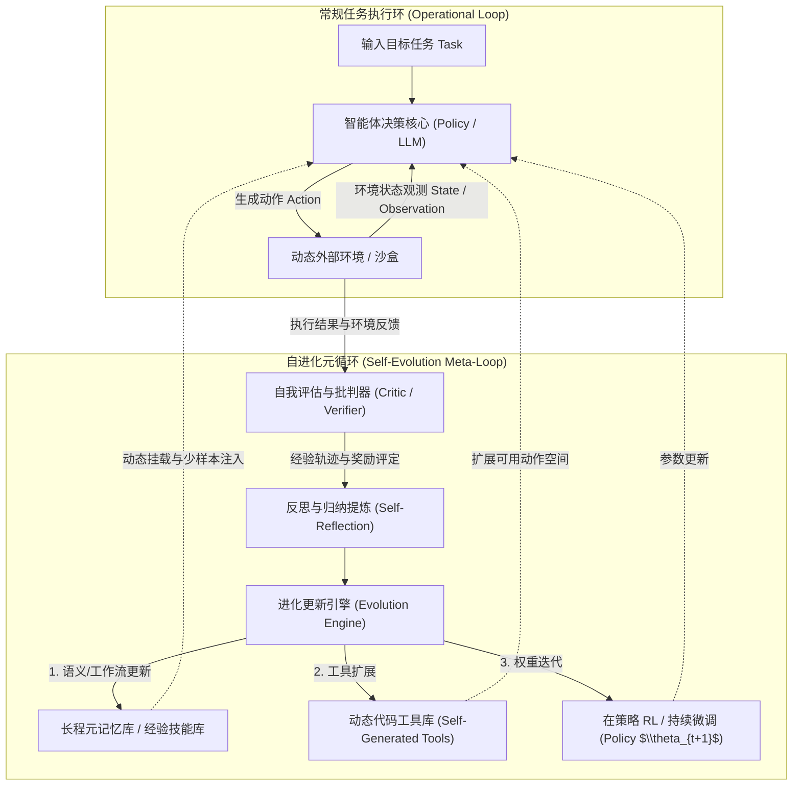

# 自进化智能体 (Self-Evolving Agents) 系统化学习笔记

> **专栏定位**：本笔记用于系统化追踪与梳理**自进化智能体（Self-Evolving / Self-Improving Agents）**的核心理论、关键技术架构、数学原理与最新研究进展。
> **维护规范**：遵循严格的增量追加准则（Strict Incremental Append），所有问答、讨论与深入推导均标明日追溯日期，历史章节内容只读不篡改，确保持久可复现的知识沉淀。

> [!TIP]
> **📚 笔记模块化重构通知 (2026-09-19)**：
> 为解决单一长 Markdown 文档内容臃肿、检索不便的问题，本知识库已完成分主题解耦与模块化重构！
> 历史全量内容已 100% 完整平移并分类归档至独立主题专栏中，且本全集文件完整保留作为历史归档与全景速查底稿。推荐点击进入专属模块进行深读：
> - 🗺️ **知识图谱与总索引**：[`00_学习笔记总索引与知识图谱.md`](file:///f:/LearningNotes/自进化智能体/01_学习笔记/00_学习笔记总索引与知识图谱.md)
> - 🏛️ **模块一 (理论与分类)**：[`01_理论基石与分类规范/自进化智能体全景概览与双维分类体系.md`](file:///f:/LearningNotes/自进化智能体/01_学习笔记/01_理论基石与分类规范/自进化智能体全景概览与双维分类体系.md)
> - ⚙️ **模块二 (外围架构与Harness)**：[`02_外围架构与Harness演进/SoL-Pi与Agent_Harness自演化深度精读.md`](file:///f:/LearningNotes/自进化智能体/01_学习笔记/02_外围架构与Harness演进/SoL-Pi与Agent_Harness自演化深度精读.md)
> - 🔄 **模块三 (强化学习与蒸馏)**：[`03_强化学习与特权蒸馏/RetireOPD与在策略自适应蒸馏深度精读.md`](file:///f:/LearningNotes/自进化智能体/01_学习笔记/03_强化学习与特权蒸馏/RetireOPD与在策略自适应蒸馏深度精读.md)
> - 🔭 **模块四 (因果探索与前驱基石)**：[`04_环境交互与因果探索/ActObs与环境观测联合建模深度精读.md`](file:///f:/LearningNotes/自进化智能体/01_学习笔记/04_环境交互与因果探索/ActObs与环境观测联合建模深度精读.md) *(含 FireAct / AgentTuning / SWE-gym 深度解构与双维标签规范)*
> - 💡 **模块五 (专题思辨与答疑沉淀)**：[`05_专题思辨与认知沉淀/外置记忆管理与自造工具核心认知答疑.md`](file:///f:/LearningNotes/自进化智能体/01_学习笔记/05_专题思辨与认知沉淀/外置记忆管理与自造工具核心认知答疑.md)

---

## 变更日志 (Changelog)

| 日期 | 章节编号与主题 | 变更类型 | 摘要说明 |
| :--- | :--- | :--- | :--- |
| 2026-09-18 | `## 1. 自进化智能体全景概览：核心概念、演进历史与前沿技术谱系` | 初始创建 | 建立知识库主干，全面梳理自进化智能体定义、三层进化架构、范式演进历史、五大技术流派与核心科研挑战。 |
| 2026-09-18 | `## 2. 视觉排版重构：自进化智能体演进全景高清图谱与模块对照` | 增量追加 | 修复 Mermaid timeline 色彩对比度缺陷导致的字体模糊问题，重构为高对比度、清晰直观的纯文本结构图与多维阶段矩阵。 |
| 2026-09-19 | `## 3. 经典前沿精读：SoL-Pi —— 递归缩放自动化科研循环与高效 Agent Harness 自演进` | 增量追加 | 深度剖析 NVIDIA/NTU/MIT 联合工作 SoL-Pi：Agent Harness 概念界定、Auto-Research Loop 宽深漏斗、四大自然选择机制（Action Fusion、Online Context Compact、ObservationPack、Evidence Reducer）、跨模型迁移与蜂群实证，以及对自进化智能体研究的深远启示。 |
| 2026-09-19 | `### 3.6 核心概念答疑：关于“假设”、“自进化阶段”与“演化目标”的本质厘清` | 增量追加 | 专题解答关于 SoL-Pi 的三大底层困惑：假设的提出与淘汰机理、自进化究竟发生在训练还是系统设计阶段、Token 削减与机制固化的工程闭环。 |
| 2026-09-19 | `### 3.7 机制安全答疑：Action Fusion 动作融合的执行风险与短路安全护栏` | 增量追加 | 深入解析动作融合不经人工确认直接执行的安全边界、短路执行（Short-Circuiting）、原子回滚以及沙盒白名单护栏设计。 |
| 2026-09-19 | `## 4. 经典前沿精读：RetireOPD —— 自退休在策略蒸馏与突破特权教师能力上限` | 增量追加 | 深度精读浙江大学/阿里团队工作 RetireOPD：特权教师在多轮 RL 中的两大致命失效假说、师生梯度对抗一阶数学动力学推导、三阶段解耦训练与自适应退休条件（\rho_m \ge \delta \land \eta_m \ge \gamma），以及学生模型超越特权教师自身的能力跃迁。 |
| 2026-09-19 | `## 5. 经典前沿精读：ActObs —— 环境观测联合监督与强化学习探索动力学` | 增量追加 | 深度剖析 AWS AI Labs 工作 ActObs：传统 Trajectory SFT 掩码环境观测造成的因果模型退化、零额外成本环境观测无掩码联合建模（\lambda=1）、SFT 期梯度正交化（g_{act} \perp g_{obs}）与残差爆炸动力学分析、RL 探索期高策略熵保持与参数微小位移、Terminal-Bench 2.0 与跨域多语言代码编辑评测突破，以及隐式世界模型对自进化智能体设计的深远启示。 |
| 2026-09-19 | `### 5.7 前驱工作辨析与分类法规范：AgentTuning、FireAct、SWE-gym 与智能体双维标签体系` | 增量追加 | 专题解构三大经典前驱基石（AgentTuning、FireAct、SWE-gym）的技术流派、演进历史与所处生命周期阶段；正式确立自进化智能体论文精选“技术机制（上下文/RL/Reasoning/Act/Harness等）× 生命周期阶段（训练/探索/蒸馏/应用）”双维分类法规范与映射矩阵。 |

---

## 目录导航 (Table of Contents)

- [1. 自进化智能体全景概览：核心概念、演进历史与前沿技术谱系 (2026-09-18 初始创建)](#1-自进化智能体全景概览核心概念演进历史与前沿技术谱系-2026-09-18-初始创建)
  - [1.1 核心概念界定与本质演进范式](#11-核心概念界定与本质演进范式)
    - [1.1.1 什么是自进化智能体](#111-什么是自进化智能体)
    - [1.1.2 与传统智能体及静态 LLM Agent 的本质分野](#112-与传统智能体及静态-llm-agent-的本质分野)
    - [1.1.3 自进化空间的三层金字塔架构 (外循环/中循环/内循环)](#113-自进化空间的三层金字塔架构-外循环中循环内循环)
  - [1.2 发展历史与里程碑脉络](#12-发展历史与里程碑脉络)
    - [1.2.1 萌芽期：符号推理、遗传规划与经典自适应系统 (1950s - 2010s)](#121-萌芽期符号推理遗传规划与经典自适应系统-1950s---2010s)
    - [1.2.2 启动期：大模型驱动的静态循环智能体 (2022 - 2023)](#122-启动期大模型驱动的静态循环智能体-2022---2023)
    - [1.2.3 跃迁期：外置记忆沉淀与工具自扩充 (2023 - 2024)](#123-跃迁期外置记忆沉淀与工具自扩充-2023---2024)
    - [1.2.4 爆发期：端到端强化学习、自对齐与参数级自迭代 (2025 - 2026)](#124-爆发期端到端强化学习自对齐与参数级自迭代-2025---2026)
  - [1.3 前沿研究的五大核心技术流派](#13-前沿研究的五大核心技术流派)
    - [流派一：经验池化与元记忆自组织 (Memory & Experience Evolution)](#流派一经验池化与元记忆自组织-memory--experience-evolution)
    - [流派二：测试时计算自演进与搜索修正 (Test-Time Compute & Search-Based Evolution)](#流派二测试时计算自演进与搜索修正-test-time-compute--search-based-evolution)
    - [流派三：环境闭环在策略强化学习与自适应蒸馏 (On-Policy RL & Adaptive Distillation)](#流派三环境闭环在策略强化学习与自适应蒸馏-on-policy-rl--adaptive-distillation)
    - [流派四：自我合成课程与数据飞轮 (Self-Curriculum & Synthetic Flywheel)](#流派四自我合成课程与数据飞轮-self-curriculum--synthetic-flywheel)
    - [流派五：元认知自反思与代码级自重构 (Metacognitive Self-Modification)](#流派五元认知自反思与代码级自重构-metacognitive-self-modification)
  - [1.4 核心科研挑战与开放瓶颈](#14-核心科研挑战与开放瓶颈)
  - [1.5 新人上手科研路径与主流 Benchmark 指南](#15-新人上手科研路径与主流-benchmark-指南)
- [2. 视觉排版重构：自进化智能体演进全景高清图谱与模块对照 (2026-09-18 增量追加)](#2-视觉排版重构自进化智能体演进全景高清图谱与模块对照-2026-09-18-增量追加)
  - [2.1 为什么 Mermaid 时间轴会导致“太花看不清”](#21-为什么-mermaid-时间轴会导致太花看不清)
  - [2.2 五阶段演进核心要素高清晰度直观图谱](#22-五阶段演进核心要素高清晰度直观图谱)
  - [2.3 自进化三大循环驱动力与执行对比](#23-自进化三大循环驱动力与执行对比)
- [3. 经典前沿精读：SoL-Pi —— 递归缩放自动化科研循环与高效 Agent Harness 自演进 (2026-09-19 增量追加)](#3-经典前沿精读sol-pi--递归缩放自动化科研循环与高效-agent-harness-自演进-2026-09-19-增量追加)
  - [3.1 论文全景与问题意识：为什么需要 Harness 层的自演化？](#31-论文全景与问题意识为什么需要-harness-层的自演化)
    - [3.1.1 什么是 Agent Harness？](#311-什么是-agent-harness)
    - [3.1.2 长程智能体与递归自我提升（RSI）的“Token 经济死锁”](#312-长程智能体与递归自我提升rsi的token-经济死锁)
    - [3.1.3 正交的优化维度：为什么不是仅靠模型量化或算子优化？](#313-正交的优化维度为什么不是仅靠模型量化或算子优化)
  - [3.2 自动科研循环 (Auto-Research Loop) 的系统架构与三大设计铁律](#32-自动科研循环-auto-research-loop-的系统架构与三大设计铁律)
    - [3.2.1 历史教训：过拟合与“虚假泛化”陷阱](#321-历史教训过拟合与虚假泛化陷阱)
    - [3.2.2 宽深漏斗搜索架构 (Broad-to-Deep Funnel)](#322-宽深漏斗搜索架构-broad-to-deep-funnel)
    - [3.2.3 严苛单向隔离边界与双重门禁 (Capability & Efficiency Gates)](#323-严苛单向隔离边界与双重门禁-capability--efficiency-gates)
    - [3.2.4 535 个真实沙盒开发环境体系](#324-535-个真实沙盒开发环境体系)
  - [3.3 自然选择保留的四大核心机制深度解构](#33-自然选择保留的四大核心机制深度解构)
    - [3.3.1 机制一：Action Fusion（动作融合调度）](#331-机制一action-fusion动作融合调度)
    - [3.3.2 机制二：Online Context Compact（在线自适应上下文压缩与缓存门禁）](#332-机制二online-context-compact在线自适应上下文压缩与缓存门禁)
    - [3.3.3 机制三：ObservationPack（长观测结果动态句柄化与按需分页）](#333-机制三observationpack长观测结果动态句柄化与按需分页)
    - [3.3.4 机制四：Evidence-Preserving Reducer（保真证据提取器与确定性验证）](#334-机制四evidence-preserving-reducer保真证据提取器与确定性验证)
  - [3.4 实验评估与突破性量化成效](#34-实验评估与突破性量化成效)
    - [3.4.1 EdgeBench 综合表现：近 50% Token 削减与 54% 成本骤降](#341-edgebench-综合表现近-50-token-削减与-54-成本骤降)
    - [3.4.2 跨基座模型零样本迁移能力 (Cross-Model Transfer)](#342-跨基座模型零样本迁移能力-cross-model-transfer)
    - [3.4.3 多智能体蜂群协同 (Efficient Agent Swarms) 实证](#343-多智能体蜂群协同-efficient-agent-swarms-实证)
    - [3.4.4 Action Fusion 27 轮自演化微观追踪 (Section 3.5 经典案例)](#344-action-fusion-27-轮自演化微观追踪-section-35-经典案例)
  - [3.5 对课题组“自进化智能体”研究的深远学术与工程启示](#35-对课题组自进化智能体研究的深远学术与工程启示)
  - [3.6 核心概念答疑：关于“假设”、“自进化阶段”与“演化目标”的本质厘清 (2026-09-19 增量追加)](#36-核心概念答疑关于假设自进化阶段与演化目标的本质厘清-2026-09-19-增量追加)
  - [3.7 机制安全答疑：Action Fusion 动作融合的执行风险与短路安全护栏 (2026-09-19 增量追加)](#37-机制安全答疑action-fusion-动作融合的执行风险与短路安全护栏-2026-09-19-增量追加)
- [4. 经典前沿精读：RetireOPD —— 自退休在策略蒸馏与突破特权教师能力上限 (2026-09-19 增量追加)](#4-经典前沿精读retireopd--自退休在策略蒸馏与突破特权教师能力上限-2026-09-19-增量追加)
  - [4.1 问题背景与核心痛点：多轮长程 Agent RL 的稀疏奖励困境](#41-问题背景与核心痛点多轮长程-agent-rl-的稀疏奖励困境)
  - [4.2 传统特权蒸馏（OPSD）的两大致命假设与现实坍塌](#42-传统特权蒸馏opsd的两大致命假设与现实坍塌)
    - [4.2.1 假设破灭一：单纯拥有特权上下文并不保证教师足够可靠](#421-假设破灭一单纯拥有特权上下文并不保证教师足够可靠)
    - [4.2.2 假设破灭二：教师指导的边际效用随时间递减并发生“梯度冲突”](#422-假设破灭二教师指导的边际效用随时间递减并发生梯度冲突)
  - [4.3 核心数学推导：GRPO 奖励梯度与 OPD 蒸馏梯度的冲突机理 (Appendix A)](#43-核心数学推导grpo-奖励梯度与-opd-蒸馏梯度的冲突机理-appendix-a)
    - [4.3.1 一阶动力学展开与梯度内积符号意义](#431-一阶动力学展开与梯度内积符号意义)
    - [4.3.2 差异停滞（Discrepancy Stagnation）作为局部冲突信号的充要性](#432-差异停滞discrepancy-stagnation作为局部冲突信号的充要性)
    - [4.3.3 教师退休退出的严格理论收益保证](#433-教师退休退出的严格理论收益保证)
  - [4.4 RetireOPD 三阶段架构与自适应退休触发判据](#44-retireopd-三阶段架构与自适应退休触发判据)
    - [4.4.1 阶段一：解耦式特权教师构建 (Privileged Teacher Construction)](#441-阶段一解耦式特权教师构建-privileged-teacher-construction)
    - [4.4.2 阶段二：联合 GRPO-OPD 技能内化 (Joint Skill Internalization)](#442-阶段二联合-grpo-opd-技能内化-joint-skill-internalization)
    - [4.4.3 阶段三：自适应退休机制 (Adaptive Teacher Retirement)](#443-阶段三自适应退休机制-adaptive-teacher-retirement)
  - [4.5 实验评估与突破性量化成效](#45-实验评估与突破性量化成效)
    - [4.5.1 ALFWorld 与 WebShop 双基准横扫全量 SOTA](#451-alfworld-与-webshop-双基准横扫全量-sota)
    - [4.5.2 最具震撼力的发现：学生策略全线超越特权教师本身](#452-最具震撼力的发现学生策略全线超越特权教师本身)
    - [4.5.3 动态自适应退休 vs 预设线性退火 (Linear Annealing)](#453-动态自适应退休-vs-预设线性退火-linear-annealing)
  - [4.6 对自进化智能体（内循环参数自演进）的核心启示](#46-对自进化智能体内循环参数自演进的核心启示)
- [5. 经典前沿精读：ActObs —— 环境观测联合监督与强化学习探索动力学 (2026-09-19 增量追加)](#5-经典前沿精读actobs--环境观测联合监督与强化学习探索动力学-2026-09-19-增量追加)
  - [5.1 传统 Trajectory SFT 的“掩码盲区”与因果表征退化悖论](#51-传统-trajectory-sft-的掩码盲区与因果表征退化悖论)
    - [5.1.1 轨迹数据中的两重对齐信号：决策 vs 物理反馈](#511-轨迹数据中的两重对齐信号决策-vs-物理反馈)
    - [5.1.2 为什么传统方法默认掩码观测？](#512-为什么传统方法默认掩码观测)
    - [5.1.3 单向拟合的致命代价：环境预测能力退化至劣于基座模型](#513-单向拟合的致命代价环境预测能力退化至劣于基座模型)
  - [5.2 ActObs 核心机制：零额外开销的环境观测联合建模](#52-actobs-核心机制零额外开销的环境观测联合建模)
    - [5.2.1 联合目标函数定义与权重调谐 (\lambda)](#521-联合目标函数定义与权重调谐-lambda)
    - [5.2.2 “四零”工程优势：0 数据、0 参数、0 序列扩充、0 额外前向](#522-四零工程优势0-数据0-参数0-序列扩充0-额外前向)
  - [5.3 SFT 期几何梯度动力学推导：梯度正交化与残差爆炸](#53-sft-期几何梯度动力学推导梯度正交化与残差爆炸)
    - [5.3.1 梯度分解数学表述：余弦相似度 c 与模长比 r](#531-梯度分解数学表述余弦相似度-c-与模长比-r)
    - [5.3.2 10~20 步迅速发生的梯度正交化 (g_{act} \perp g_{obs})](#532-1020-步迅速发生的梯度正交化-g_act-perp-g_obs)
    - [5.3.3 残差梯度爆炸机理：ActionSFT 模长比飙升至 41 vs ActObs 稳定于 0.5](#533-残差梯度爆炸机理actionsft-模长比飙升至-41-vs-actobs-稳定于-05)
  - [5.4 RL 探索期微观动力学演变：熵保持、解空间保活与微小策略位移](#54-rl-探索期微观动力学演变熵保持解空间保活与微小策略位移)
    - [5.4.1 训练期动态跟踪：奖励稳步爬升与轨迹长度收缩](#541-训练期动态跟踪奖励稳步爬升与轨迹长度收缩)
    - [5.4.2 结构化自策略熵保持：参数与路径标记的高不确定性保留](#542-结构化自策略熵保持参数与路径标记的高不确定性保留)
    - [5.4.3 更小的策略位移 KL(\pi_{init} \parallel \pi_{final}) 与解空间保活](#543-更小的策略位移-klpi_init-parallel-pifinal-与解空间保活)
    - [5.4.4 温度匹配反事实检验：为什么提高推理 Temperature 无法复现收益？](#544-温度匹配反事实检验为什么提高推理-temperature-无法复现收益)
  - [5.5 实验评估与跨域迁移全面实证](#55-实验评估与跨域迁移全面实证)
    - [5.5.1 Terminal-Bench 2.0 评测：从平庸 SFT 到全面领跑 RL](#551-terminal-bench-20-评测从平庸-sft-到全面领跑-rl)
    - [5.5.2 跨域零样本代码编辑 (aider-polyglot)：+43% 惊人相对增益](#552-跨域零样本代码编辑-aider-polyglot43-惊人相对增益)
    - [5.5.3 关键消融与控制实验：时序分步 Obs \to Act 为何失效？随机观测为何崩盘？](#553-关键消融与控制实验时序分步-obs-to-act-为何失效随机观测为何崩盘)
  - [5.6 对自进化智能体架构设计的深远启示](#56-对自进化智能体架构设计的深远启示)
    - [5.6.1 启示一：抛弃笨重外挂，内化“免费”的隐式世界模型](#561-启示一抛弃笨重外挂内化免费的隐式世界模型)
    - [5.6.2 启示二：重新定义冷启动 SFT —— 几何流形塑造者而非行为复印机](#562-启示二重新定义冷启动-sft--几何流形塑造者而非行为复印机)
    - [5.6.3 启示三：在策略演化中的“抗坍缩”解空间拓扑保护](#563-启示三在策略演化中的抗坍缩解空间拓扑保护)
  - [5.7 前驱工作辨析与分类法规范：AgentTuning、FireAct、SWE-gym 与智能体双维标签体系 (2026-09-19 增量追加)](#57-前驱工作辨析与分类法规范agenttuningfireactswe-gym-与智能体双维标签体系-2026-09-19-增量追加)
    - [5.7.1 三大前驱基石深度解构：方向、阶段与核心贡献](#571-三大前驱基石深度解构方向阶段与核心贡献)
    - [5.7.2 建立自进化智能体双维坐标系：技术机制 × 生命周期阶段](#572-建立自进化智能体双维坐标系技术机制--生命周期阶段)
    - [5.7.3 经典前沿论文双维坐标映射矩阵](#573-经典前沿论文双维坐标映射矩阵)
    - [5.7.4 后续论文追踪与知识库维护执行准则](#574-后续论文追踪与知识库维护执行准则)

---

## 1. 自进化智能体全景概览：核心概念、演进历史与前沿技术谱系 (2026-09-18 初始创建)

### 1.1 核心概念界定与本质演进范式

#### 1.1.1 什么是自进化智能体
**自进化智能体（Self-Evolving Agent / Self-Improving Agent）**是指具备在与复杂动态环境（物理世界、数字沙盒、软件交互界面等）持续交互过程中，能够**自主捕获反馈信号、反思历史成败、主动生成新认知或新技能，并持续更新自身的策略分布、知识库、工具链乃至元架构**，从而实现在未见任务和长期生命周期中性能单调或持续跃迁的自主智能系统。

从控制论与认知科学角度看，自进化智能体在经典的感知-规划-行动（Perceive-Plan-Act）循环之上，引入了**自我演进元闭环（Self-Evolution Meta-Loop）**：
$$\mathcal{M}_{t+1} = \mathcal{U}(\mathcal{M}_t, \mathcal{T}_t, \mathcal{E}_t, \mathcal{R}_t)$$
其中 $\mathcal{M}_t$ 表示智能体在 $t$ 时刻的内部系统状态（涵盖模型权重 $\theta$、提示模板 $\mathcal{P}$、记忆库 $\mathcal{K}$ 以及可用动作/工具空间 $\mathcal{A}$）；$\mathcal{T}_t$ 为智能体执行任务的历史轨迹；$\mathcal{E}_t$ 为环境反馈与观测序列；$\mathcal{R}_t$ 为环境奖惩或自我评估奖励；$\mathcal{U}$ 则为自进化更新算子。



#### 1.1.2 与传统智能体及静态 LLM Agent 的本质分野
| 维度 | 传统规则/静态智能体 (e.g. Expert System / FSM) | 经典 LLM Agent (e.g. ReAct / AutoGPT) | 自进化智能体 (Self-Evolving Agent) |
| :--- | :--- | :--- | :--- |
| **策略核心** | 预定义的硬编码规则或固定启发式树 | 冻结权重的大模型（Frozen Weights）依靠单次 Prompt | 动态演进的混合体（权重自优化 + 结构自调优） |
| **经验留存** | 无（或仅限局部变量），生命周期随进程结束清空 | 依赖短期上下文（Context Window），遇到同类错误重复犯错 | 跨任务长期记忆沉淀，构建终身技能库与反思树 |
| **动作空间** | 严格受限于预设 API / 离散动作集 | 固定预定义的 Tool 列表（如搜索、计算器） | **工具自创（Tool Making）**，通过合成代码拓展动作空间 |
| **自我改进机制** | 需人类专家手动修改代码与规则库 | 局限于单次推理内的少量自我纠错（Self-Correction） | **闭环飞轮**：自主合成数据、自我博弈（Self-Play）、在策略蒸馏（OPD） |
| **适应分布外 (OOD) 能力** | 极度脆弱，遇到新规则直接报错崩溃 | 泛化能力依赖基础模型预训练知识，无法针对新场景自适应强化 | 具备环境感知监督与自主探索，可在与新环境碰撞中自适应收敛 |

#### 1.1.3 自进化空间的三层金字塔架构 (外循环/中循环/内循环)
自进化智能体的技术演化空间可以解构为从浅到深的三层闭环：

1. **外循环：记忆与上下文级自进化（In-Context / Memory-level Evolution）**
   - **载体**：外置向量知识库、经验树（Experience Graph）、Prompt 元模板。
   - **特点**：无需改变大模型权重，通过智能体与环境交互中生成的正反案例，自主提炼出抽象规则、避坑指南、思维链范例，存入外部记忆并在后续类似任务中检索增强。
   - **代表工作**：Reflexion (Shinn et al.), ExpeL (Zhao et al.), MemGPT (Packer et al.)。

2. **中循环：动作空间与工具链级自进化（Action & Tool-level Evolution）**
   - **载体**：动态代码库、Python 函数注册表、组合宏技能。
   - **特点**：智能体在遇到现有工具无法解决的问题时，自主编写新的工具函数，通过沙盒单元测试检验正确性，并将高可用工具注册为长期可调用的新技能。
   - **代表工作**：Voyager (Wang et al., Minecraft 中的技能库递归构建), LATM (Large Language Models as Tool Makers), Cradle。

3. **内循环：模型内在权重与策略分布级自进化（Parametric & Policy-level Evolution）**
   - **载体**：LoRA 适配层、全量参数更新、值函数/奖励模型权重。
   - **特点**：利用环境奖励（Environment Reward）或智能体自我验证器（Self-Verifier）产生的监督信号，通过强化学习（PPO, GRPO, DPO）、在策略蒸馏（On-Policy Distillation, OPD）或自我训练（STaR），直接使模型参数吸收交互经验。
   - **代表工作**：STaR (Zelikman et al.), Self-Instruct / Self-Alignment, RetireOPD (2026), ActObs (2026)。

---

### 1.2 发展历史与里程碑脉络

| 时期阶段 | 代表范式 / 核心机制 | 标志性工作 / 技术突破 | 智能体能力跃迁特征 |
| :--- | :--- | :--- | :--- |
| **萌芽期**<br>*(1950s - 2010s)* | **符号主义与遗传规划**<br>启发式搜索与经典自适应系统 | 学习分类器系统 (LCS)<br>遗传规划 (GP)、元学习架构 | 局限于封闭世界和离散状态空间，缺乏开放域常识与跨任务语义泛化能力。 |
| **启动期**<br>*(2022 - 2023)* | **大语言模型静态交互循环**<br>思维链 (CoT) + 外部工具调用 | **ReAct** (Reasoning + Acting)<br>AutoGPT、BabyAGI、Toolformer | 奠定思考-行动交替范式；但模型权重冻结且缺乏长程记忆，执行失败极易陷入死循环。 |
| **跃迁期**<br>*(2023 - 2024)* | **反思记忆沉淀与工具自创**<br>外循环与中循环非参数化演进 | **Reflexion** (口头自我反省)<br>**Voyager** (Minecraft 代码技能库)<br>**ExpeL** (跨任务经验沉淀) | 引入长程经验库与动态代码生成，无需更新大模型权重即可实现非参数化技能终身演化。 |
| **扩展期**<br>*(2024 - 2025)* | **结构化搜索与测试时计算**<br>多步推演、剪枝与模拟沙盒 | **LATM** (智能体工具自造)<br>MCTS 树搜索、Tree of Thoughts<br>OSWorld、SWE-bench 复杂评测 | 强化长程因果规划与形式化验证反馈，将单次线性生成拓展为带有剪枝与回溯的状态树搜索。 |
| **爆发期**<br>*(2025 - 2026)* | **端到端在策略 RL 与自迭代**<br>内循环参数级自进化与自超越 | **RetireOPD** (自退休在策略蒸馏)<br>**ActObs** (环境观测联合监督)<br>**EvoSkill-GUI** (活体技能自修复) | 攻克稀疏奖励与探索坍塌，利用特权教师自适应蒸馏与环境动力学内化，实现智能体策略超越教师上限。 |


#### 1.2.1 萌芽期：符号推理、遗传规划与经典自适应系统 (1950s - 2010s)
- **早期的自适应控制与元学习（Meta-Learning）**：早期的自进化概念源于控制论（Cybernetics）与遗传算法（Genetic Programming）。约翰·霍兰德（John Holland）提出的学习分类器系统（Learning Classifier Systems）尝试通过规则演化和信用分配让智能体适应环境。
- **瓶颈**：状态表示能力极度受限，缺乏开放域常识与自然语言理解能力，面对复杂开集（Open-ended）任务无法实现语义级别的泛化。

#### 1.2.2 启动期：大模型驱动的静态循环智能体 (2022 - 2023)
- **ReAct 范式**：Yao 等人在 2022 年底提出 ReAct（Reasoning + Acting），将思维链（Chain-of-Thought）推理与外部工具调用交替交织，奠定了现代 LLM Agent 的标准交互循环。
- **痛点曝光**：AutoGPT、BabyAGI 等初代项目爆火后迅速遇冷，原因是智能体处于**完全静态与遗忘状态**：执行失败后往往陷入死循环，即使多次执行相同任务依然重复相同错误，缺乏“经验学习”能力。

#### 1.2.3 跃迁期：外置记忆沉淀与工具自扩充 (2023 - 2024)
- **Reflexion (NeurIPS 2023)**：首次系统性提出利用自然语言作为反思信号。智能体在任务失败后，自主生成口头反思（Verbal Reflection），并将反思记录保存在短时记忆中指导下一次尝试，使推理成功率大幅提升。
- **Voyager (NeurIPS 2023 Outstanding Paper)**：在《我的世界》（Minecraft）开放世界中首次实现了终身自进化。Voyager 拥有**自主探索课程（Curriculum）**、**可执行代码技能库（Skill Library）**以及**自我纠错循环（Self-Verification）**。智能体自写代码作为技能，成功后永久存入向量数据库，实现了复杂技能的自主组合与递归演进。
- **ExpeL (AAAI 2024)**：探索了非参数化智能体跨任务经验提炼，智能体从离线交互轨迹中自动抽取“成功经验准则”和“失败警示准则”，在不改变模型权重的前提下，让智能体在数十个新环境中表现单调提升。

#### 1.2.4 爆发期：端到端强化学习、自对齐与参数级自迭代 (2025 - 2026)
随着基础模型进入推理时代（Reasoning Era），智能体自进化进入**参数级自演进与在策略强化学习（On-Policy RL）深水区**：
- **测试时计算扩展（Test-Time Compute Scaling）**：智能体不再只是单次生成回答，而是利用蒙特卡洛树搜索（MCTS）、束搜索（Beam Search）和自验证机制，在推理阶段进行大量的思维展开、自我对弈与动态剪枝。
- **智能体专属在策略强化学习（Agentic RL）**：传统 RL（如基于单步文本奖励的 PPO）在智能体多轮长程规划中遭遇严重的奖励稀疏与信用分配难题。学术界开始结合**组相对策略优化（GRPO）**与**在策略知识蒸馏（On-Policy Distillation, OPD）**，如最新的 **RetireOPD**（解决特权教师退出与自适应演进）以及 **ActObs**（对环境观测实施联合监督，激活环境预测世界模型动力学）。

---

### 1.3 前沿研究的五大核心技术流派

#### 流派一：经验池化与元记忆自组织 (Memory & Experience Evolution)
- **机制原理**：利用分层记忆系统（工作记忆、情节记忆、语义记忆）。智能体从海量长程多轮交互中，自动执行“去粗取精”与“抽象提炼”。
- **前沿研究点**：
  - 记忆动态修剪与遗忘机制（Memory Pruning & Decay）：避免记忆无限膨胀导致上下文超载和无关召回干扰。
  - 案例图谱与因果经验挖掘：将成功的 Action Trajectory 转化为图结构因果逻辑链，支持跨任务相似性迁移。

#### 流派二：测试时计算自演进与搜索修正 (Test-Time Compute & Search-Based Evolution)
- **机制原理**：利用环境反馈作为形式化验证（Verifiable Reward），如代码执行结果、单元测试通过率、定理证明器（Lean 4 / Isabelle）反馈。
- **前沿研究点**：
  - 过程奖励模型（Process Reward Models, PRM）与自主价值评估：智能体能够对多步决策中的每一阶段动作打分，而非等到最后一步。
  - 树形/图搜索自适应展开：将 MCTS 与智能体思考树（Tree of Thoughts）融合，根据当前不确定性动态分配推理 Token 预算。

#### 流派三：环境闭环在策略强化学习与自适应蒸馏 (On-Policy RL & Adaptive Distillation)
- **机制原理**：针对交互式智能体任务（如操作系统控制 OSWorld、软件工程 SWE-bench、虚拟网页 WebShop 等），从环境直接获取奖励信号，驱动策略网络自身迭代。
- **前沿研究点**：
  - **特权自教师与在策略自蒸馏（Self-Teacher On-Policy Distillation）**：例如 **RetireOPD**，首先让具有特权信息（例如查看环境隐藏状态、更强先验）的自身教师模型获取高胜率，然后指导无特权学生模型学习；当学生模型掌握特定技能后，教师适时“自退休（Self-Retiring）”，完全由环境 RL 驱动自主超越。
  - **环境观测与状态预测（World Modeling via Observation Supervision）**：例如 **ActObs**，在进行策略微调时不仅监督智能体的行动 Token，还对环境反馈 Observation 进行联合无额外开销监督，使智能体的大脑内部内化环境动力学模型，显著增强后续 RL 探索的熵保持与稳定性。

#### 流派四：自我合成课程与数据飞轮 (Self-Curriculum & Synthetic Flywheel)
- **机制原理**：智能体自身充当“出题人（Task Generator）”与“解题人（Solver）”。
- **前沿研究点**：
  - 处于“最近发展区（Zone of Proximal Development）”的自适应课程：智能体根据当前解决能力，自主生成难度略高于当前水平的新探索任务，避免自我训练落入无效循环或过难停滞。
  - 弱到强泛化（Weak-to-Strong Generalization）与自过滤数据飞轮：自动合成高质量合成轨迹并剔除低价值噪声，构建专属于特定领域的微调数据集。

#### 流派五：元认知自反思与代码级自重构 (Metacognitive Self-Modification)
- **机制原理**：**“Code-as-Agent”** 理念——智能体本身的运行框架、Prompt、路由逻辑、记忆检索算法均以代码形式表示。
- **前沿研究点**：
  - 智能体自身拥有对其运行代码仓库的读写权限。在遇到系统性性能瓶颈时，智能体通过静态分析和运行时 Profiling，自主修改并测试自身的底层 Agent 架构代码，实现达尔文式代码演化（Darwinian Self-Refactoring）。

---

### 1.4 核心科研挑战与开放瓶颈

1. **分布漂移与灾难性遗忘（Distribution Shift & Catastrophic Forgetting）**：
   - 智能体在特定新环境（例如专门针对某款 IDE 或某个专业领域软件）自进化时，容易丧失在基准通用领域的常识与遵循指令能力。
2. **奖励欺骗与自放大幻觉（Reward Hacking & Hallucination Cascades）**：
   - 在缺乏硬反馈（Hard Verification）的开放域任务中，依靠大模型作为判决者（LLM-as-a-Judge）极易产生自我强化偏差，导致智能体找到利用评估漏洞的投机解而非真正解决问题。
3. **探索效率与模式坍塌（Exploration Collapse）**：
   - 在高维动作空间中，如果初始探索策略缺乏有效引导，在策略强化学习往往陷入局部最优或输出长度急剧膨胀（如 On-Policy Distillation 中的 Length Inflation 问题）。
4. **安全约束与价值漂移（Safety Under Dynamic Pressure）**：
   - 当赋予智能体自我更新权限后，智能体在追求任务成功率或外部压力（如紧急时间限制、用户诱导）下，是否会动态绕过系统设定的合规安全规则（如 PACT 基准所揭示的问题）。

---

### 1.5 新人上手科研路径与主流 Benchmark 指南

若要开展自进化智能体方向的高水平科研（如投稿 NeurIPS / ICLR / ICML / ACL），建议从以下基准与实验环境切入：

1. **具身/沙盒交互环境**：
   - **ALFWorld / ScienceWorld**：交互式文本与具身操作环境，经典研究长期规划与记忆进化的标准测试床。
   - **Crafter / Minecraft (Voyager)**：开集探索与技能库递归构建的黄金试验场。
2. **数字软件与系统操作（Computer Use & OS Agents）**：
   - **OSWorld / Terminal-Bench**：真实操作系统命令行、GUI 与终端交互，测试智能体在真实软件工具环境下的在策略强化与自主学习。
   - **SWE-bench / Aider-Polyglot**：真实 GitHub 软件工程修复任务，评测智能体自编写代码、自我调试与环境反馈对齐的极高难度基准。
3. **网页与实际商业场景**：
   - **WebShop / VisualWebArena**：真实多步骤网页浏览与复杂任务交互。

---

*（后续学习深入、专项问题讨论与数学公式推导，将严格遵循增量规范在下方物理追加）*


### 2.2 五阶段演进核心要素高清晰度直观图谱

```plaintext
===================================================================================================
                        自进化智能体 (Self-Evolving Agents) 演进脉络全景图
===================================================================================================

 [第 1 代: 萌芽期] (1950s - 2010s)
   ├─ 核心范式：符号主义、启发式搜索、遗传编程 (GP) 与学习分类器系统 (LCS)
   ├─ 运行机制：封闭规则集 + 离散动作搜索
   └─ 演进瓶颈：无法处理开放域未见状态，无自然语言理解与语义泛化能力

                                        │
                                        ▼ (大语言模型技术爆发)

 [第 2 代: 启动期] (2022 - 2023)
   ├─ 核心范式：大模型静态循环 (Frozen Weights + ReAct 交互循环)
   ├─ 代表工作：ReAct, AutoGPT, BabyAGI, Toolformer
   ├─ 运行机制：思维链 (CoT) 推理 ──> 调用外部搜索/计算器 ──> 接收结果
   └─ 演进瓶颈：智能体“失忆且无状态”；执行失败时陷入循环撞墙，无法自更新

                                        │
                                        ▼ (引入反思与非参数化记忆)

 [第 3 代: 跃迁期] (2023 - 2024)
   ├─ 核心范式：外循环反思记忆 + 中循环工具自制造 (In-Context & Tool Evolution)
   ├─ 代表工作：Reflexion (自然语言自反思), Voyager (代码技能递归库), ExpeL (经验沉淀)
   ├─ 运行机制：执行失败 ──> 口头反省写入 Memory ──> 自写 Python 工具并注册 ──> 终身复用
   └─ 演进瓶颈：模型核心参数仍未改变，依赖长上下文检索，容易受上下文窗口与干扰限制

                                        │
                                        ▼ (测试时推理扩展与环境沙盒评测)

 [第 4 代: 扩展期] (2024 - 2025)
   ├─ 核心范式：测试时计算自演进 (Test-Time Compute) 与结构化探索
   ├─ 代表工作：MCTS 树搜索、Tree of Thoughts、SWE-bench 自动化修复沙盒、OSWorld
   ├─ 运行机制：生成多条候选路径 ──> 过程奖励 (PRM) 打分 ──> 动态回溯与自我纠错
   └─ 演进瓶颈：单步搜索推理算力消耗极高，缺乏从环境真实奖励向内部参数的梯度回传

                                        │
                                        ▼ (在策略强化学习与自适应蒸馏)

 [第 5 代: 爆发期] (2025 - 2026 至今)
   ├─ 核心范式：端到端在策略 RL (On-Policy RL)、自对齐与参数级自进化 (Parametric Evolution)
   ├─ 代表工作：
   │    • RetireOPD (2026)：自退休在策略蒸馏，让学生完全超越特权教师自身上限
   │    • ActObs (2026)：环境观测联合监督，零额外开销内化环境动力学世界模型
   │    • EvoSkill-GUI (2026)：免训练“活体技能包”，Reflect-Revise-Reuse 闭环
   └─ 核心突破：攻克多轮长程规划中的稀疏奖励、终止符错位与模式坍塌难题，实现策略自主进化
===================================================================================================
```

---

### 2.3 自进化三大循环驱动力与执行对比

为了方便在科研选题时清晰定位研究方向（你是要做 Prompt/Memory 外循环？Tool 中循环？还是 RL 内循环？），下表对三层演化机制的工程与学术属性进行了横向对比：

| 进化层级 | 更新目标 (Update Target) | 驱动信号源 (Signal Source) | 计算开销 (Cost) | 部署生效延迟 (Latency) | 核心代表算法与工作 |
| :--- | :--- | :--- | :--- | :--- | :--- |
| **外循环**<br>*(记忆与语义级)* | 外部向量库、上下文 Prompt、经验警示池、Few-shot 示范 | 执行失败后的 Verbal 反思、成功案例归纳 | **低**<br>(仅需数次 LLM 调用) | **即时生效**<br>(下一次 Prompt 组装即生效) | **Reflexion**<br>**ExpeL**<br>**MemGPT** |
| **中循环**<br>*(动作与工具级)* | Python 代码工具库、API 注册表、结构化技能包 (Skill Package) | 沙盒单元测试通过率、编译器报错、任务成功信号 | **中等**<br>(需代码生成与沙盒环境验证) | **分钟级**<br>(验证通过后注册到工具池) | **Voyager**<br>**LATM**<br>**EvoSkill-GUI** |
| **内循环**<br>*(参数与策略级)* | 模型内部权重 $\theta$、LoRA 适配层、价值网络 / 奖励模型 | 环境真实奖励 (Reward)、在策略蒸馏损失 (OPD Loss)、GRPO/PPO 梯度 | **高**<br>(需 GPU 集群反向传播微调) | **离线/批量生效**<br>(需经过多轮 Rollout 梯度迭代) | **RetireOPD**<br>**ActObs**<br>**STaR** |

---

## 3. 经典前沿精读：SoL-Pi —— 递归缩放自动化科研循环与高效 Agent Harness 自演进 (2026-09-19 增量追加)

> **文献元数据**：
> - **论文原名**：*SoL-Pi: Recursively Scaling Auto-Research Loops for Efficient Agent Harness*
> - **arXiv 编号**：`arXiv:2609.20519` (2026-08)
> - **作者团队**：Haozhe Liu, Tian Ye, Sensen Gao, Qihang Cao, Yitong Li, Song Han 等（NVIDIA、南洋理工大学 NTU、麻省理工学院 MIT）
> - **官方开源代码**：[https://github.com/NVlabs/SoL-Pi](https://github.com/NVlabs/SoL-Pi)
> - **本地归档文献**：[`02_前沿论文追踪/2026-09-18/2609.20519_SoL-Pi_ Recursively Scaling Auto-Research Loops fo.pdf`](file:///f:/LearningNotes/自进化智能体/02_前沿论文追踪/2026-09-18/2609.20519_SoL-Pi_%20Recursively%20Scaling%20Auto-Research%20Loops%20fo.pdf)

---

### 3.1 论文全景与问题意识：为什么需要 Harness 层的自演化？

#### 3.1.1 什么是 Agent Harness？
在经典大模型智能体架构中，人们往往过分关注基座模型本身的能力（如 GPT-5.6、Claude 3.5/Opus 5、Qwen2.5），或者停留在提示词（Prompt）工程的微调上。然而，模型本身并不能直接操作计算机操作系统或沙盒环境。

**Agent Harness（智能体线束 / 运行时执行中枢）**，是指介于**底层大语言模型（LLM Core）**与**外部宿主环境（操作系统、编译器、浏览器、API）**之间的系统级软件框架。Harness 掌控着整个智能体生命周期的核心管道：
1. **状态投影与上下文管理 (State & Context Management)**：决定当前轮次将哪些历史轨迹、环境反馈投影进模型的 Context Window；
2. **工具动作暴露与分派 (Tool Schema & Action Dispatching)**：向模型声明可用工具定义，并将模型生成的结构化调用转化为系统底层执行指令；
3. **环境观测捕获与后处理 (Observation Parsing & Filtering)**：捕获终端 stdout/stderr、错误堆栈、DOM 树，并进行截断、清洗与组装；
4. **验证、子任务分派与异常恢复 (Verification, Delegation & Recovery)**：控制子代理派生、多步规划跟踪以及在报错时的重试回退逻辑；
5. **停机仲裁 (Termination Control)**：决定任务何时完成或强制终止。

#### 3.1.2 长程智能体与递归自我提升（RSI）的“Token 经济死锁”
随着智能体从简单的单轮代码补全（Supervised Code Completion）演进为 **7x24 小时全天候无人值守的自主探索系统（Unattended Around-the-Clock Exploration）**，智能体的交互轨迹动辄长达数百步甚至数千步。

在长程任务中，上下文历史的指数级累积导致了严重的**“Token 经济死锁”**：
- **算力与资金消耗失控**：单次长程任务可能产生数十亿（Billions）级别的输入/输出 Token，仅单任务 API 费用即可达数百美元；
- **注意力稀释与性能恶化 (Lost in the Middle)**：上下文窗口被海量冗余日志挤满，导致模型核心推理逻辑崩溃；
- **RSI 规模化落地受阻**：递归自我提升（Recursive Self-Improvement）需要智能体在环境中进行数万次自我试错与演进，若单步执行代价高昂，整个自进化飞轮在工程和商业上将彻底不可行。

#### 3.1.3 正交的优化维度：为什么不是仅靠模型量化或算子优化？
针对效率瓶颈，学术界此前的努力主要集中在另外两个正交维度：
- **基础设施与底层内核级优化**：例如 FlashAttention、vLLM/SGLang 批处理调度、KV Cache 压缩算子（降低每 Token 的前向耗时）；
- **模型参数与轻量化级优化**：例如权重量化（INT4/FP8）、剪枝、知识蒸馏出小模型。

**SoL-Pi 开辟了第三条完全正交的全新演化路径——在 Harness 运行时层进行自演化**：
> **核心命题**：在**完全不重新训练基座大模型、完全不牺牲模型核心解决能力**的前提下，是否能够让智能体自身去“自主科研、自我重构” Harness 运行时的代码与调度逻辑，从源头上抹平 45%~50% 的无谓 Token 消耗？

---

### 3.2 自动科研循环 (Auto-Research Loop) 的系统架构与三大设计铁律

#### 3.2.1 历史教训：过拟合与“虚假泛化”陷阱
自动化智能体设计并不罕见（如 Meta-Harness、RHI）。但前期学术界的深入复现评估（如 Wang et al. 2026）揭示了一个严酷事实：**绝大多数通过自演化自动生成的 Harness 规则，在搜索任务上表现惊艳，但一旦放到从未见过的 Held-out 基准上，收益全部归零甚至引发负迁移，本质是严重的“测试集偷窥过拟合”**。

#### 3.2.2 宽深漏斗搜索架构 (Broad-to-Deep Funnel)
为了发现**具备真实跨领域、跨模型通用泛化能力**的活体机制，SoL-Pi 提出了宽深结合的双阶段漏斗机制：
1. **外层宽泛探索 (Broad Search)**：
   - 启动 **152 个初始机制假设**，广泛覆盖智能体的 6 大族系：上下文管理（Context）、任务进度跟踪（Progress）、工具交互（Tools）、子代理委派（Delegation）、提示词与策略（Prompt & Policy）、自我改进与评估（Improvement & Evaluation）；
   - 引入 **Oracle Analysis（先验轨迹透视分析）**：在分配具体执行预算前，首先通过分析基准轨迹，量化该假设的潜在理论收益上限，剔除伪需求；
2. **内层深度自愈迭代 (Deep Refinement & Ralph Loop)**：
   - 每个选中的假设进入独立的自动化科研循环（Auto-Research Loop）；
   - 采用 **Ralph Loop 循环**：代码生成器（Implementer）编写候选机制 -> 独立代码审查器（Independent Reviewer）进行 AST 静态检查与逻辑审核 -> 审核失败则强制回退重新修改 -> 审核通过后部署到沙盒环境中跑真实任务。

#### 3.2.3 严苛单向隔离边界与双重门禁 (Capability & Efficiency Gates)
为了彻底根绝过拟合，SoL-Pi 在系统架构中筑起了**绝对物理隔离墙**：

```
┌────────────────────────────────────────────────────────┐
│   探索与研发沙盒 (Search / Development Environments)     │
│   • 535 个真实可执行沙盒 (495 GitHub Repos + 40 Verifiers) │
│   • Map-Reduce 轨迹分析 ──> 机制提出 ──> Ralph Loop 实现   │
│   • 双重门禁过滤：Capability Gate 必须在容忍线内           │
│                  Efficiency Gate 必须展现显著正收益        │
└──────────────────────────┬─────────────────────────────┘
                           │ 成功通过双重门禁
                           ▼
               [ FREEZE 代码绝对冻结 ]
                           │
                           ▼ (严格单向流入，永不反哺)
┌────────────────────────────────────────────────────────┐
│   最终未见验证基准 (Held-Out Benchmark: EdgeBench)     │
│   • 40 项全盲未见复杂软件工程任务                       │
│   • 评测结果只读输出：失败即淘汰，严禁回传反馈给搜索循环   │
└────────────────────────────────────────────────────────┘
```

- **双重门禁 (Two Sequential Gates)**：
  1. **能力门禁 (Capability Gate)**：任务完成度或评测分必须保持在预设的严格容忍度内（$\ge 93\%$ 基准线），严禁以牺牲核心解题能力为代价去刷省 Token 指标；
  2. **效率门禁 (Efficiency Gate)**：必须在声明的效率指标（总 Token、Cache 读取、API 实际美元成本）上取得帕累托支配（Non-dominated）。
- **单向只读验证**：一旦候选机制被冻结（Freeze），送往 EdgeBench 进行最终评测；**若在 EdgeBench 上失败，系统直接抛弃该候选，绝对不把失败原因反馈回搜索系统**，彻底消除“针对测试用例打补丁”的作弊可能。

#### 3.2.4 535 个真实沙盒开发环境体系
SoL-Pi 拒绝在玩具虚拟环境中训练，而是构建了庞大的可执行沙盒底座：
- **495 个真实 GitHub 仓库环境 (Repository-Derived)**：源自真实 GitHub Issue 与 Pull Request，包含 Python、TypeScript、Go、Rust、C++、Java 等多语言项目。每个环境配置了真实的依赖镜像，且**强制要求回归测试在修复前必报错、修复后必通过**；
- **40 个基于 Verifier 的终端环境 (Verifier-Driven)**：支持多种有效解决路径的开放式终端沙盒；
- 累计经历了 **3,000+ 次自主试验，执行超过 60,000 次真实环境交互**。

---

### 3.3 自然选择保留的四大核心机制深度解构

在 152 个初始假设中，绝大多数机制未能经受住 535 个真实环境的大浪淘沙。最终，仅有 **4 大机制** 突破重重门禁成功存活，它们分别针对交互生命周期的不同瓶颈协同作用：

```
[智能体动作阶段] ──> 1. Action Fusion (动作融合，合并编辑与测试，压减模型交互轮次)
       │
[环境返回阶段] ──> 4. Evidence-Preserving Reducer (保真证据提取，小模型蒸馏大日志)
       │
[上下文维护阶段] ──> 3. ObservationPack (长输出动态句柄化，按需分页召回)
       │
[规划断点阶段] ──> 2. Online Context Compact (自适应缓存成本门禁，权衡重写与缩短开销)
```

#### 3.3.1 机制一：Action Fusion（动作融合调度）
- **工程痛点**：人类在编程时，编辑完文件通常会立即在终端运行单元测试或编译。而传统 Agent Harness 必须经历 2 个完整的模型交互回合（Round-trip）：
  `模型生成编辑指令` $\to$ `系统执行` $\to$ `系统返回修改成功` $\to$ `模型再次思考` $\to$ `模型生成测试指令` $\to$ `系统执行返回测试结果`。
  这不仅白白浪费了一次昂贵的主模型 API 调用，还让上下文凭空增加了一倍的提示词轮次。
- **机制创新**：
  - 重构 Tool Schema，为文件修改工具（`edit` / `write`）引入可选的伴随执行参数 `then_run`；
  - 智能体可以在单一工具调用中声明：`edit(file="test.py", ..., then_run="pytest test.py")`；
  - Harness 先安全应用文件更改，随后自动紧接着在同一沙盒执行命令，并将修改状态与命令输出**打包在单一 Observation 中一次性回传给模型**；
- **量化成效**：直接将相关场景的模型调用轮次从 3 轮压减至 2 轮，模型调用交互步数减少 **10.8%**，节省总上下文 Token **11.5%**。

#### 3.3.2 机制二：Online Context Compact（在线自适应上下文压缩与缓存门禁）
- **工程痛点**：长程任务中全量保留历史会导致输入 Token 呈二次方增长。但如果粗暴地定期对上下文做摘要压缩（如每 10 步总结一次），会**破坏大模型服务端的前缀缓存（Prefix Caching / Prompt Cache）**！
  - 在当前主流 API 定价中，Cache Read 极为廉价，而 Cache Write（写入新前缀）的单价比 Read 贵 4~5 倍；
  - 如果盲目压缩，虽然缩短了 Token 数量，但因为频繁重写前缀导致 Cache Write 费用暴涨，**最终账单反而比不压缩更贵**！
- **机制创新**：
  - 挂钩子任务规划断点（Plan-Step Completion）：仅当智能体通过 `update_plan` 标记完成一个实质性子任务阶段时，才评估压缩；
  - **部署动态成本门禁 (Cost Gate)**：
    $$\mathbb{E}[\text{Token Savings}] = \Delta L_{\text{ctx}} \times N_{\text{rem\_steps}} \times P_{\text{cache\_read}}$$
    $$\text{Overhead} = L_{\text{compacted}} \times P_{\text{cache\_write}}$$
    Harness 根据当前剩余未执行子步骤数预测未来的调用轮次，严格比对**“后续因上下文缩短所节省的 Cache-Read 费用”与“本次重写前缀所支付的 Cache-Write 罚款”**。只有当预测节省利润显著大于重写代价，或者上下文已逼近物理窗口上限时，才触发真正的物理压缩。

#### 3.3.3 机制三：ObservationPack（长观测结果动态句柄化与按需分页）
- **工程痛点**：终端运行经常返回极其冗长的输出（例如安装依赖时的数百行日志、执行 `git status` 或 `find` 输出的大型文件列表，大小常常超过 10KB~50KB）。这个庞然大物一旦进入消息历史，在接下来的 20~50 轮调用中，每次都会被全量当作 Prompt 传给模型，导致巨额冗余。
- **机制创新**：
  - **前两轮完整可见**：超过 10KB 的环境输出，在前 2 轮交互中原样提供，确保主模型有充分机会获取刚出炉的新信息；
  - **第三轮自动句柄化归档 (Handle Substitution)**：从第 3 轮调用开始，Harness 自动将长文本移出活动上下文并持久化存盘，在上下文中替换为：
    - 一个唯一的内存/磁盘句柄：`[Observation Handle: obs_8f3a12]`；
    - 原始数据大小（如 `Length: 42,510 bytes`）；
    - 仅保留前 10 行与后 10 行的紧凑摘要（1KB Excerpt）；
  - **按需精准反查 (On-Demand Page Recall)**：如果智能体在后续规划中确实需要查阅第 50 行的具体报错，可以随时调用专用工具 `inspect_observation(handle="obs_8f3a12", page=2)` 定向提取该局部页面，实现“即用即查、不用不背”。

#### 3.3.4 机制四：Evidence-Preserving Reducer（保真证据提取器与确定性验证）
- **工程痛点**：编译（Build）和测试（Test）输出往往非常庞大（如几千行编译信息），但其中 95% 是无关紧要的依赖提示，只有中间几行断言错误和最后的退出码（Exit Code）是关键因果证据。
- **机制创新**：
  - **廉价模型辅助蒸馏**：针对特定命令且大于 4KB 的日志，主 Harness 拦截该输出，派发给成本极其低廉的侧翼小模型（如 GPT-5.6 Luna / 轻量模型），由其提取出结构化的紧凑凭证（Compact Receipt）；
  - **确定性校验护栏 (Deterministic Verifier)**：
    为了杜绝小模型在蒸馏时产生因果幻觉，Harness 部署了硬编码的确定性校验逻辑，严格验证凭证中的 4 个铁律：
    1. Schema 格式合法性；
    2. 源码字符级 Hash 签名；
    3. 退出码（Exit Status 0/1）绝对一致；
    4. **精准引用检查（Exact Quotes）**：凭据中的每一行关键报错文本，必须在原始日志中 100% 存在完全匹配的子串！
  - **安全保底**：只要校验器发现任何不符、怀疑涉及敏感凭据，或压缩后体积未见明显减少，**立即硬回退至原版原始日志**，确保主智能体拿到的证据绝对保真。

---

### 3.4 实验评估与突破性量化成效

#### 3.4.1 EdgeBench 综合表现：近 50% Token 削减与 54% 成本骤降
EdgeBench 是业内顶尖的高难度软件工程交互基准。在 51 项开放任务的严苛全盲评测中，SoL-Pi 展现了令人震惊的系统效率：

| 评估配置 | 基座模型 | 记录总 Token 流量 (Billion) | API 实际总支出 (USD) | 任务平均得分 (Score ↑) | 效能比 ($/Score ↓) | 核心指标表现 |
| :--- | :--- | :---: | :---: | :---: | :---: | :--- |
| **原生 Codex** | GPT-5.6 Sol | 3.05 B | $1,787 | 34.7 | 1.01 | 原生工业级 Harness |
| **Pi Baseline** | GPT-5.6 Sol | 2.15 B | $1,339 | 44.8 | 0.58 | 开源 SOTA Harness 基线 |
| **SoL-Pi [Performance]** | GPT-5.6 Sol | 2.02 B | $1,271 | **47.2** | 0.53 | **得分最高 (+5.3%)，成本同步降 5.1%** |
| **SoL-Pi [Efficiency]** | GPT-5.6 Sol | **1.10 B** | **$894** | 42.0 | **0.42** | **Token 流量骤降 49.0%，费用大砍 33.2%** |
| **原生 Claude Code** | Claude Opus 5 | 2.00 B | $2,535 | 43.7 | 1.14 | Anthropic 官方原生 Harness |
| **SoL-Pi [Efficiency]** | Claude Opus 5 | **1.31 B** | **$1,158** | 42.2 | **0.54** | **相比 Claude Code 官方直接省钱 54.3%** |

- **关键经济账**：相比于原生 Codex 和 Claude Code Harness，SoL-Pi 在长时间运行中，**每小时为用户直接净节省 $8.75 ~ $13.50 的真实 API 账单**！

#### 3.4.2 跨基座模型零样本迁移能力 (Cross-Model Transfer)
这是本篇论文最具说服力的学术贡献之一：
- SoL-Pi 的 4 大机制**全部是在 GPT-5.6 Sol 上通过 Auto-Research 自动搜索演化得出的**；
- 研究人员**没有修改一行代码、没有针对 Claude 重新做任何搜索**，直接把这套 Harness 挂载到架构和训练机制完全不同的 **Claude Opus 5** 上进行零样本迁移；
- 实验表明：在 Opus 5 上，SoL-Pi 依然稳健地实现了 **44.7% 的 Token 流量削减与 33.5% 的费用缩减**，平均任务得分保持率高达 94.3%！这有力证明了 SoL-Pi 发现的是**底层软件工程与环境交互的共性物理规律**，而非拟合某单一模型的特有 Prompt 偏置。

#### 3.4.3 多智能体蜂群协同 (Efficient Agent Swarms) 实证
在大型工程中，单智能体算力往往不够，需要多智能体协同（Swarm）。论文在极其严苛的底层内核机器周期优化（Kernel Optimization Benchmark）中验证了 SoL-Pi：
- **蜂群拓扑**：1 个 Codex-Sol 主协调器 + 20 个 Worker 智能体（分为 5 个协作小组，每组设独立看板，定期提交不可变快照由独立环境做真实验证）；
- **实测结果**：
  - 采用 Pi 基线的 20 个 Worker 蜂群，在 2 小时预算内耗资 **$82.12**，优化出的内核速度为 **1,366 周期**；
  - 采用 **SoL-Pi 的 20 个 Worker 蜂群**，不仅耗资下降到 **$60.11（直接省钱 26.8%）**，而且跑出了 **1,127 周期**的极致性能（越低越快），全部通过 8 级速度门禁！
- **学术结论**：一个高效的 Harness 能够让群体智能在有限的预算内展开更充分、更高吞吐量的有效探索。

#### 3.4.4 Action Fusion 27 轮自演化微观追踪 (Section 3.5 经典案例)
论文在第 3.5 节详细复盘了 Action Fusion 是如何被 Auto-Research 算法一步步从无到有“发明”出来的：
1. **阶段 1：Oracle 先验分析（第 0 轮）**：AI 发现基准轨迹中 12.3% 的相邻动作是紧密相连的 Edit 与 Test，预测有直接优化空间；
2. **阶段 2：基线搭建（第 1~6 轮）**：AI 最初尝试只在 System Prompt 里用自然语言劝导模型“请你一次性做完测试”，但实测发现大模型极不可靠，触发率波动极大；
3. **阶段 3：接口重构与自创评价指标（第 7~24 轮）**：AI 意识到自然语言行不通，**自主决定修改 Python 代码重构 Tool Schema**，直接暴露复合工具参数；同时，Auto-Research 算法自主引入了 **Trigger Rate（触发率）** 作为中间评估指标；
4. **阶段 4：最终冻结（第 26~27 轮）**：最终达成 100% 触发率且 0 次非法调用，冻结后顺利通过 Held-out 测试。

---

### 3.5 对课题组“自进化智能体”研究的深远学术与工程启示

精读完 SoL-Pi，结合我们研究组的主攻方向，可以提炼出三项极具震撼力的科研与落地启示：

1. **确立自进化智能体的“第四大载体”——运行时 Harness 自身**：
   - 过去我们研究自进化，眼光往往局限于：修改模型权重（内循环 RL）、积累向量记忆（外循环 Memory）、编写单一函数（中循环 Tool）；
   - SoL-Pi 证明了：**智能体的操作系统层与执行骨架（Harness）本身就是一个可以不断递归演化的有机体**。Harness 的演化属于“免训练参数（Training-Free）、系统级生效”的维度，其迁移能力和性价比极高。
2. **攻克 RSI（递归自我提升）的“落地工程学”**：
   - 过去的 RSI 概念往往被科幻化或陷入“代码自主重构导致系统死锁崩溃”的灾难；
   - SoL-Pi 给出了一个教科书级的 RSI 正确打开方式：**通过可验证环境自然选择（Natural Selection over Executable Environments） + 严苛单向隔离门禁（One-Way Held-Out Boundary） + 确定性回退护栏（Deterministic Verification）**。只有在这些工程护栏的约束下，递归自演化才能单调上升而不失控。
3. **彻底打破大模型探索的“Token 经济墙”**：
   - 很多顶尖的强化学习与自演化算法之所以在工业界无法铺开，纯粹是因为“太贵了、显存爆了”；
   - SoL-Pi 的四项机制（动作融合、缓存门禁、动态句柄化、保真证据提取）为我们后续搭建研究组自己的实验平台、跑大规模长程多智能体轨迹探索，提供了立竿见影的降本系统设计蓝图。

---

### 3.6 核心概念答疑：关于“假设”、“自进化阶段”与“演化目标”的本质厘清 (2026-09-19 增量追加)

<font color="#0969da"><b>【问 3.6·SoL-Pi 机制本质与生命周期】</b>：假设是什么？是那个需要淘汰的机制吗？这个项目是在什么阶段使用的，是 Agent 的训练上吗？是通过自进化训练得到有用机制然后保存下来，最后发现 Token 消耗减少了吗？</font>

**答**：
你的这组提问**极其直击要害，精准抓住了整篇论文最核心的工程思想与自进化边界！** 我们逐层为你剖析其本质：

#### 1. “假设 (Hypotheses)”到底是什么？——正是待淘汰、待检验的“候选机制原型”！
- **假设从何而来**：
  在系统运行初期，研究团队并没有手动设计机制，而是让一个**“研究型 AI（Research AI / Optimizer Agent）”**充当架构师，去审查执行智能体在基线 Harness 下跑复杂任务留下的数千行交互轨迹（Traces）。
  这个 Research AI 会分析出系统中的低效环节，并自主提出优化脑洞与假设（共有 **152 个初始假设**，跨越上下文、工具、进度跟踪等 6 个族系）。
- **假设的具体形态**：
  每一个假设并不是一段空泛的文字，而是**一份具体要求修改 Harness 代码的实现方案**：
  - 例如假设 A：“智能体改完文件大概率会马上跑测试，如果在 Tool Schema 里增加 `then_run` 参数，把两步合并，是否能节省 1 轮模型调用？”（这就是 Action Fusion 假设）；
  - 例如假设 B：“终端返回的长日志在历史里反复传输太浪费，若超过 10KB 自动存盘替换为内存句柄，需要时再按页查，是否能省 Token？”（这就是 ObservationPack 假设）；
  - 例如失败假设 C：“在每次模型推理前，先强行调用一次小模型生成长篇内心独白计划”（实际测试发现：不仅没省 Token，反而让单步成本暴增且严重拖慢速度，直接淘汰！）；
  - 例如失败假设 D：“每隔 5 轮交互就粗暴做一次文本摘要”（实际测试发现：频繁打碎了服务端的 Prefix Cache，写入缓存的账单翻倍，直接淘汰！）。
- **淘汰机制**：
  这 152 个假设必须在 535 个沙盒环境里真实运行，接受“能力门禁（不准变笨）”和“效率门禁（必须省钱）”的严酷筛选。**绝大多数假设都被无情淘汰（152 个里淘汰了 148 个）**，最终只有通过双重门禁的 4 个机制被作为“自然选择胜出者”保留了下来。

#### 2. 这个项目到底在什么阶段使用？是在 Agent 的模型训练上吗？
**结论非常关键：它不是在训练大模型参数（Training-Free），而是用在“智能体系统架构研发阶段”，产出的是一套高度优化的“运行时 Harness 软件系统”，最终服务于推理执行（Inference）！**

为了彻底理清，我们可以将其分为两个清晰的生命周期阶段：

```
┌────────────────────────────────────────────────────────────────────────┐
│  阶段一：自动化系统研发阶段 (Auto-Research / Architecture Search Phase)  │
│  • 基座大模型 (如 GPT-5.6 Sol) 权重 100% 冻结，不做反向传播/SGD         │
│  • 演化对象是系统代码：Research AI 自动修改 Harness 的 Python 源代码     │
│  • 经历 3,000+ 次沙盒实验与自然选择，淘汰劣质方案，留存 4 大黄金机制    │
│  • 产物：将 4 大机制合并并代码封板，形成【SoL-Pi Harness 软件库】       │
└───────────────────────────────────┬────────────────────────────────────┘
                                    │ 交付安装
                                    ▼
┌────────────────────────────────────────────────────────────────────────┐
│  阶段二：生产推理与任务执行阶段 (Deployment / Inference Phase)           │
│  • 任何用户、任何基座模型 (无论是 GPT-5.6、Claude Opus 5 还是 Qwen)   │
│  • 只要挂载上【SoL-Pi Harness】去跑复杂软件工程 (如 SWE-bench/EdgeBench)│
│  • 自动获得：Token 流量直接砍半 49%、API 费用节省 33%~54% 的系统级红利!  │
└────────────────────────────────────────────────────────────────────────┘
```

- **形象类比**：
  如果把基座大模型（LLM）比作一辆赛车的**“发动机”**，把 Harness 比作赛车的**“变速箱、风阻套件与进排气调度系统”**：
  - 传统的自进化研究（如微调/RL）是在“拆开发动机重新铸造气缸”（改动模型参数 $\theta$）；
  - **SoL-Pi 则是完全不碰发动机（大模型完全冻结），而是让 AI 自主研发并改装出最顶级的变速箱和排气管道（Harness 优化）**，使得整台赛车在马力丝毫不减的前提下，百公里油耗直接腰斩！

#### 3. “通过自进化得到有用机制并保存，最后发现 Token 消耗减少”——总结完全准确！
你的理解**百分之百命中了整个项目的闭环逻辑**：
1. **探索与筛选**：AI 在 535 个沙盒中自我摸索出 152 个想法，通过实战检验，淘汰差的，提取出 4 个真正有用的好机制；
2. **沉淀与固化**：将这 4 个机制（动作融合、缓存门禁、动态句柄、保真凭证）合体固化为一套可复用的通用中间件系统；
3. **未见测试集实测**：把它拿到全盲的 EdgeBench（40 个未见任务）以及完全没参与过搜索的全新模型（Claude Opus 5）上做严格验证，证实不仅不是过拟合，而且**平均成功率依然保持 94%~105%，而总 Token 消耗直接砍掉 44.7%~49.0%，每小时真实省下 $8~$13 的硬成本**！

---

### 3.7 机制安全答疑：Action Fusion 动作融合的执行风险与短路安全护栏 (2026-09-19 增量追加)

<font color="#0969da"><b>【问 3.7·Action Fusion 安全边界与执行风险】</b>：动作融合（Action Fusion）是不经过确认直接执行吗？这个有风险吧？在无人值守或自动化场景下，系统是如何做安全防范与故障短路的？</font>

**答**：
你的警惕性非常高！在分布式系统、自动化运维以及自主智能体中，**“合并操作、省去二次确认”永远伴随着极大的工程安全隐患**。你的直觉完全切中了系统架构设计的核心死穴。

针对动作融合是否会引发灾难性事故，我们可以从“确认主体划分”、“潜在破坏风险”以及“SoL-Pi 的底层安全护栏”三个维度彻底拆解：

#### 1. 首先厘清：被省略掉的“确认”究竟是谁在确认？
在讨论风险前，必须区分两种完全不同的“确认”：
- **维度 A：人类确认 (Human-in-the-Loop Confirmation)**：
  在我们在 IDE 里写代码或者聊天交互时，执行修改通常需要人肉点一下 `Approve`。但在 **SWE-bench、EdgeBench 以及全天候 7x24 小时无人值守（Unattended Exploration）** 场景下，整个任务完全由 AI 自主执行，**现场根本没有人坐在屏幕前点确认**。
- **维度 B：大模型自己的中间确认 (Model Round-trip Confirmation)**：
  在传统的智能体中，流程是：
  1. 模型发出：`edit(file="calc.py", content=...)`；
  2. 系统改完后回传：`{"status": "success", "file_saved": true}`；
  3. 模型看了回传信息，确认文件存好了，再发出：`bash("pytest calc.py")`；
  4. 系统执行测试并返回测试结果。
- **Action Fusion 省掉的，正是第 2 步和第 3 步之间“大模型跟自己唠嗑”的冗余轮次**。

#### 2. “不经中间确认直接跑命令”存在哪些真实风险？
如果在工程上简单粗暴地用 Python 写一个 `os.system(edit); os.system(then_run)`，会产生三大致命隐患：
1. **连锁雪崩风险 (Cascading Failure)**：如果代码由于路径错误、缩进错误或语法不通修改失败，系统依然盲目去执行测试命令，会引发严重的不可预期报错，甚至死锁；
2. **越权与破坏性动作风险 (Destructive Command Injection)**：如果智能体在修改完文件后，伴随执行了一条高危命令（如误删目录 `rm -rf`、错误覆盖配置文件、甚至发起未授权的网络请求）；
3. **工具调用幻觉 (Tool Schema Hallucination)**：大模型把 `then_run` 当作随意发挥的垃圾桶，胡乱拼接参数。

#### 3. SoL-Pi 是如何设计“安全短路护栏”化解风险的？
论文团队在开发这套机制时，经历了极其惨痛的早期试错（详见论文 Section 3.5），最终构建了四道坚固的系统级防护墙：

```
[智能体发起融合调用: edit + then_run]
               │
               ▼
   [ 步骤一：原子化文件修改与校验 ]
               │
          修改是否成功？
         ├── 否 (报错/语法不通/权限不足) ──>【立即熔断短路 (Short-Circuit)】
         │                                   • 终止执行 then_run
         │                                   • 抛出错误 Observation 给模型
         │                                   • 保护沙盒不被脏状态污染
         └── 是 (写入成功)
               │
               ▼
   [ 步骤二：安全边界与命令白名单检查 ]
               │
          是否属于受限安全命令？
         ├── 否 (涉及破坏性操作/敏感状态) ──>【拒绝融合，强制拆分为独立调用】
         └── 是 (仅限编译/构建/单元测试)
               │
               ▼
   [ 步骤三：沙盒环境隔离执行并打包回传 ]
```

- **第一道防线：确定性短路保护（Short-Circuiting / Fail-Fast）**：
  在 Harness 底层代码中，`then_run` 并不是无脑异步触发的，而是带有强前置断言。
  Harness 会首先执行文件修改并进行基础静态校验。**一旦文件编辑返回非零状态（例如文件未找到、正则匹配失败、AST 语法树解析报错），系统立即硬件级熔断短路，根本不会去触碰 `then_run` 的任何一行命令**，而是立即向主模型返回修改失败的异常堆栈。
- **第二道防线：非破坏性命令白名单（严格限制为测试/构建）**：
  论文在第 4 页明确制定了安全红线：
  > *"Commands that require inspecting the mutation result remain separate."*
  （凡是需要细致审查修改结果、或具备潜在状态破坏性的复杂命令，严禁融合，必须强制走独立的单步交互轮次。）
  Action Fusion 的作用域被严格收敛在 **“修改代码后的即时自测（Unit Tests / Build Verification）”**，如 `pytest`、`npm test`、`cargo check` 等幂等、只读的验证性指令，绝不允许执行破坏性操作。
- **第三道防线：Schema 强类型约束消除幻觉（0 次非法调用实录）**：
  在早期阶段（Stage 01-02），AI 尝试仅仅通过 Prompt 去引导模型，结果发现模型经常乱传参导致运行时崩溃；
  后来 AI 自动重构了 Tool Schema 的静态签名，将参数严格强类型化（Strict Types），配合确定性校验器，最终在真实的 60,000+ 次沙盒交互中实现了 **0 次非法调用（0 invalid calls）**。
- **第四道防线：不可变 Git 沙盒与轻量容器隔离**：
  所有的执行均在 Docker 容器或配置了独立工作区的 Git 沙盒中进行。即便出现逻辑执行偏差，环境在每一次子任务提交前均有原子快照（Snapshot），可以随时一键回滚重置，不会对宿主系统造成任何不可逆破坏。

**总结**：动作融合绝不是“脱缰野马式的裸跑”，而是**在严格的沙盒隔离、强类型 Schema 约束、非破坏性白名单与“修改失败即熔断”的短路保护下**实施的系统级管道压茬优化。

---

## 4. 经典前沿精读：RetireOPD —— 自退休在策略蒸馏与突破特权教师能力上限 (2026-09-19 增量追加)

> **文献元数据**：
> - **论文原名**：*RetireOPD: Self-Retiring On-Policy Distillation for Agentic Reinforcement Learning*
> - **arXiv 编号**：`arXiv:2609.20784` (2026-09)
> - **作者团队**：Yan Yu, Zhengxi Lu, Yizhou Liu, Yichen Pan, Aozhe Wang, Yongliang Shen 等（浙江大学计算机学院 / 阿里集团）
> - **官方开源代码**：[https://github.com/ZJU-REAL/SDAR](https://github.com/ZJU-REAL/SDAR)
> - **本地归档文献**：[`02_前沿论文追踪/2026-09-18/2609.20784_RetireOPD_ Self-Retiring On-Policy Distillation fo.pdf`](file:///f:/LearningNotes/自进化智能体/02_前沿论文追踪/2026-09-18/2609.20784_RetireOPD_%20Self-Retiring%20On-Policy%20Distillation%20fo.pdf)

---

### 4.1 问题背景与核心痛点：多轮长程 Agent RL 的稀疏奖励困境

在基于可验证奖励的强化学习（RLVR，如 GRPO、PPO）训练多轮长程智能体（Multi-turn LLM Agents）时，存在一个致命的学术痛点：
- **奖励极度稀疏与信用分配（Credit Assignment）难题**：
  智能体在复杂环境（如 ALFWorld 具身家居交互、WebShop 网页搜索购买、软件代码修复）中，往往需要历经几十轮甚至上百轮连续的感知与动作决策序列。然而，环境通常只能在整条轨迹终止时给出**唯一的二值标量奖励（$R(\tau) \in \{0, 1\}$）**。
- **纯强化学习（Pure RL）的冷启动荒漠**：
  由于中间步骤没有密集的逐步反馈，基座智能体在训练初期如同盲人摸象，只能靠无序随机探索（Random Walk）。在长程决策下，完全走对整条链路的概率呈指数级衰减，策略长期陷入“零回报”状态，训练极度缓慢且极易坍塌。

为了给智能体提供密集的 Token 级指导，学界的主流思路是引入**在策略自蒸馏（On-Policy Distillation, OPD / OPSD）**：
构建一个拥有**特权信息（Privileged Information，如检索到的专业任务技能、外部专家提示、上帝视角的参考方案）**的教师模型，在学生自身采样的探索轨迹上，逐 Token 提供密集的概率分布对齐监督，试图让学生把特权能力“内化”到自己的无特权权重中。

---

### 4.2 传统特权蒸馏（OPSD）的两大致命假设与现实坍塌

浙江大学团队在长程多轮智能体实验中发现，当前学界广泛推崇的特权在策略蒸馏，实际上建立在两个**极其脆弱且完全不成立的致命假设**之上：

```
                传统假设                              真实惨痛现实
┌──────────────────────────────────────┐     ┌──────────────────────────────────────┐
│ 假设一：拥有特权信息，老师就必然强？ │ ──> │ 现实一：未训练的特权老师胜率仅 23%!   │
│         (Privilege = Capability)     │     │         给技能提示词也会产生严重幻觉 │
└──────────────────────────────────────┘     └──────────────────────────────────────┘
┌──────────────────────────────────────┐     ┌──────────────────────────────────────┐
│ 假设二：向老师学习应当贯穿训练始终？ │ ──> │ 现实二：中后期必然爆发“师生梯度冲突” │
│         (Lifelong Distillation)      │     │         学生探索被死死锁死在老师上限 │
└──────────────────────────────────────┘     └──────────────────────────────────────┘
```

#### 4.2.1 假设破灭一：单纯拥有特权上下文并不保证教师足够可靠
- **学界盲区**：大家普遍假设，给同一个大模型在 Prompt 里挂载上任务技巧（Skill Context $c^+$），它就能自动成为一个合格的“高维教师”。
- **实测结果**：在 ALFWorld 上，直接给一个拥有 70 亿参数的 Qwen2.5-7B 模型提供特权技能 Prompt，其任务成功率**竟然低至 23.4%**！
- **学术结论**：大语言模型**并不会凭空自动学会如何将特权技能转化为精准的多轮动作策略**！未经强化学习优化过的特权模型，其给出的概率分布充满了长程幻觉与次优决策。**必须先让教师在环境奖励下独立经过强化学习训练，把特权信息转化为实质的行动胜率，它才配当老师！**

#### 4.2.2 假设破灭二：教师指导的边际效用随时间递减并发生“梯度冲突”
- **学界盲区**：以往研究通常采用预设的衰减计划（Linear Annealing）或者直接把蒸馏损失一直加到训练结束。
- **实测发现（U 型反弹曲线）**：
  在联合训练中，师生之间的行为差异（Teacher-Student Discrepancy）**并不是一直下降的，而是先下降、后反弹**！
  1. **初期（快速对齐）**：学生迅速吸收特权教师的基本规范，差异缩小，任务成功率飙升；
  2. **中后期（梯度对抗）**：当学生把教师的基础技能充分吃透后，为了追求更高的环境任务奖励，学生开始探索教师从未走过的新动作；但此时蒸馏损失却硬拉着学生向教师看齐，**环境奖励梯度与教师蒸馏梯度形成了直接的正面对抗**！
  3. **后果**：持续蒸馏变成了学生的“紧箍咒”，将学生的发展死死锁死在有缺陷的教师水平上限之下。

---

### 4.3 核心数学推导：GRPO 奖励梯度与 OPD 蒸馏梯度的冲突机理 (Appendix A)

为了彻底从理论上证明“为什么教师必须适时退休”，论文在附录 A 给出了极其优雅、严谨的**一阶局部动力学（First-Order Local Dynamics）推导**：

#### 4.3.1 一阶动力学展开与梯度内积符号意义
设智能体策略参数为 $\theta$：
- 真实环境累积期望回报：$J(\theta) = \mathbb{E}_{x, \tau \sim \pi_\theta}[R(\tau)]$；
- 师生之间的逆向 KL 蒸馏差异：
  $$D(\theta) = \mathbb{E}_{x, y \sim \pi_\theta} \left[ \frac{1}{|y|} \sum_{t=1}^{|y|} D_{KL}\left( \pi_\theta(\cdot | x, y_{<t}) \parallel \pi_T(\cdot | x, c^+, y_{<t}) \right) \right]$$
- 定义环境奖励梯度为 $g = \nabla_\theta J(\theta)$，蒸馏差异梯度为 $h = \nabla_\theta D(\theta)$。
  联合优化的单步参数更新方向为（$\eta$ 为学习率，$\lambda$ 为蒸馏权重）：
  $$\theta^+ = \theta + \eta (g - \lambda h)$$
  （其中 $+g$ 旨在最大化环境奖励，$-h$ 旨在最小化师生差异）。

对更新后的环境回报 $J(\theta^+)$ 进行一阶泰勒展开：
$$J(\theta^+) - J(\theta) = \langle \nabla_\theta J(\theta), \theta^+ - \theta \rangle + \mathcal{O}(\eta^2) = \eta \langle g, g - \lambda h \rangle + \mathcal{O}(\eta^2) = \eta \left( \|g\|^2 - \lambda \langle g, h \rangle \right) + \mathcal{O}(\eta^2)$$

由此揭示了内积 $\langle g, h \rangle$ 的决定性物理意义：
- **当 $\langle g, h \rangle < 0$ 时（初期阶段）**：
  $-\lambda \langle g, h \rangle > 0$，蒸馏方向与奖励提升方向夹角为锐角，**蒸馏有力地加速了环境回报的优化**；
- **当 $\langle g, h \rangle > 0$ 时（中后期阶段）**：
  $-\lambda \langle g, h \rangle < 0$，**蒸馏梯度与环境奖励梯度发生内耗与对抗**，抵消了强化学习的收益；
- **极端恶化临界点**：
  一旦 $\lambda \langle g, h \rangle > \|g\|^2$，**联合更新会导致环境回报一阶期望直接发生倒退（$J(\theta^+) < J(\theta)$）！**

#### 4.3.2 差异停滞（Discrepancy Stagnation）作为局部冲突信号的充要性
如何在不计算高昂 Hessian 矩阵的前提下，在训练中实时感知这种冲突？推导时间导数：
$$\frac{d}{dt} D(\theta) = \left\langle \nabla_\theta D(\theta), \frac{d\theta}{dt} \right\rangle = \langle h, g - \lambda h \rangle = \langle g, h \rangle - \lambda \|h\|^2$$

- 当师生差异 $D(\theta)$ 处于健康缩小阶段时，$\frac{d}{dt} D(\theta) < 0$；
- **一旦师生差异停止下降甚至反弹（$\frac{d}{dt} D(\theta) \ge 0$），必定在数学上满足：**
  $$\langle g, h \rangle \ge \lambda \|h\|^2 \ge 0$$
  **这无可辩驳地证明了：只要师生差异一旦停止收敛，梯度冲突（$\langle g, h \rangle > 0$）就已经客观爆发！**

#### 4.3.3 教师退休退出的严格理论收益保证
若在冲突点（$\langle g, h \rangle > 0$）主动断开教师指导（$\lambda \to 0$），对比继续联合训练的更新点 $\theta^+_{joint}$ 与纯 RL 退出点 $\theta^+_{exit} = \theta + \eta g$：
$$J(\theta^+_{exit}) - J(\theta^+_{joint}) = \left[ J(\theta) + \eta \|g\|^2 \right] - \left[ J(\theta) + \eta (\|g\|^2 - \lambda \langle g, h \rangle) \right] + \mathcal{O}(\eta^2) = \eta \lambda \langle g, h \rangle + \mathcal{O}(\eta^2) > 0$$

**数学定理证实：只要存在冲突，主动断开教师指导所获得的环境回报提升，严格大于继续保留教师指导！**

---

### 4.4 RetireOPD 三阶段架构与自适应退休触发判据

基于上述理论，RetireOPD 构建了一套环环相扣的三阶段自进化框架：

```
[阶段一: 教师构建]       [阶段二: 联合内化]                   [阶段三: 自适应退休]
┌────────────────┐     ┌─────────────────────────────┐     ┌────────────────────────┐
│ 特权技能上下文 │     │ 学生在无特权下自行采样轨迹  │     │ 实时监控滑动窗口       │
│      c⁺        │     │                             │     │ • 差异停滞率: ρₘ ≥ δ  │
│       │        │     │ 联合损失:                   │     │ • 相对胜率比: ηₘ ≥ γ  │
│       ▼        │     │ L_student = L_GRPO + λL_OPD │     └───────────┬────────────┘
│ 带技能教师 π_T │     └──────────────┬──────────────┘                 │
│ 用环境奖励优化 │                    │ 满足双重门禁条件               │
│ 胜率跃迁后冻结 │ ───────────────────┘ ───────────────────────────────┘
└────────────────┘                                                     │ 教师永久退休!
                                                                       ▼
                                                           ┌────────────────────────┐
                                                           │ 纯粹 GRPO 强化学习      │
                                                           │ 学生彻底解放探索熵     │
                                                           │ 全面超越特权教师自身!  │
                                                           └────────────────────────┘
```

#### 4.4.1 阶段一：解耦式特权教师构建 (Privileged Teacher Construction)
- 初始化一个与学生同架构的模型副本；
- 在输入端挂载特权技能 $c^+$，**利用真实环境标量奖励，通过 GRPO 独立优化该教师策略**：
  $$\phi^* = \arg\max_\phi \mathbb{E}_{x \sim \mathcal{D}, \tau \sim \pi_\phi(\cdot|x, c^+)} [R(\tau)]$$
- 将训练至胜率达标的成熟策略完全冻结，记为熟练特权教师 $\pi_T$。

#### 4.4.2 阶段二：联合 GRPO-OPD 技能内化 (Joint Skill Internalization)
- 无特权学生 $\pi_\theta$ 自主与环境交互，采样一组轨迹并获取组相对优势 $\hat{A}^{(i)}$；
- 计算单样本蒙特卡洛逆向 KL 散度（避免遍历全词表，高效计算）：
  $$\Delta_t = \log \pi_T(y_t \mid x, c^+, y_{<t}) - \log \pi_\theta(y_t \mid x, y_{<t})$$
- 联合梯度反向传播：$\mathcal{L}_{student}(\theta) = \mathcal{L}_{GRPO}(\theta) + \lambda \mathcal{L}_{OPD}(\theta)$。

#### 4.4.3 阶段三：自适应退休判定准则 (Adaptive Teacher Retirement)
系统将训练切分为跨度为 $W$ 步的监控滑动窗口，统计每个窗口内的两个核心动态信号：
1. **对齐进展停滞率 $\rho_m^{(K)}$**：
   $$\rho_m^{(K)} = \frac{\bar{K}_m - \bar{K}_{m-1}}{\bar{K}_m}$$
   （负数表示师生差异仍在缩小；非负数 $\ge 0$ 表示差异缩小已停滞或开始反弹回升）；
2. **相对能力完备度 $\eta_m$**：
   $$\eta_m = \frac{SR_m + SR_{m-1}}{2 \cdot SR_T}$$
   （衡量学生近两轮平均成功率与熟练教师基准成功率的比值）。

**自适应退休触发判据**：
$$m^* = \inf \left\{ m \ge 2 : \rho_m^{(K)} \ge \delta \ \land \ \eta_m \ge \gamma \right\}$$
（论文默认阈值：停滞阈值 $\delta = 0$，相对胜率比 $\gamma = 0.9$）。

- **双重门禁防抖设计**：如果仅看差异停滞，训练极早期的噪声可能引起误触；如果仅看胜率比，可能错过最佳断开时机。**只有当学生能力达到教师的 90% 以上且师生差异不再收敛时，系统判定学生已完全吃透先验，自适应宣布教师退休！**
- **退休后操作**：立刻彻底切断蒸馏（$\lambda \to 0$），后续训练完全由 GRPO 主导，且由于不再需要教师进行前向推理，显存和训练速度大幅优化。

---

### 4.5 实验评估与突破性量化成效

#### 4.5.1 ALFWorld 与 WebShop 双基准横扫
基于 Qwen2.5 系列模型（1.5B、3B、7B 各规模），在文字具身环境 ALFWorld 和复杂网页决策 WebShop 上展开系统实测：

| 模型尺寸 | 评测基准 | 纯强化学习基线 (GRPO) | 持续联合蒸馏 (GRPO+OPD) | **RetireOPD (自退休)** | 绝对能力提升 |
| :---: | :--- | :---: | :---: | :---: | :---: |
| **1.5B** | ALFWorld (胜率) | 72.8% | 87.5% | **89.8%** | **+17.0%** 相比 GRPO |
| **1.5B** | WebShop (准确率) | 56.8% | 69.9% | **75.8%** | **+19.0%** 相比 GRPO |
| **3B** | ALFWorld (胜率) | 75.0% | 82.8% | **93.8%** | **+18.8%** 相比 GRPO |
| **3B** | WebShop (准确率) | 63.3% | 74.2% | **77.3%** | **+14.0%** 相比 GRPO |
| **7B** | ALFWorld (胜率) | 81.2% | 92.2% | **95.3%** | **+14.1%** 相比 GRPO |
| **7B** | WebShop (准确率) | 72.6% | 81.2% | **84.4%** | **+11.8%** 相比 GRPO |

#### 4.5.2 最具震撼力的发现：学生策略全线超越特权教师本身！
在所有尺寸和评测基准下，**经过自适应退休的学生模型，最终任务胜率无一例外全部显著超越了那个拥有特权技能的教师模型**：
- 在 ALFWorld 上，熟练特权教师 Skill-3B 的胜率为 **79.7%**，而脱离教师后的 3B 学生最终冲到了 **93.8%（超越教师整整 14.1 个百分点！）**；
- 在 WebShop 上，特权教师 Skill-3B 的准确率为 **64.8%**，而 3B 学生最终冲到了 **77.3%（超越教师 12.5 个百分点！）**；
- 如果不让教师退休（GRPO+OPD 贯穿到底），学生的性能始终被死死钉在 82.8% 附近，无法突破。

#### 4.5.3 动态自适应退休 vs 预设线性退火 (Linear Annealing)
与人工设定固定衰减周期的 Linear Annealing（如 ATOD）相比：
- 线性退火虽然也让权重衰减，但其时序脱离了模型真实的认知演化轨迹，后期同样早早陷入平台期；
- RetireOPD 依靠模型内在的对齐进展和相对胜率信号自动判定，在不同模型尺寸（1.5B~7B）自适应在第 50~90 步间精准触发退休，展现了极强的动力学泛化鲁棒性。

---

### 4.6 对自进化智能体（内循环参数自演进）的核心启示

这篇论文对我们研究组主攻的自进化智能体“内循环”具有教科书级的范式意义：

1. **确立“教师作为脚手架（Scaffolding）”的演进认知**：
   - 教师不是智能体能力的上限，而仅仅是学步时期的“脚手架”；
   - 自进化智能体的终极目标是**“自主超越（Self-Transcendence）”**，必须在系统设计中内置“破除教条、弑师断奶”的自适应机制。
2. **完美兼顾“冷启动效率”与“渐进探索自由度”**：
   - 前期靠在策略蒸馏，让智能体在数步之内跨越随机探索的死亡低谷；
   - 中后期果断解绑，让智能体凭借从环境真实物理反馈中学到的世界因果，向更高阶的多样性策略自由演进。
3. **基于训练动力学指标在线决策，替代死板超参数**：
   - 不要人为拍脑袋设定“训练到第 1000 步切换策略”；
   - 应该像 RetireOPD 一样，**从一阶梯度的数学冲突本质出发，利用师生差异停滞率与胜率比作为活体信号**，让自进化系统自主掌控自己的生命演化节律。

---

## 5. 经典前沿精读：ActObs —— 环境观测联合监督与强化学习探索动力学 (2026-09-19 增量追加)

> **论文全名**：*Don't Mask the Environment: Observation Supervision Changes How Agents Explore Under RL*  
> **论文作者**：Juzheng Zhang (UMD / AWS AI Labs), Disha Makhija, Manoj Ghuhan Arivazhagan, Vinayshekhar Bannihatti Kumar, Rashmi Gangadharaiah (AWS AI Labs)  
> **预印本版本**：arXiv:2609.20715v1 [cs.LG], 17 Sep 2026  
> **本地原著 PDF 留存**：[`2609.20715_Don't Mask the Environment_ Observation Supervisio.pdf`](file:///f:/LearningNotes/自进化智能体/02_前沿论文追踪/2026-09-18/2609.20715_Don't%20Mask%20the%20Environment_%20Observation%20Supervisio.pdf)

---

### 5.1 传统 Trajectory SFT 的“掩码盲区”与因果表征退化悖论

#### 5.1.1 轨迹数据中的两重对齐信号：决策 vs 物理反馈
在智能体与环境的交互过程中，一条完整的长程轨迹 $\tau$ 天然交替记录着两套并行的信息流：
$$\tau = (x, a_1, o_1, a_2, o_2, \dots, a_T, o_T)$$
- **动作流（Actions, $\mathcal{A}$）**：智能体或专家在每个时间步做出的思维链反思、推理与工具调用指令（如命令行按键、代码编辑命令）；
- **观测流（Observations, $\mathcal{O}$）**：真实物理环境或数字沙盒在接收动作后，状态发生跃迁所产生的即时物理反馈（如终端标准输出、报错堆栈、返回码）。

#### 5.1.2 为什么传统方法默认掩码观测？
在 AgentTuning、FireAct、SWE-gym 等绝大多数学术界与工业界标准微调框架中，存在一个被长期奉为圭臬的“行业惯例”：
> **传统 Trajectory SFT（ActionSFT）的教条**：
> 部署后的智能体在推理阶段只负责输出决策指令，绝不会去凭空生成终端返回或网页界面。因此，在计算交叉熵损失（Cross-Entropy Loss）时，**环境观测（Observation）仅作为上文 Context 供模型阅读，其对应的 Token 损失全部被掩码掉（Label Mask = -100）**，损失函数仅惩罚模型自己编写的 Action Token。

这一设计看似极其自然且符合直觉：“既然智能体推理时不输出终端内容，为什么要浪费算力去监督预测终端内容？”

#### 5.1.3 单向拟合的致命代价：环境预测能力退化至劣于基座模型
ActObs 论文作者提出了一个直击灵魂的问题：**这种惯用做法真的为后续的强化学习（RL）准备好了最佳的初始化策略吗？**

通过实测基座模型（Base）、动作微调模型（ActionSFT）与联合微调模型在未见测试轨迹上的交叉熵变化（Figure 6b, c），研究人员揭示了一个触目惊心的事实：
1. **因果世界表征坍缩**：ActionSFT 专注于高精度模仿专家动作，导致模型参数发生**单向特化（One-Sided Specialization）**；
2. **预测能力反向倒退**：经过 ActionSFT 微调后，模型对终端观测输出（Shell 提示符、错误行、执行 Payload）的自回归预测交叉熵**全面劣于未经任何微调的预训练基座模型（Base Model）**！
3. **探索盲区**：智能体只学会了“在特定上下文下死记硬背敲这行命令”，却丧失了对“敲下这行命令后环境会发生什么”的内在因果推演能力，为后续 RLVR（强化学习验证阶段）埋下了探索萎缩的隐患。

```
传统 ActionSFT 的信息截断与因果丢失：
[任务输入 x] ──> [动作 a_1 (算 Loss)] ──> [观测 o_1 (MASK 扔掉!)] ──> [动作 a_2 (算 Loss)]
                     │                        ▲
                     └────── 丢失因果关联合成 ────┘

ActObs 完整的因果闭环学习：
[任务输入 x] ──> [动作 a_1 (算 Loss)] ──> [观测 o_1 (算 Loss!)] ──> [动作 a_2 (算 Loss)]
                     │                        ▲
                     └───── 强制表征动作后果 ─────┘ (内化隐式世界模型)
```

---

### 5.2 ActObs 核心机制：零额外开销的环境观测联合建模

#### 5.2.1 联合目标函数定义与权重调谐 ($\lambda$)
ActObs 的做法惊人地简单与纯粹：**彻底打破对环境观测的掩码屏障，将轨迹中天然存在的观测 Token 同步纳入语言模型的预测目标中**。

设轨迹序列为 $y_{1:N}$，动作 Token 索引集合为 $\mathcal{A}$，环境观测 Token 索引集合为 $\mathcal{O}$。ActObs 优化的联合目标函数定义如下：
$$\mathcal{L}_\lambda(\theta) = - \frac{\sum_{i \in \mathcal{A}} \log p_\theta(y_i \mid y_{<i}) + \lambda \sum_{i \in \mathcal{O}} \log p_\theta(y_i \mid y_{<i})}{|\mathcal{A}| + \lambda |\mathcal{O}|}$$

- 当 $\lambda = 0$ 时：完全等价于传统的纯动作监督微调（ActionSFT）；
- 当 $\lambda = 1$ 时（ActObs 默认推荐设定）：动作与环境观测赋予完全相等的预测权重；
- **分母归一化**：$|\mathcal{A}| + \lambda |\mathcal{O}|$ 严格保证在调节超参数 $\lambda$ 时，每个样本的损失绝对数值尺度保持平稳，不会因为未掩码 Token 增多而发生梯度尺度的剧烈抖动。

#### 5.2.2 “四零”工程优势
与以往所有需要构建外置世界模型、前向预演器或增加判别头的方法相比，ActObs 具备无可比拟的落地实用性：
1. **0 额外训练数据**：直接复用原本用于 SFT 的现有轨迹语料（在作者实验中，观测 Token 约占 Nemotron-Terminal-Corpus 语料的 45%）；
2. **0 额外模型参数**：不增加任何独立的 Transition Head 或辅助神经网络，决策与因果表征完全共享主干 Transformer 权重；
3. **0 额外序列扩充**：没有引入额外的虚拟思考 Token 或未来状态 Prompt，Token 序列长度毫厘不增；
4. **0 额外前向/反向开销**：在现代自回归训练流水线中，Context 本就需要执行全量前向注意力计算，ActObs **仅仅将 Loss Mask 中原本置为 0 的观测 Token 翻转为 1**，代码修改量仅需一行！

---

### 5.3 SFT 期几何梯度动力学推导：梯度正交化与残差爆炸

为什么在推理时不输出环境观测的智能体，仅仅在训练时对观测算一次损失，就能在后续强化学习中爆发出巨大的探索优势？作者从一阶损失曲面的几何动力学给出了深刻的数学剖析。

#### 5.3.1 梯度分解数学表述：余弦相似度 $c$ 与模长比 $r$
设在任意训练步下，动作 Token 产生的全参数累加梯度为 $g_{act} = \sum_{i \in \mathcal{A}} \nabla_\theta \mathcal{L}_i$，环境观测 Token 产生的累加梯度为 $g_{obs} = \sum_{i \in \mathcal{O}} \nabla_\theta \mathcal{L}_i$。

定义：
- **梯度方向余弦相似度**：$c = \cos(g_{obs}, g_{act}) = \frac{\langle g_{obs}, g_{act} \rangle}{\|g_{obs}\| \|g_{act}\|}$
- **梯度相对模长比**：$r = \frac{\|g_{obs}\|}{\|g_{act}\|}$
- 设 $\hat{g}_{act} = \frac{g_{act}}{\|g_{act}\|}$ 为平行于动作梯度的单位向量，$\hat{g}_{act}^\perp$ 为观测梯度中正交于动作梯度的单位分量。

则观测梯度可被唯一正交分解为：
$$g_{obs} = r \|g_{act}\| \left( c \hat{g}_{act} + \sqrt{1 - c^2} \hat{g}_{act}^\perp \right)$$

#### 5.3.2 10~20 步迅速发生的梯度正交化 ($g_{act} \perp g_{obs}$)
在未训练的基座模型初始状态（Step 0），$c \approx 0.83$，说明最初两者的梯度方向具有较强的共线性（都在学习基础的自回归语言先验）。

然而，**在 SFT 训练仅仅开始 10 到 20 步之后，$c$ 便如同自由落体般直线下跌至经验噪声基线（$c \approx 0$）并在此后永久维持为 0**！
这意味着：
$$\lim_{t \to \text{early}} c = 0 \implies \sqrt{1 - c^2} \approx 1 \implies g_{obs} \approx r \|g_{act}\| \hat{g}_{act}^\perp$$
**数学结论**：动作模仿学习与环境物理因果建模，在参数更新空间中是**完全相互正交的两个独立优化子空间**！ActionSFT 的动作梯度根本无法在数学上投影或替代观测梯度。

#### 5.3.3 残差梯度爆炸机理：ActionSFT 模长比飙升至 41 vs ActObs 稳定于 0.5
当 $c \to 0$ 时，传统 ActionSFT 造成的几何灾难正式降临：
- **ActionSFT 的残差爆炸**：由于 ActionSFT 的损失掩码彻底丢弃了正交分量 $\hat{g}_{act}^\perp$，优化器仅拼命沿 $g_{act}$ 冲向极小值点，使得 $\|g_{act}\| \to 0$。然而，正交方向上的观测梯度残差 $\|g_{obs}\|$ 从未得到优化，导致**相对模长比 $r = \|g_{obs}\| / \|g_{act}\|$ 狂飙至 41 以上（爆炸了 40 多倍！）**。此时模型处于一种病态的鞍点/狭窄山脊上：在动作空间极其平坦过拟合，但在因果物理空间极其陡峭脆弱；
- **ActObs 的动力学平衡**：由于 ActObs 在反向传播中同步注入了正交分量，两个子空间得到协同优化，$r$ 在整个 781 步 SFT 生命周期中**始终稳定控制在 0.5 左右**。这种联合监督从根本上遏制了单向特化，使模型驻留在兼具高动作表达与平滑因果认知的最优参数区域。

```
损失几何流形对比：

[ActionSFT 的病态狭谷]
        ▲ 正交观测梯度 g_obs (残差极大，模长比 r ≈ 41，未被优化!)
        │
        │ 陡峭不稳定
        │
────────┴────────────────────► 动作梯度 g_act (已收敛为 0，极度平坦狭窄)

[ActObs 的平滑对称盆地]
        ▲ 正交观测梯度 g_obs (持续协同下降)
        │
        │ 平衡共生 (模长比 r ≈ 0.5)
        │
────────┴────────────────────► 动作梯度 g_act (平稳收敛)
```

---

### 5.4 RL 探索期微观动力学演变：熵保持、解空间保活与微小策略位移

很多研究者初读该论文时会困惑：在 SFT 刚结束时，ActObs 与 ActionSFT 在 Terminal-Bench 2.0 上的 pass@1 几乎毫无区别（4B 模型为 4.4% vs 4.5%）。**为什么两者的真正分水岭，必须等到强化学习（GRPO）阶段才会全面爆发？**

#### 5.4.1 训练期动态跟踪：奖励稳步爬升与轨迹长度收缩
在后续对两组检查点加载完全相同的 GRPO 强化学习流水线（基于 Endless Terminals 的 2,392 个真实沙盒任务）时，动力学轨迹显现出鲜明差异：
- **训练奖励**：ActObs 初始阶段与基线持平，但在中后期奖励上升更平稳，最终收敛于更高的奖励值；
- **轨迹长度**：ActionSFT 在强化学习后期往往出现“胡乱拉长调用步数以碰运气”的虚假试探现象；而 ActObs 的采样轨迹在初期探索后**逐渐收缩且保持紧凑**，表明其策略更新不是靠暴力试探，而是源于高质量的有效步进。

#### 5.4.2 结构化自策略熵保持：参数与路径标记的高不确定性保留
在多轮强化学习中，最大的杀手是**策略熵塌缩（Entropy Collapse）**——模型快速过拟合到少数见过的成功路径，丧失了探索潜在更优解的多样性。

作者深入 Token 级别剖析了自策略熵（Self-Entropy on Rollouts）的空间分布（Figure 6a）：
- **命令词位置（Command Head）**：在指令开头的前几个 Token（如 `python`, `qemu-system-x86_64`, `grep`），ActObs 与 ActionSFT 同样果断、自信，策略熵极低且高度重合；
- **参数与路径位置（Arguments, Flags & Paths）**：在命令的后半段（指定显存参数 `-m 128M`、配置标志位 `--network`、搜索路径 `/app/alpine.iso` 等），ActObs 的策略熵显著高于 ActionSFT！
- **探索价值**：这种**结构化熵保留（Structured Entropy Retention）**赋予了智能体极其宝贵的“针对性试错自由度”。例如在 Terminal-Bench 2.0 的一个真实 QEMU 启动测试中，ActObs 在保持启动命令正确的前提下，主动按顺序扫描不同内存配置参数组合，直到找到能够成功唤醒虚拟机的有效配置；而 ActionSFT 则过早确定了死板参数，多次重试均全军覆没。

#### 5.4.3 更小的策略位移 $KL(\pi_{init} \parallel \pi_{final})$ 与解空间保活
在固定评估状态下测量强化学习终点模型与 SFT 初始模型之间的 KL 散度 $KL(\pi_{init} \parallel \pi_{final})$（Figure 4a）：
- ActionSFT 发生了极大的策略漂移（Movement 很大），同时策略自熵大幅萎缩；
- **ActObs 展现出最小的策略端点位移，却保留了最高的策略自熵，并夺得了最高的 pass@16 胜率**！

> **核心力学解释**：
> 传统的 RLVR（Reinforcement Learning via Verifiable Rewards）常常像一把严苛的刻刀，为了优化单次尝试成功率（pass@1），强行把概率质量集中在狭隘的已验证轨迹上，代价是削减了多次采样（pass@k）所依赖的广泛解空间支持集（Support）。  
> **ActObs 由于在 SFT 阶段内化了物理反馈因果流形，使得强化学习优化器无需大动干戈地剧烈扭曲参数，就能在离初始流形极近的位置找到全局优质奖励区域，从而完整保护了原始解空间的连通性与多样性**。

#### 5.4.4 温度匹配反事实检验：为什么提高推理 Temperature 无法复现收益？
有人可能会质疑：“既然 ActObs 是靠保留高策略熵取胜，那我们在 ActionSFT 推理时直接把 Temperature 调高一点（比如从 0.6 调到 0.64），不就也能增加多样性吗？”

作者做了严谨的反事实温度匹配实验：
- 强行将 ActionSFT 的解码温度调高至其自熵与 ActObs 完全一致；
- **实验结果**：在 16 次采样评估中，温度上调后的 ActionSFT 在 pass@1、pass@4、pass@8、pass@16 上的变化幅度均小于 0.7 个百分点，**且没有多解出哪怕任何 1 道新任务**！
- **实证结论**：ActObs 的优势源于**模型权重内部对真实物理因果依赖的结构化建模**（知道在何处可以探索、何处必须严谨），绝非在推理阶段盲目注入白噪声所能模拟。

---

### 5.5 实验评估与跨域迁移全面实证

#### 5.5.1 Terminal-Bench 2.0 评测：从平庸 SFT 到全面领跑 RL
基于 89 个高难度真实的 Linux 命令行沙盒任务展开全量评测（每个任务独立采样 16 次，消除偶然偏差）：

| 模型基座 | 训练阶段 | pass@1 (%) | pass@4 (%) | pass@8 (%) | pass@16 (%) | 独立解决任务总数 (89题) |
| :--- | :--- | :---: | :---: | :---: | :---: | :---: |
| **Qwen3-4B** | Base (未经微调) | 1.2 | 3.3 | 4.7 | 5.6 | 7 |
| | ActionSFT | 4.5 | 10.4 | 14.0 | 16.9 | 15 |
| | **ActObs** (SFT期) | 4.4 | 9.9 | 14.0 | 18.0 | 16 |
| | ActionSFT $\to$ GRPO | 5.6 | 11.1 | 14.0 | 18.0 | 16 |
| | **ActObs $\to$ GRPO** | **7.2** (+29% rel) | **12.5** (+13% rel) | **15.5** (+11% rel) | **19.1** (+6% rel) | **17** |
| **Qwen3-8B** | Base (未经微调) | 2.7 | 7.0 | 9.3 | 11.2 | 10 |
| | ActionSFT | 9.2 | 18.2 | 21.9 | 24.7 | 22 |
| | **ActObs** (SFT期) | 7.9 | 16.1 | 19.7 | 22.5 | 20 |
| | ActionSFT $\to$ GRPO | **12.3** | 18.7 | 21.0 | 23.6 | 21 |
| | **ActObs $\to$ GRPO** | 11.0 | **19.3** | **23.6** (+2.6 pp) | **27.0** (+3.4 pp) | **24 (净胜 3 题!)** |

**核心亮点提炼**：
1. **4B 尺度全线碾压**：从 pass@1 到 pass@16，ActObs 在每一个评估预算点上全面压制传统 ActionSFT，单次胜率相对暴涨 **29%**！
2. **8B 尺度大预算爆发**：ActObs 在单次尝试上略微收敛（11.0% vs 12.3%），但在多次重复采样（pass@16）上展现出压倒性韧性，成功率从 23.6% 跃升至 **27.0%（相对净增 14%）**；
3. **破局未知任务**：在 8B 规模下，ActObs 成功解出了 **3 道其他任何基准模型（无论是 ActionSFT 还是其 RL 后版本）均彻底失败的高难任务**！

#### 5.5.2 跨域零样本代码编辑 (aider-polyglot)：+43% 惊人相对增益
为了检验因果表征的泛化力，作者在完全未见的跨域基准 **aider-polyglot**（包含 6 种编程语言、225 个由单元测试判定的代码编辑任务）上进行了零样本迁移评测：
- 在 4B 规模下：ActObs $\to$ GRPO 达到 **13.9% pass@1**，而 ActionSFT $\to$ GRPO 仅为 **9.7%**（**相对暴涨 43%**！）；pass@4 达到 **25.3% vs 20.4%（相对暴涨 24%）**；
- 尤为震撼的是：在微调刚刚结束时，4B ActObs 在该数据集上的得分甚至略低于 ActionSFT。这强力佐证了：**观测联合监督赋予模型的是一种底层的结构化因果适应力，这种能力在未见环境的 RL 试错中展现出了无与伦比的迁移爆发力**。

#### 5.5.3 关键消融与控制实验
作者在附录 B 中设计了教科书般周密的消融对照，彻底封死了任何侥幸解释的漏洞：

```
消融实验对比矩阵 (Qwen3-8B on Terminal-Bench 2.0 pass@16):

[ActObs (联合监督)]         ████████████████████████████ 27.0% (最优解!)
[ActionSFT (传统动作掩码)]  ████████████████████ 23.6%
[Obs -> Act (时序两阶段)]   ████████████████████ 23.6% (退化! 先训观测再训动作会被遗忘覆盖)
[ActObs-100 (仅前100步联合)] ████████████████ 19.1% (过早截断观测监督，性能断崖下跌)
[Shuffled Obs (观测随机乱序)] █ 3.7% (崩盘! 证明必须是真实动作导致的严格因果物理输出)
```

1. **时序解耦对照 (`Obs -> Act`)**：先用 1 个 Epoch 纯训观测预测，再用 1 个 Epoch 纯训动作。结果其 pass@16 仅有 23.6%，与 ActionSFT 完全一致！**证明只要你后续只训动作，网络就会迅速遗忘环境因果表征；必须是联合共生训练！**
2. **因果打乱对照 (`Shuffled Obs`)**：将轨迹中的动作与从其他轨迹中随机抽取的观测强行配对。结果模型 pass@1 瞬间腰斩至 3.7%，pass@4 从 16.1% 暴跌至 9.0%！**证明 ActObs 绝不是充当无脑的语言正则化噪声，模型确确实实在学习“当前动作 $\to$ 导致当前物理结果”的精确因果映射**。
3. **真实生产日志对照 (`Wild Logs`)**：将观测替换为格式相似但无关的线上服务器真实日志。模型 pass@1 维持在 7.9%，无法产生任何超越基线的因果红利。

---

### 5.6 对自进化智能体架构设计的深远启示

ActObs 的核心思想给自进化智能体（Self-Evolving Agents）技术范式带来了三层震荡级的认知重塑：

#### 5.6.1 启示一：抛弃笨重外挂，内化“免费”的隐式世界模型
在以往关于具身智能与自进化决策的探索中，学界往往热衷于设计极其庞杂的外部架构：独立的 World Model 神经网络、MCTS 蒙特卡洛未来搜索树、状态回放生成器等。这些外挂不仅带来成倍的推理延迟、复杂的系统工程依赖，更容易因级联误差（Compounding Errors）导致决策幻觉。  
**ActObs 证明：大语言模型强大的自回归注意力结构本身就是天然的世界模型。只要在微调时放开对观测反馈的掩码，智能体就能以零参数、零额外延迟的代价，将环境物理转移规律内化为自身的原生神经直觉。**

#### 5.6.2 启示二：重新定义冷启动 SFT —— 几何流形塑造者而非行为复印机
在传统的思维定势中，SFT 仅仅被视为一种“行为克隆（Behavioral Cloning）工具”——即让模型学会像人类专家一样模仿动作、遵从工具格式。  
**ActObs 颠覆了这一认知：SFT 的本质价值，在于为后续的强化学习演化塑造一个健康、对称、抗塌缩的参数几何流形。**  
如果 SFT 阶段只监督动作，模型就会在正交子空间中积累高达 40 余倍的巨大残差，形成病态的参数脆弱性；唯有联合监督物理后果，才能将策略安放在最平滑的探索发射台上。

#### 5.6.3 启示三：在策略演化中的“抗坍缩”解空间拓扑保护
在自进化智能体的长程自我演进（Self-Improvement Loop）中，系统往往需要经历反复的“采样探索 $\to$ 收集轨迹 $\to$ 策略更新”。这一过程最致命的陷阱是**多样性枯竭（Mode Collapse）**——模型由于贪婪追逐即时奖励，快速收缩为一个死板的僵尸策略，一旦遇到环境扰动立即崩溃。  
**ActObs 揭示了保护解空间的关键：通过对环境物理状态的持续表征，模型能够将策略熵高精度地锁定在决策自由度最高的“参数与标志位”区间，并在微小的策略位移（$KL$ 极小）下实现探索能力的最大化扩展。这为我们在设计自进化参数内循环时，提供了一条优雅而坚固的理论与工程护栏。**

---

### 5.7 前驱工作辨析与分类法规范：AgentTuning、FireAct、SWE-gym 与智能体双维标签体系 (2026-09-19 增量追加)

在精读 ActObs 时，论文第 1 节与第 6 节反复提到了三个极为关键的前驱基石：**`FireAct`**、**`AgentTuning`** 与 **`SWE-gym`**。为了彻底理清它们与自进化智能体技术谱系的关系，并统一后续论文追踪的沉淀标准，本节专门进行系统辨析并正式确立“自进化双维分类法规范”。

#### 5.7.1 三大前驱基石深度解构：方向、阶段与核心贡献

##### 1. FireAct (普林斯顿 / 姚顺雨等，arXiv:2310.05915，2023年10月)
- **技术方向**：`[动作与工具 Act]` + `[轨迹模仿微调 Trajectory Tuning]`
- **生命周期阶段**：`[离线训练阶段 (Offline SFT / Post-training)]`
- **产生背景与痛点**：在 2022~2023 年早期，大家让大模型使用工具（ReAct 模式：Thought $\to$ Act $\to$ Observation）完全依赖 **In-Context Prompting**（在 Prompt 里塞几个 Few-shot 样例）。这种纯提示方式存在致命缺陷：极其消耗 Context 窗口、推理成本高昂，且对于开源中小模型（如 LLaMA-7B/13B）极难稳定遵循工具格式，频繁发生解析失败。
- **具体做了什么**：
  - **首创智能体微调范式**：FireAct 是业内**第一个系统化探索“如何通过微调（Fine-Tuning）赋予开源大模型 Agent 能力”的开山之作**；
  - **轨迹收集与蒸馏**：利用 GPT-4 运行 ReAct 提示，在问答与网页任务上收集多轮交互轨迹，清洗后对 LLaMA-2 进行监督微调（SFT）；
  - **核心结论**：微调后的小模型不仅大幅超越了 Few-shot Prompting 的胜率，还将推理 Prompt Token 消耗降低至数分之一，并验证了多任务工具调用的泛化可能。
  - **与 ActObs 的联系**：FireAct 是**“仅计算 Action Token 损失、对 Observation 计算掩码”这一行业惯例的典型开创者**。ActObs 正是在质疑和修正以 FireAct 为代表的掩码设计。

##### 2. AgentTuning (清华大学 / 智谱 AI，ACL 2024 Findings / arXiv:2310.12823，2023年10月)
- **技术方向**：`[动作与工具 Act]` + `[混合指令微调 Hybrid Tuning]`
- **生命周期阶段**：`[离线训练阶段 (Offline SFT / Post-training)]`
- **产生背景与痛点**：在 FireAct 之后，社区发现如果把开源大模型直接拿去微调特定的 Agent 轨迹，模型很容易发生**“灾难性遗忘”**——原本强大的通用指令理解、中英文对话、常识推理或写代码能力急剧退化；但如果不针对性微调，模型在复杂工具环境中的交互胜率又极低。
- **具体做了什么**：
  - **构建高质量数据集 AgentInstruct**：涵盖操作系统（OS）、网页决策（WebShop）、知识图谱（KG）、多步网页浏览（Mind2Web）、数字游戏等 6 大核心场景，包含 1,866 组精细打磨的长程交互轨迹；
  - **混合指令微调策略（AgentTuning）**：将 AgentInstruct 轨迹与通用高质量指令对话数据（如 ShareGPT）按照严格配比进行混合微调，成功训练并开源了著名的 **`AgentLM`** 系列模型（7B、13B、70B）；
  - **核心结论**：首次系统证明了“在大幅激活未见 Agent 任务泛化能力的同时，可以做到通用基座语言能力零损耗”。
  - **与 ActObs 的联系**：AgentTuning 同样遵循了传统 ActionSFT 规范（仅对 Agent 的思维链和动作命令计算交叉熵损失，环境 Observation 视为无梯度输入）。

##### 3. SWE-gym (CMU / Graham Neubig / Heng Ji / 张一哲等，ICML 2025 / arXiv:2412.21139，2024年12月)
- **技术方向**：`[代码动作与工具 Act]` + `[结果验证器 Verifier]` + `[真实沙盒环境基座 Gym]`
- **生命周期阶段**：`[离线数据合成与SFT]` + `[在线强化学习探索 (RL Exploration)]`
- **产生背景与痛点**：SWE-bench（基于真实 GitHub 真实 Issue 的端到端修 Bug 基准）被公认为大模型编程能力的“试金石”。但原版 SWE-bench 只是一个只读的“测试集（Benchmark）”，不能直接用来支持大规模强化学习试错；同时缺乏中间执行反馈的自动化判定器。
- **具体做了什么**：
  - **将静态基准环境化（Gym 化）**：将 2,430 个真实开源 Python 代码仓库的 GitHub Issue，封装成了标准、可单步交互、支持 Docker 沙盒隔离执行的强化学习环境 **`SWE-gym`**；
  - **合成高质量软件工程轨迹**：利用高阶模型在沙盒中进行成千上万次探索，筛选出完全通过 pytest 单元测试的成功轨迹，用于大规模 SFT 微调；
  - **训练软件工程验证器（Outcome Verifier）**：利用沙盒最终的 pytest 与 git patch 判定结果，训练能够自动化评估中间状态价值的结果验证器，为后续智能体强化学习（Agent-RLVR）提供奖励信号源。
  - **与 ActObs 的联系**：SWE-gym 既是轨迹微调的数据源，也是智能体在复杂终端环境中进行多步动作探索的训练场。其 SFT 数据流水线同样默认对运行 pytest 等产生的庞大终端输出采取了掩码策略。

---

#### 5.7.2 建立自进化智能体双维坐标系：技术机制 × 生命周期阶段

随着自进化智能体技术的井喷式爆发，研究已从单一大模型提示词扩散到脚手架优化、策略梯度微调、隐式因果建模等多个完全不同的系统层级。为了确保后续追踪每一篇前沿论文时认知清晰、绝不混淆，我们正式建立如下**双维坐标系规范**：

```
自进化智能体双维分类空间 (Dual-Dimensional Taxonomy Framework):

[维度一：技术机制分类 Technical Dimension]
1. 上下文演进 (In-Context / Memory)   ── 不改参数，靠动态 Prompt、少样本样例、外置记忆库沉淀经验
2. 强化学习演进 (RL / RLVR / Policy)   ── 改变参数，在沙盒中多轮试错，基于可验证奖励优化策略分布
3. 慢思考推理 (Reasoning / Test-Time) ── 聚焦长思维链、MCTS 搜索、自反思修正，依赖测试时算力
4. 动作与工具执行 (Act / Tool-Use)     ── 聚焦工具调用对齐、API 交互、命令行操作、动作轨迹 Imitation
5. 外围架构与脚手架 (Harness)         ── 不动模型，重构外部调度骨架（如动作融合、智能缓存、日志脱敏）
6. 自动化科研与自重构 (Auto-Research)  ── 智能体自主构思假设、编写系统代码、评估并淘汰无效组件

                       ✖ 交叉相乘

[维度二：生命周期阶段 Lifecycle Phase]
1. 离线训练阶段 (Offline Training / SFT)  ── 静态数据拟合，行为克隆（BC），建立指令格式遵从
2. 在线探索阶段 (Online Exploration)      ── 动态环境交互，生成 Rollouts，面临稀疏奖励与策略熵塌缩
3. 知识蒸馏阶段 (Distillation / Transfer) ── 利用特权教师或大模型轨迹，将高阶能力压缩到学生模型
4. 测试时 / 应用阶段 (Inference / Runtime) ── 线上落地部署，单次推理、重复采样验证（pass@k）、外围调度
5. 系统元设计阶段 (Meta-Design / Search)  ── 自演化系统通过遗传/漏斗循环自动搜索与固化更优机制
```

---

#### 5.7.3 经典前沿论文双维坐标映射矩阵

基于上述标准，我们精读过的核心前沿论文与经典基石在坐标系中的准确定位如下：

| 论文名称 | 核心机构与年份 | 维度一：技术机制分类 | 维度二：生命周期阶段 | 核心技术要点一句话定位 |
| :--- | :--- | :--- | :--- | :--- |
| **SoL-Pi** | NVIDIA / NTU / MIT (2026) | `[外围脚手架 Harness]` + `[自动化科研 Auto-Research]` | `[系统元设计阶段]` $\to$ `[应用/推理阶段]` | 用 Auto-Research 宽深漏斗自动进化 Coding Harness，保留四大机制使应用期 Token 消耗减半。 |
| **RetireOPD** | 浙江大学 / 阿里巴巴 (2026) | `[强化学习 RL]` + `[动作 Act]` + `[特权蒸馏]` | `[在线探索阶段]` + `[知识蒸馏阶段]` $\to$ `[参数更新]` | 建立特权教师在策略蒸馏，基于一阶梯度冲突与差异停滞率自适应“弑师退休”，使学生反超特权教师。 |
| **ActObs** | AWS AI Labs / UMD (2026) | `[动作 Act]` + `[隐式世界模型]` + `[强化学习 RL]` | `[离线微调阶段 (SFT)]` $\to$ `[在线探索阶段 (RL)]` | 消除环境观测掩码，SFT 联合建模物理因果，保持 RL 期参数与路径高策略熵，小位移撬动 pass@k 大跃升。 |
| **FireAct** | 普林斯顿大学 (2023) | `[动作与工具 Act]` | `[离线微调阶段 (Offline SFT)]` | 率先开创智能体多轮 ReAct 轨迹指令微调框架，替代低效的 Few-shot Prompting。 |
| **AgentTuning** | 清华大学 / 智谱 AI (2024) | `[动作与工具 Act]` + `[混合微调]` | `[离线微调阶段 (Offline SFT)]` | 提出 AgentInstruct 与通用对话混合微调（AgentLM），兼顾未见工具泛化与通用基座能力保护。 |
| **SWE-gym** | CMU / 机构联合 (2024) | `[代码动作 Act]` + `[验证器 Verifier]` + `[沙盒基座]` | `[离线SFT阶段]` + `[在线探索RL阶段]` | 将真实 GitHub Issue 封装为标准化 Gym 交互沙盒，打通代码智能体从数据合成到 RLVR 训练全链路。 |

---

#### 5.7.4 后续论文追踪与知识库维护执行准则
为满足科研与工程实践的严谨性，后续在 `02_前沿论文追踪/` 每日文献摘取、每日精选 Digest，以及 `01_学习笔记/` 深度剖析中，**必须对每一篇纳入分析的论文强制打上该“双维标签”**：
1. **标题规范**：明确标注 `【技术机制：...】 | 【生命周期：...】`；
2. **摘要提炼**：第一句话必须用人话交代清楚“该方法在什么阶段以什么机制解决什么核心瓶颈”；
3. **架构对齐**：清晰区分其改进究竟作用于 Prompt（上下文）、Harness（外围框架）、Policy Weights（模型参数），还是 Verifier（验证反馈器）。


