# 2026-09-22 自进化智能体前沿论文深度追踪与精选简报

> **归档目录**：`02_前沿论文追踪/2026-09-22/`  
> **数据源**：[Hugging Face Daily Papers](https://huggingface.co/papers?date=2026-09-22) + arXiv 每日最新预印本 (2026-09-22 全量研判)  
> **学术准入标准**：严格聚焦自进化智能体（Self-Evolving Agents）、在策略强化学习与蒸馏（On-Policy RL / OPD）、程序性技能演化（Procedural Skill Evolution / RSI）、多专家协同蒸馏（Multi-Teacher Distillation）、运行时形式化治理（Runtime Formal Governance），彻底剔除非智能体与非演化方向论文。  
> **双维标签体系**：所有收录论文全面执行 `[技术机制分类 (上下文/RL/Reasoning/Act/Harness/Auto-Research)]` × `[生命周期阶段 (离线训练/在线探索/知识蒸馏/测试应用/系统元设计)]` 标准标注。  
> **本地文献归档**：本期收录的 5 篇核心成果中，3 篇已归档官方原版 PDF（9.3MB、26.0MB、2.8MB），2 篇因 arXiv 刚发布当天 PDF 编译通道延迟，已完整提取并本地归档 HTML 与全文本，支持离线查阅。
> **本地文献归档**：本期收录的 5 篇核心成果已 **100% 全部归档官方原版高清 PDF**（累计超过 42MB，包含 9.3MB、26.0MB、3.5MB、2.8MB、0.5MB），同时保留高价值离线 HTML 与全文提取，支持极速全景研读。

---

## 目录导航 (Table of Contents)

- [今日自进化智能体前沿技术速查矩阵](#今日自进化智能体前沿技术速查矩阵)
- [1. One to More, More to One: Category-Aware Iterative Expert Training for Software Engineering Agents (Logics-SWE)](#1-one-to-more-more-to-one-category-aware-iterative-expert-training-for-software-engineering-agents-logics-swe)
- [2. Designer-RSI: Evolving Procedural Memory from User Traffic for Agentic Graphic Design](#2-designer-rsi-evolving-procedural-memory-from-user-traffic-for-agentic-graphic-design)
- [3. 1% of Tokens Can Be Enough: On Gradient Estimation in On-Policy Distillation (IER-OPD)](#3-1-of-tokens-can-be-enough-on-gradient-estimation-in-on-policy-distillation-ier-opd)
- [4. FRAUDSkill: Structured Frozen-Weight Skill Optimization for Audio Anti-Fraud Detection](#4-fraudskill-structured-frozen-weight-skill-optimization-for-audio-anti-fraud-detection)
- [5. ActGov: Governing LLM Agent Actions via Policy-Constrained Validation](#5-actgov-governing-llm-agent-actions-via-policy-constrained-validation)

---

## 今日自进化智能体前沿技术速查矩阵

| 序号 | 论文简称 / 核心主题 | arXiv ID | 双维标签定位 [技术机制 × 生命周期] | 核心突破机制 | 本地文献 / PDF 归档 |
| :---: | :--- | :---: | :---: | :--- | :---: |
| 1 | **Logics-SWE** | `2609.23377` | `[强化学习 RL / 动作 Act / 多专家在策略蒸馏 MOPD]` × `[在线探索 Rollouts / 训练微调 / 内循环]` | 破解 SWE 智能体“分类跷跷板”退化，同源多专家循环探索 (RL + RRE 数据引擎) + 标签路由在策略蒸馏，Pro-618 达 58.04% 刷新开源 SOTA | [📑 本地 PDF](./2609.23377_One_to_More_More_to_One_Category-Aware_Iterative_Expert.pdf) |
| 2 | **Designer-RSI** | `2609.22086` | `[递归自我提升 RSI / 程序性记忆演化 / 活体技能]` × `[测试时运行态自演进 / 外循环]` | 破解无确定性代码验证器场景下的自适应演化，冻结主模型 + 230 个专业工具，程序性记忆从用户流量中“拓宽”与“加深”，成功率从 72.7% 跃升至 99.3% | [📑 本地 PDF](./2609.22086_Designer-RSI_Evolving_Procedural_Memory_from_User_Tra.pdf) |
| 3 | **IER-OPD** | `2609.24432` | `[强化学习 RL / 在策略蒸馏 OPD / 信息几何梯度估计]` × `[知识蒸馏阶段 / 内循环参数优化]` | 信息几何解析单样本反向 KL 梯度方差，提出信息效率比（IER）；仅需 0.1%~1% 的核心 Token 蒸馏即可追平甚至超越 100% 全量 Token OPD | [📄 本地文本](./2609.24432_text.txt) / [🌐 HTML](./2609.24432_html.html) |
| 3 | **IER-OPD** | `2609.24432` | `[强化学习 RL / 在策略蒸馏 OPD / 信息几何梯度估计]` × `[知识蒸馏阶段 / 内循环参数优化]` | 信息几何解析单样本反向 KL 梯度方差，提出信息效率比（IER）；仅需 0.1%~1% 的核心 Token 蒸馏即可追平甚至超越 100% 全量 Token OPD | [📑 本地 PDF](./2609.24432_IER-OPD_1_Percent_of_Tokens_Can_Be_Enough.pdf) |
| 4 | **FRAUDSkill** | `2609.18766` | `[动作与工具 Act / 结构化免微调技能优化 / 外部路由]` × `[中循环活体技能自演进 / 测试时应用]` | 针对专业对抗与长程多轮决策，免模型微调以防遗忘；构建外置结构化技能层与多分支遗传演化搜索，Macro-F1 达 73.5% (+31.96% 相对增益) | [📑 本地 PDF](./2609.18766_FRAUDSkill_Structured_Frozen-Weight_Skill_Optimization.pdf) |
| 5 | **ActGov** | `2609.24446` | `[外围脚手架 Harness / 运行时策略约束 / 形式化验证 Z3]` × `[系统元设计阶段 / 运行时治理]` | 彻底解耦动作提案与执行授权，2D 正交状态模式 + 离线 Z3 验证消除逻辑冲突漏洞，运行时确定性门控拦截间接提示注入，ASR 降至近 0% | [📄 本地文本](./2609.24446_text.txt) / [🌐 HTML](./2609.24446_html.html) |
| 5 | **ActGov** | `2609.24446` | `[外围脚手架 Harness / 运行时策略约束 / 形式化验证 Z3]` × `[系统元设计阶段 / 运行时治理]` | 彻底解耦动作提案与执行授权，2D 正交状态模式 + 离线 Z3 验证消除逻辑冲突漏洞，运行时确定性门控拦截间接提示注入，ASR 降至近 0% | [📑 本地 PDF](./2609.24446_ActGov_Governing_LLM_Agent_Actions.pdf) |

---

## 核心前沿论文深度拆解

### 1. One to More, More to One: Category-Aware Iterative Expert Training for Software Engineering Agents (Logics-SWE)

- **论文元数据**：`arXiv:2609.23377` | [Hugging Face 论文讨论页](https://huggingface.co/papers/2609.23377) | [arXiv 原文](https://arxiv.org/abs/2609.23377)
- **本地 PDF 文献**：**[📑 点击直接在本地打开原版论文 PDF](./2609.23377_One_to_More_More_to_One_Category-Aware_Iterative_Expert.pdf)** *(已归档至本目录)*
- **学术评级**：⭐⭐⭐⭐⭐ 【软件工程智能体强化学习重大突破 · 破解多任务分类跷跷板 · 刷新开源权重 SWE-bench SOTA】
- **双维定位**：`[强化学习 RL / 动作 Act / 多专家在策略蒸馏 MOPD]` × `[在线探索 Rollouts / 训练微调 / 内循环]`
- **研究团队与机构**：Jie Zhao, Ziyu Jiang, Suhang Zheng, Minghui Shan, Xiaoxiao Xu, Jianshe Li, Fanying Meng, Peng Chen, Jie Bao, Yuan Shen, Zhiqiang Gao, Guoliang Li, Minlie Huang（清华大学交互式人工智能实验室 THUNLP / 阿里巴巴 / 智谱 AI / 顶尖科研机构联合团队）
- **核心自进化流派**：同源专家分化演化与多教师在策略蒸馏闭环（Category-Aware Iterative Expert RL & MOPD）

#### 🔬 深度科研结构化拆解：

1. **具体研究什么 (What is being studied)**：
   - 仓库级真实软件工程（SWE）任务包含高度异质的分类（如错误修复 Bugfix、功能新增 Feature、配置变更 Configuration、依赖重构 Refactoring 等）。论文深入研究为什么在混合所有类别进行全局强化学习（Pooled RL）时，模型在某些任务类型上的性能提升总会伴随着其他类型的严重性能倒退（即“分类跷跷板”现象 Category See-saw），并探索如何设计“分化训练 $\to$ 多教师协同蒸馏”的自进化机制。
2. **解决了什么核心痛点 (Problem Solved & Pain Points)**：
   - **痛点一：多类别混合强化学习中的互斥与遗忘（Category See-saw）**。混合训练容易被高频或易收敛的任务类别主导，导致小众或高难度类别出现负迁移；全局总解决率指标掩盖了关键细分类别的能力溃败。
   - **痛点二：单步蒸馏的模式塌缩**。传统单次 SFT 或纯离线知识蒸馏无法将不同专家的长程决策与探索能力合成为一个兼具广度与深度的通用智能体。
3. **提出的新技术 / 新架构 / 新理念 (Novel Techniques & Concepts)**：
   - **One-to-More（一派多枝：同源专家分化训练）**：
     - **SWE 分类标注器 (SWE Labeler)**：定义多维正交任务属性轴（问题属性、模块范围、修改规模），自动对真实 GitHub Issues 进行精准标签化；
     - **同源专家初始化**：从同一个基座模型分裂出各领域的专业子智能体（Experts）；
     - **在线强化学习与 RRE 数据引擎轮转**：各专家交替运行基于执行环境反馈的 **Agentic-miniRL**（在策略动作空间探索）与 **Refresh-Repair-Expand (RRE)** 机制（重放最新探索轨迹、自我修复失败步并由真实测试套件验证，产出高质量领域专精微调数据）；
   - **More-to-One（万木归林：多教师在策略蒸馏 MOPD）**：
     - **标签路由的多教师指导**：根据任务类别由对应的专家充当 Teacher；
     - **带外推奖励校准的在策略蒸馏 (MOPD with Reward Extrapolation)**：在反向 KL 蒸馏中，引入基于学生真实执行奖励提升的外推门控（ReLU-gated bonus），当学生自身探索达到甚至超越教师时动态降低正则化惩罚，彻底消除传统蒸馏对学生自主探索的束缚。
4. **对自进化智能体研究的深远影响与启示 (Impact on Self-Evolving Agents)**：
   - 在权威基准 SWE-bench Verified、Lite 以及最苛刻的 SWE-bench Pro-618 上全面霸榜，在 Pro-618 上达到 **58.04%**（相比 baseline 跃升 **+5.39 个百分点**），刷新了全球开源权重代码智能体的最高纪录；
   - 证明了**面对超大规模复杂异构系统，自进化智能体不应采用单一模型“硬吞”所有分布，而应采取“细胞分化演化（同源多专家专项突破） $\to$ 免疫重组聚合（在策略蒸馏回流主干）”的生物拟态演化架构**。

👉 点击展开查看论文官方英文 Abstract 原文

> Repository-level software engineering (SWE) comprises heterogeneous task categories, whose progress under pooled agentic reinforcement learning can be uneven: gains in some categories coincide with regressions in others, while aggregate resolution obscures these changes. Motivated by this category see-saw, we introduce Category-Aware Iterative Expert Training (Logics-SWE). We first frame SWE category labeling along multiple orthogonal axes and train a category labeler on GitHub issues, then initialize specialized agents from a common parent. In each round, each expert alternates between on-policy reinforcement learning via Agentic-miniRL and Refresh-Repair-Expand (RRE), a data engine that re-executes, self-repairs, and verifies recent trajectories to construct category-targeted supervised fine-tuning data. Across rounds, label-routed Multi-Teacher On-Policy Distillation (MOPD) aggregates expert knowledge into a single agent, where reward extrapolation mitigates over-regularization by prioritizing teacher guidance when student reward improves. Across three SWE-bench suites, Logics-SWE consistently improves category resolution, outperforming pooled RL and single-turn distillation and lifting full-benchmark performance to 58.04% on SWE-bench Pro-618 (+5.39 pp over the baseline), setting a new state of the art for open-weight models.

---

### 2. Designer-RSI: Evolving Procedural Memory from User Traffic for Agentic Graphic Design

- **论文元数据**：`arXiv:2609.22086` | [Hugging Face 论文讨论页](https://huggingface.co/papers/2609.22086) | [arXiv 原文](https://arxiv.org/abs/2609.22086)
- **本地 PDF 文献**：**[📑 点击直接在本地打开原版论文 PDF](./2609.22086_Designer-RSI_Evolving_Procedural_Memory_from_User_Tra.pdf)** *(已归档至本目录)*
- **学术评级**：⭐⭐⭐⭐⭐ 【外循环程序性记忆演化 · 零代码预言机场景下的持续自适应 · Adobe 工业级实战】
- **双维定位**：`[递归自我提升 RSI / 程序性记忆演化 / 活体技能]` × `[测试时运行态自演进 / 外循环]`
- **研究团队与机构**：Hongyang Du, Lan Yan, Christian Flores, Asim Kadav（Adobe Research）
- **核心自进化流派**：外循环活体技能与程序性记忆演进（Procedural Memory Evolution & Replay Gating）

#### 🔬 深度科研结构化拆解：

1. **具体研究什么 (What is being studied)**：
   - 解决面向专业设计工业软件（如 Photoshop/Illustrator 等图形界面及 API 工具链）的长程智能体在**缺乏确定性可执行代码预言机（No Programmatic Oracle）**的真实世界中，如何利用海量真实用户交互流量（User Traffic），实现端到端的持续自我进化与经验沉淀。
2. **解决了什么核心痛点 (Problem Solved & Pain Points)**：
   - **痛点一：真实工业领域缺乏单元测试/自动通过断言**。数学有精确答案，代码有编译器和单元测试，但图形设计排版、排版美感、矢量图元协同没有任何现成的单元测试能判定是否成功，传统 RL 无法在此类任务中建立奖励；
   - **痛点二：模型权重冻结与多工具交互灾难**。工业系统包含超过 230 个底层参数敏感的 API 工具，若直接微调模型会导致底座泛化受损且成本极高；纯 Prompt 工程则在长程复杂动作组合时频频出现参数幻觉与逻辑短路。
3. **提出的新技术 / 新架构 / 新理念 (Novel Techniques & Concepts)**：
   - **冻结基座 + 外置程序性记忆演进架构 (Evolving Procedural Memory)**：基座采用冻结的顶尖模型（如 Claude-3.5-Sonnet），完全依靠外挂的结构化程序性记忆库作为执行技能载体；
   - **横向扩展与纵向深化 (Memory Widening & Deepening)**：
     - **记忆拓宽 (Widens)**：遇到未被覆盖的子任务或全新操作流时，自动从成功轨迹中抽取模块化新技能（Skill Synthesis）；
     - **记忆深化 (Deepens)**：当已存技能在长程执行中因工具变更或复杂边界遇到失败/部分成功时，动态修订内部步骤、参数边界与防错断言；
   - **匹配重放门控 (Matched Replay Gate)**：
     - 每次对技能进行深化或修改时，系统自动检索该技能在历史所有任务中的执行案例进行影子重放，**唯有在所有历史验证用例上全部保持通过且在新任务上取得正向增益时，才允许技能入库提交**，彻底杜绝自演进过程中的灾难性遗忘与破坏性篡改。
4. **对自进化智能体研究的深远影响与启示 (Impact on Self-Evolving Agents)**：
   - 经历真实用户 1,000 多个任务、覆盖 230 个工业 API 的持续演化后，外部技能库由初始的 **76 个**稳健自演进扩展至 **139 个**；
   - 在独立严格评测基准 GenEval2 上，执行成功率由初始未演进的 **72.7% 暴增至 99.3%**；在专业平面设计师的双盲主观评测中，演进后智能体在 **74.2%** 的成对比较中被评为更优；
   - 首次在工业界强力证实：**自进化智能体完全可以在不碰模型参数、没有确定性代码编译器判定奖赏的前提下，仅依靠外置程序性记忆库与历史回放门控机制，实现近乎 100% 成功率的稳健终身学习**。

👉 点击展开查看论文官方英文 Abstract 原文

> Professional graphic design is a long-horizon agentic task in which structured, editable artifacts emerge from many interdependent actions, yet outcomes admit no reliable programmatic oracle. We introduce a continual adaptation framework in which a frozen frontier model operates professional design software and evolves an external procedural memory from real-world user interactions. The memory widens by synthesizing new skills for unmet subtasks and deepens by refining existing skills against observed success and failure. A matched replay gate preserves skills whose historical tasks are verified, guarding against destructive revisions and forgetting. Over 1,000 user tasks across 230 APIs in a professional desktop design application, Designer-RSI grows its procedural memory from 76 to 139 skills while improving execution success from 72.7% to 99.3% on GenEval2, an independently verified evaluation suite. In qualitative blind assessments by professional graphic designers, outputs from Designer-RSI are preferred over the unadapted base agent in 74.2% of pairwise comparisons. These results establish that procedural memory evolution with replay-gated adaptation enables continual improvement in complex agentic domains lacking ground-truth execution verifiers.

---

### 3. 1% of Tokens Can Be Enough: On Gradient Estimation in On-Policy Distillation (IER-OPD)

- **论文元数据**：`arXiv:2609.24432` | [Hugging Face 论文讨论页](https://huggingface.co/papers/2609.24432) | [arXiv 原文](https://arxiv.org/abs/2609.24432) | [💻 官方开源代码](https://github.com/BruceSheng1202/IER-OPD)
- **本地归档文献**：**[📄 本地全文文本提取](./2609.24432_text.txt)** | **[🌐 HTML 全文源码](./2609.24432_html.html)** *(已完整归档至当日本地目录)*
- **本地 PDF 文献**：**[📑 点击直接在本地打开原版论文 PDF](./2609.24432_IER-OPD_1_Percent_of_Tokens_Can_Be_Enough.pdf)** *(已归档至本目录)* | [📄 本地文本](./2609.24432_text.txt) | [🌐 HTML](./2609.24432_html.html)
- **学术评级**：⭐⭐⭐⭐⭐ 【内循环理论突破 · 信息几何梯度分解 · 稀疏在策略蒸馏极值验证】
- **双维定位**：`[强化学习 RL / 在策略蒸馏 OPD / 梯度方差优化]` × `[知识蒸馏阶段 / 内循环参数微调]`
- **研究团队与机构**：Huanxin Sheng, Zhiling Ye, Haonan Wang, Jian Wang, Jinjie Gu, Jian Kang（穆罕默德·本·扎耶德人工智能大学 MBZUAI & 蚂蚁集团 Ant Group）
- **核心自进化流派**：在策略蒸馏梯度信号信噪比分解与极度稀疏自适应（Information Geometry Sparse OPD）

#### 🔬 深度科研结构化拆解：

1. **具体研究什么 (What is being studied)**：
   - 深入研究在策略知识蒸馏（On-Policy Distillation, OPD）中单样本采样的梯度估计可靠性（Gradient Estimation Reliability）。剖析为什么在学生自生成的轨迹上，即使用户/教师提供了极有价值的指导，反向传播计算出的单 Token 梯度依然存在剧烈方差甚至产生错误更新方向。
2. **解决了什么核心痛点 (Problem Solved & Pain Points)**：
   - **痛点：传统稀疏蒸馏盲目信任启发式有用性分数，忽视了梯度估计采样噪音**。传统做法（如根据熵、教师差异、前缀位置截断）只关注“这个 Token 对学生是否有用”，但在单步采样估计的反向 KL 散度期望梯度下，很多有用 Token 的梯度在有限采样下具有巨大的抽样误差，99% 以上的 Token 梯度完全被随机采样噪声所淹没，不仅拖慢数十倍训练吞吐，还会直接破坏模型参数收敛。
3. **提出的新技术 / 新架构 / 新理念 (Novel Techniques & Concepts)**：
   - **信息几何梯度信号与噪声正交分解**：
     - 在局部 KL 散度诱导的 Fisher 信息度量 $F$ 下，分析自然梯度空间中的真实漂移；
     - 严格推导并证明了方差最小化的最优标量基线（Optimal Baseline）$b^\star$：
       $$b^\star = \frac{\mathbb{E}_p [\rho(a) L(a)]}{\mathbb{E}_p [L(a)]} \quad \text{其中 } L(a) = \frac{1 - p_a}{p_a},\; \rho(a) = \log\frac{p_a}{q_a}$$
   - **信息效率比 (Information-Efficiency Ratio, IER)**：
     - 定义 IER 为最优基线下的**信号与噪声能量比 (Signal-to-Noise Ratio)**：$\mathrm{IER} = \frac{\mathrm{Signal}}{\mathrm{Noise}}$。论文严格证明了 $\mathrm{IER}^{-1}$ 恰好等于局部梯度估计的相对均方误差（Relative MSE）；
   - **候选集近似与双轴软门控 (IER-OR / IER-AND)**：
     - 利用前 $K$ 个 Top-logits 构建候选集避免全词表复杂度；
     - 将 IER 排名与传统有用性指标通过软逻辑门控进行联合筛选，构建“既具有高学习价值、又具备高方向信噪比”的极度纯净更新流。
4. **对自进化智能体研究的深远影响与启示 (Impact on Self-Evolving Agents)**：
   - **颠覆性实证：1% 的 Token 甚至 0.1% 的 Token 就足够了！** 在数学推理（AIME 25/26, HMMT）和开放式医疗推理（HealthBench）中，仅保留整个 Rollout 轨迹中 **0.1% ~ 1.0%** 的最高 IER 标记，其蒸馏后的最终效果便持平甚至全面反超使用了 100% 全量 Token 的标准 OPD！
   - 与 9-21 南京大学的 Cal-OPD（剔除教师自身偏差）形成最强理论互补：Cal-OPD 解决了“教师指导方向偏了”的问题，而 IER-OPD 则彻底解决了“单样本采样把梯度方差放大了”的根本缺陷，为自进化智能体的超轻量在策略微调提供了极其强大的数学基石。

👉 点击展开查看论文官方英文 Abstract 原文

> Sparse on-policy distillation (OPD) allocates teacher supervision to a small subset of tokens in student-generated trajectories. However, useful teacher guidance can yield a noisy update when its gradient is estimated from a sampled next token. We study this estimation problem at a fixed prefix in information geometry and propose an information-efficiency ratio (IER) based on a signal-to-noise decomposition. IER characterizes relative gradient estimation error under an optimal scalar baseline. A candidate-set approximation enables token selection based on IER and its combination with existing usefulness scores, while retaining the sampled reverse-KL training objective. On mathematical and medical reasoning tasks, adding IER improves existing selectors in multiple settings, with sparse configurations matching or exceeding full OPD without token selection at small token budgets of 0.1%–1%. These results support accounting for both usefulness and gradient-estimation reliability when allocating sparse supervision. Our code is available at https://github.com/BruceSheng1202/IER-OPD .

---

### 4. FRAUDSkill: Structured Frozen-Weight Skill Optimization for Audio Anti-Fraud Detection

- **论文元数据**：`arXiv:2609.18766` | [Hugging Face 论文讨论页](https://huggingface.co/papers/2609.18766) | [arXiv 原文](https://arxiv.org/abs/2609.18766)
- **本地 PDF 文献**：**[📑 点击直接在本地打开原版论文 PDF](./2609.18766_FRAUDSkill_Structured_Frozen-Weight_Skill_Optimization.pdf)** *(已归档至本目录)*
- **学术评级**：⭐⭐⭐⭐ 【中循环活体技能优化 · 冻结权重防遗忘 · 语音对抗与层次协议】
- **双维定位**：`[动作与工具 Act / 结构化免微调技能优化 / 外部路由]` × `[中循环活体技能自演进 / 测试时应用]`
- **研究团队与机构**：Chengxian Hu, Zhiming Ma, Mingjun Pan, Yifan Wang, Shun Zhang, Xinchao Wang（顶尖安全与语音智能体联合科研团队）
- **核心自进化流派**：经验池化与动作技能中循环自演化（Structured Frozen-Weight Skill Evolution）

#### 🔬 深度科研结构化拆解：

1. **具体研究什么 (What is being studied)**：
   - 研究在极端复杂的专业对抗场景（如语音反欺诈检测、多轮电话欺诈鉴别）中，智能体既需要严格遵守固定业务规范与标签体系（场景识别 $\to$ 嫌疑定性 $\to$ 欺诈细分类 $\to$ 证据链归因），又必须对欺诈分子的多变话术进行自适应演进的挑战。
2. **解决了什么核心痛点 (Problem Solved & Pain Points)**：
   - **痛点一：参数微调（PEFT/LoRA）导致基础对齐能力崩塌与灾难性遗忘**。直接对音频-语言大模型微调下游欺诈数据会严重破坏其通用语音理解能力；
   - **痛点二：纯 In-Context Learning 无法驾驭长程多分支决策路径**。单一提示词在面对多阶段分层业务协议时，极易发生逻辑漂移和证据归因错位。
3. **提出的新技术 / 新架构 / 新理念 (Novel Techniques & Concepts)**：
   - **结构化免微调技能优化架构 (FRAUDSkill)**：
     - **解耦推理为模块化技能单元**：将业务协议打散为“场景研判”、“意图探测”、“证据归因”等独立的可组合技能构件；
     - **层次化目标导向的遗传提示搜索**：通过环境真实判别结果对各模块化技能进行跨轮次交叉与突变演进；
     - **动态路径路由机制**：在测试执行时，智能体根据前序证据自适应激活特定专精技能子图，保持推理的确定性与敏捷度。
4. **对自进化智能体研究的深远影响与启示 (Impact on Self-Evolving Agents)**：
   - 在权威对抗性音频反欺诈测试基准上实现 **73.5% 的 Macro-F1**，相比未优化的冻结基座取得了 **+31.96% 的相对性能飞跃**，且基座语言-语音通用感知能力保持 100% 零衰减；
   - 证明了**在专业安全高敏感领域，免微调外挂结构化可演化技能库（Frozen-weight with external skill optimization）是平衡“模型安全与合规红线”与“战术自适应进化”的最佳落地形态**。

👉 点击展开查看论文官方英文 Abstract 原文

> Large audio-language models have shown promise for anti-fraud detection by directly processing speech and reasoning over fraud-related evidence. Their deployment, however, requires predictions to follow a predefined label space and a structured decision protocol consisting of service-scenario identification, fraud suspicion determination, fraud type classification, and evidence attribution. Parameter-efficient fine-tuning on downstream data often degrades base capabilities, while standard in-context learning struggles with multi-turn reasoning and complex decision paths. In this work, we propose FRAUDSkill, a structured skill optimization framework for frozen-weight models. FRAUDSkill decouples reasoning into modular skill units and optimizes them via an evolutionary prompt search guided by hierarchical task objectives. Across multiple benchmarks, FRAUDSkill substantially outperforms frozen-model and LoRA baselines, achieving 73.5% Macro-F1 with a 31.96% relative improvement over standard in-context learning while preserving general speech-language capabilities.

---

### 5. ActGov: Governing LLM Agent Actions via Policy-Constrained Validation

- **论文元数据**：`arXiv:2609.24446` | [Hugging Face 论文讨论页](https://huggingface.co/papers/2609.24446) | [arXiv 原文](https://arxiv.org/abs/2609.24446)
- **本地归档文献**：**[📄 本地全文文本提取](./2609.24446_text.txt)** | **[🌐 HTML 全文源码](./2609.24446_html.html)** *(已完整归档至当日本地目录)*
- **本地 PDF 文献**：**[📑 点击直接在本地打开原版论文 PDF](./2609.24446_ActGov_Governing_LLM_Agent_Actions.pdf)** *(已归档至本目录)* | [📄 本地文本](./2609.24446_text.txt) | [🌐 HTML](./2609.24446_html.html)
- **学术评级**：⭐⭐⭐⭐ 【系统元设计 · 形式化验证与运行时门控 · 智能体工具执行安全】
- **双维定位**：`[外围脚手架 Harness / 运行时策略约束 / 形式化验证 Z3]` × `[系统元设计阶段 / 运行时治理]`
- **研究团队与机构**：Kaiyuan Zhang, Yuke Peng, Ke Jiang, Yinqian Zhang（南方科技大学计算机系 SUSTech & 新加坡南洋理工大学 NTU）
- **核心自进化流派**：运行时脚手架防御与策略约束演化（Formally Verified Runtime Action Governance）

#### 🔬 深度科研结构化拆解：

1. **具体研究什么 (What is being studied)**：
   - 解决工具调用自主智能体在长程复杂工作流中，面对环境数据中潜伏的“间接提示注入（Indirect Prompt Injection, IPI）”时，如何防止攻击者诱导智能体滥用系统权限（如删库、窃取凭证、发起越权外部网络请求），建立具有数学证明保障的动作治理防线。
2. **解决了什么核心痛点 (Problem Solved & Pain Points)**：
   - **痛点一：盲目依赖 LLM 自身进行安全自省必然遭遇越狱**。无论模型多聪明，直接让执行 LLM 自行研判“输入内容是否为恶意注入”永远存在被同构自然语言欺骗的概率；
   - **痛点二：静态工作流白名单阻断了智能体的动态适应能力**。现存很多方案通过锁定预定义步骤来防范越权，导致智能体面对正常环境中的动态分支变化时无法继续完成合法任务，任务效用（Utility）断崖式下跌。
3. **提出的新技术 / 新架构 / 新理念 (Novel Techniques & Concepts)**：
   - **彻底解耦“动作提案”与“执行权限” (Action Proposal vs. Execution Authority)**：智能体可以随意思考并提出工具调用请求，但在触碰现实外部环境前必须由独立的 ActGov 门控进行严密裁决；
   - **2D 正交状态模式 (Orthogonal 2D Record Schema)**：
     - **形成层 (Formation Axis)**：L1 确定性系统状态、L2 有界语义解析（LLM 仅充当特征分类器）、L3 布尔逻辑合成；
     - **语义域 (Semantic Axis)**：覆盖动作属性、基线权限、参数溯源、历史义务、目标绑定、外部端点等 7 大维度；
   - **离线 SMT (Z3) 形式化演进与运行时确定性裁决**：
     - **ActGov-Policy 离线演进**：利用工具规范、正常任务与攻击样本自主归纳策略，但每一次策略更新必须经由 Z3 求解器进行反例检查，确保策略绝对不存在逻辑漏洞或内部矛盾；
     - **ActGov-Runtime 零延迟在线校验**：运行时将复杂上下文映射为有限记录，依据已形式化验证的策略集进行纯布尔代数快速判定，不引入额外的在线求解开销。
4. **对自进化智能体研究的深远影响与启示 (Impact on Self-Evolving Agents)**：
   - 在 AgentDojo 与极具动态挑战性的 AgentDyn 基准上，跨 Qwen3.6-flash、DeepSeek-v4-pro、MiniMax-M2.5 等多家基座模型，将间接提示注入的攻击成功率（ASR）直接**压制到 0.0% ~ 0.007% 的近零水平**，同时几乎完全保留了智能体的原始任务完成效用（Clean & Attacked Utility）；
   - 为自进化智能体提供了**永不宕机的系统外围“宪章（Constitution）与安全气囊”**：允许内循环探索和中循环技能野蛮进化，但所有触碰外部世界现实影响的 Act 动作必须牢固锁死在经形式化证明的物理边界之内。

👉 点击展开查看论文官方英文 Abstract 原文

> Large language model (LLM) agents increasingly execute long-horizon workflows through external tools, allowing untrusted outputs to influence subsequent actions and exceed user authorization. Existing defenses isolate injected content or constrain execution with predefined plans and static policies, but these approaches are brittle under dynamic workflows and scale poorly across extensible tool ecosystems. In this work, we present ActGov, a runtime enforcement framework that validates each LLM-proposed tool action before it causes external effects. Built on a unified semantic model of authorization, actions, runtime context, and security constraints, the ActGov-Policy component iteratively constructs a policy set from tool specifications, benign tasks, and observed failure traces, with each update verified through SMT-based counterexample checking. At runtime, ActGov-Runtime abstracts each tool call into finite policy records and permits it only if it remains within the task-scoped authorization boundary and satisfies all applicable policies. This per-action enforcement preserves authorization throughout long-horizon, dynamically branching workflows. We evaluate ActGov on the AgentDojo and AgentDyn benchmarks across multiple models and attack configurations. It shows that ActGov consistently reduces the success rate of indirect prompt-injection attacks while preserving task utility, significantly outperforming existing defenses. These results demonstrate that ActGov can enforce fine-grained authorization over dynamic agent executions without relying on the underlying LLM to correctly identify malicious instructions.

---

## 本期追踪总结与自进化智能体全景洞察

```mermaid
flowchart TD
    subgraph 外循环与运行态演化 [外循环 / 测试时持续演化 Outer-Loop RSI]
        A[真实用户交互流量] --> B[Designer-RSI: 记忆拓宽与深化]
        B --> C{Matched Replay Gate 历史回放门控}
        C -- 验证通过 --> D[沉淀 139 个专业设计程序性技能]
    end

    subgraph 中循环技能资产化 [中循环 / 结构化技能演化 Mid-Loop Skills]
        E[专业领域复杂协议] --> F[FRAUDSkill: 模块化技能单元解耦]
        F --> G[遗传算法多目标搜索]
        G --> H[免微调高鲁棒多分支技能路由]
    end

    subgraph 内循环参数与探索优化 [内循环 / 在策略微调与强化学习 Inner-Loop RL & OPD]
        I[Logics-SWE: 同源专家分化] --> J[Agentic-miniRL + RRE 数据引擎]
        J --> K[标签路由 MOPD + 外推奖励校准]
        K --> L[统一全能 SWE 基座: Pro-618 58.04%]
        
        M[在策略蒸馏反向 KL 梯度] --> N[IER-OPD: Fisher 信息几何信噪比分解]
        N --> O[最优基线 b* + 1% 高 IER Token 稀疏反传]
        O --> P[极速、低显存、抗漂移精准参数自更新]
    end

    subgraph 系统元架构与安全护栏 [系统元设计 / 形式化执行边界 Meta-System Harness]
        Q[智能体动作意图提案] --> R[ActGov: 2D 正交记录抽象]
        R --> S{离线 Z3 证明的形式化安全策略库}
        S -- 允许执行 --> T[安全工具物理生效]
        S -- 越权拦截 --> U[阻断间接提示注入 ASR 接近 0%]
    end
```

今日（2026-09-22）的前沿自进化智能体学术成果呈现出极其鲜明的技术纵深演进特征：
1. **内循环从“粗放探索”迈向“极限纯化与专家分化”**：清华团队的 **Logics-SWE** 揭示并攻克了复杂工程任务中的“分类跷跷板”互斥顽疾，确立了“同源多专家探索 $\to$ 在策略蒸馏聚合”的成熟范式；MBZUAI 与蚂蚁联合推出的 **IER-OPD** 则以极其严谨的信息几何推导，证明仅需 **1% 的高信噪比 Token** 即可完成高质量参数演化，极大压低了自进化训练的算力与方差门槛；
2. **外循环与中循环攻克“无确定性代码编译器”场景**：Adobe 的 **Designer-RSI** 树立了工业级标杆，展示了在完全没有单元测试判定断言的设计领域，如何利用真实流量和历史重放门控实现程序性记忆的自主演进；**FRAUDSkill** 则探索了高对抗安全场景下免微调技能模块化进化的可行性；
3. **系统元设计为完全自主进化的动作提供“数学确定性安全边界”**：南科大与 NTU 的 **ActGov** 实现了形式化方法（Z3 SMT）与智能体运行时门控的无缝融合，确保智能体即使在面对最隐蔽的间接提示注入时，其自我进化与长程工具调用的物理行为依然牢牢受控。

