# 2026-09-23 自进化智能体前沿论文深度追踪与精选简报

> **归档目录**：`02_前沿论文追踪/2026-09-23/`  
> **数据源**：[Hugging Face Daily Papers](https://huggingface.co/papers?date=2026-09-23) + arXiv 每日最新预印本 (2026-09-23 全量研判)  
> **学术准入标准**：严格聚焦自进化智能体（Self-Evolving Agents）、递归自我提升（Recursive Self-Improvement / RSI）、智能体脚手架自演进与蒸馏（Harness Evolution & Distillation）、在策略对齐与干预（On-Policy Trajectory Steering）、外置快慢记忆系统（Dual-System Agentic Memory）、多阶段持续学习（Agent Continual Learning / ACL）、以及活体技能形式化规约检验（Skill Specification Reasoning）。  
> **双维标签体系**：所有收录论文全面执行 `[技术机制分类 (上下文/RL/Reasoning/Act/Harness/Auto-Research)]` × `[生命周期阶段 (离线训练/在线探索/知识蒸馏/测试应用/系统元设计)]` 标准标注。  
> **本地文献归档**：本期收录的 6 篇前沿重磅成果已 **100% 全部归档官方原版高清 PDF**（累计超过 9MB，平均单篇 20+ 页深度论证），支持本地零延迟离线研读。

---

## 目录导航 (Table of Contents)

- [今日自进化智能体前沿技术速查矩阵](#今日自进化智能体前沿技术速查矩阵)
- [1. RRSI: Regularized Recursive Self-Improvement of Agent Harnesses (Google Research)](#1-rrsi-regularized-recursive-self-improvement-of-agent-harnesses)
- [2. Harness-Zero: Harness Distillation via Agent-as-Harness (北大团队)](#2-harness-zero-harness-distillation-via-agent-as-harness)
- [3. onPanda: Efficient Annotation of On-Policy Alignment Data for LLMs and Agents via Token-Level Correction](#3-onpanda-efficient-annotation-of-on-policy-alignment-data-for-llms-and-agents-via-token-level-correction)
- [4. Jev-Mem: System-One-Controlled Agentic Memory for Efficient AI Agents](#4-jev-mem-system-one-controlled-agentic-memory-for-efficient-ai-agents)
- [5. ACLArena: Agent Continue Learning in Multi-stage Post-training (UCLA)](#5-aclarena-agent-continue-learning-in-multi-stage-post-training)
- [6. SkillSpec: Intent-Masked Specification Reasoning for Agent Skill Correctness (北航团队)](#6-skillspec-intent-masked-specification-reasoning-for-agent-skill-correctness)
- [本期追踪总结与自进化智能体全景技术演进图谱](#本期追踪总结与自进化智能体全景技术演进图谱)

---

## 今日自进化智能体前沿技术速查矩阵

| 序号 | 论文简称 / 核心主题 | arXiv ID | 双维标签定位 [技术机制 × 生命周期] | 核心突破机制 | 本地文献 / PDF 归档 |
| :---: | :--- | :---: | :---: | :--- | :---: |
| 1 | **RRSI** | `2609.24972` | `[系统元设计与脚手架 Harness / 递归自我提升 RSI]` × `[外循环测试时自演进 / 系统元设计阶段]` | Google Research 破解智能体脚手架自动化演进（RSI）在训练任务上的严重过拟合；引入时间退火预算、新颖度探索奖励与批判剪枝选择器，OOD 提升 +4.7 分且节省 30% Token | [📑 本地 PDF](./2609.24972_RRSI_Regularized_Recursive_Self-Improvement_of_Agent_Harnesses.pdf) |
| 2 | **Harness-Zero** | `2609.24974` | `[外围脚手架 Harness / 行为蒸馏 / Agent-as-Harness]` × `[知识蒸馏阶段 / 内循环参数内化]` | 北大团队提出智能体脚手架蒸馏范式；以“Agent-as-Harness”作为中介桥梁，将领域特化外挂脚手架的引导行为端到端蒸馏内化至模型权重，部署时彻底丢弃外部脚手架，成功率反超带挂基线（44.3% vs 41.7%） | [📑 本地 PDF](./2609.24974_Harness-Zero_Harness_Distillation_via_Agent-as-Harness.pdf) |
| 3 | **onPanda** | `2609.24983` | `[强化学习 RL / 在策略对齐 OPD / Token 级修正监督]` × `[在线探索与轨迹干预 / 离线与在策略微调]` | 提出 Token 级交互式“定位-修正-接续（Locate-Correct-Continue）”闭环；在保证模型原生采样分布的前提下精准干预智能体轨迹，标注时间削减 52%，产出天然配对的高质量在策略对齐数据 | [📑 本地 PDF](./2609.24983_onPanda_Efficient_Annotation_of_On-Policy_Alignment_Data.pdf) |
| 4 | **Jev-Mem** | `2609.23986` | `[上下文演进 / 智能体外置记忆 / 快慢双系统控制]` × `[测试时运行态自演进 / 外循环记忆检索]` | 破解自回归 LLM 独占记忆关键路径导致的延迟瓶颈；提出 System-1 轻量控制面（图谱管理/动态路由/自适应停机）+ 多关系记忆面 + System-2 深度推理面，记忆构建提速 6.6 倍，查询延迟降 36.7% | [📑 本地 PDF](./2609.23986_Jev-Mem_System-One-Controlled_Agentic_Memory.pdf) |
| 5 | **ACLArena** | `2609.23989` | `[持续学习 ACL / 多教师在策略蒸馏 MOPD / 路由 LoRA 专家]` × `[在线探索 / 训练微调 / 终身自进化]` | UCLA 构建多阶段后训练智能体持续学习基准；从模型与 Token 双重视角解构遗忘机理，提出“高质量轨迹经验重放 + 强化学习专精的动态路由多 LoRA 专家”，系统化攻克多任务技能互斥与衰退 | [📑 本地 PDF](./2609.23989_ACLArena_Agent_Continue_Learning_in_Multi-stage_Post-training.pdf) |
| 6 | **SkillSpec** | `2609.06052` | `[动作与工具 Act / 形式化规约推理 / 活体技能沙盒校验]` × `[中循环活体技能资产化 / 质量保障]` | 北航团队针对复用技能库中自然语言意图与代码实现之间的隐式语义冲突，建立基于霍尔逻辑（Hoare-style）的意图掩蔽规约推理框架，在 515 个真实技能中精确捕获并沙盒验证 763 处致命缺陷 | [📑 本地 PDF](./2609.06052_SkillSpec_Intent-Masked_Specification_Reasoning.pdf) |

---

## 核心前沿论文深度拆解

### 1. RRSI: Regularized Recursive Self-Improvement of Agent Harnesses

- **论文元数据**：`arXiv:2609.24972` | [Hugging Face 论文讨论页](https://huggingface.co/papers/2609.24972) | [arXiv 原文](https://arxiv.org/abs/2609.24972) | [💻 官方开源代码](https://github.com/google-research/rrsi) | [🌐 官方项目主页](https://regularized-rsi.com/)
- **本地 PDF 文献**：**[📑 点击直接在本地打开原版论文 PDF](./2609.24972_RRSI_Regularized_Recursive_Self-Improvement_of_Agent_Harnesses.pdf)** *(已归档至本目录)*
- **学术评级**：⭐⭐⭐⭐⭐ 【Google Research 重磅力作 · 破解递归自我提升 RSI 过拟合魔咒 · 正则化脚手架演化】
- **双维定位**：`[系统元设计与脚手架 Harness / 递归自我提升 RSI]` × `[外循环测试时自演进 / 系统元设计阶段]`
- **研究团队与机构**：Peng Xia, Rujun Han, Zifeng Wang, Yanfei Chen, Yufan Zhang, Yoonho Lee, Chengsong Huang, Han Yu, Zhongying CuiZhu, Yifei Ming, Huaxiu Yao, Burak Gokturk, Tomas Pfister, Chen-Yu Lee（Google Cloud AI Research / 北卡罗来纳大学教堂山分校 UNC / 斯坦福大学 Stanford / 麻省理工学院 MIT / 香港大学 HKU）
- **核心自进化流派**：系统级递归自我提升与元脚手架正则化演进（Regularized Harness RSI）

#### 🔬 深度科研结构化拆解：

1. **具体研究什么 (What is being studied)**：
   - 智能体的端到端能力极大程度上被包裹在冻结基座外部的**脚手架（Harness）**所放大（涵盖 Prompt 系统提示词、控制流逻辑、工具定义、长程记忆组织以及上下文管理策略）。近期自动化研究尝试通过迭代式地提出并选择局部组件编辑（Component-wise Edits），在系统层面构建**递归自我提升（Recursive Self-Improvement, RSI）闭环**。本研究聚焦探讨：为什么这种自动化脚手架演化极易陷入对评估基准任务的“死记硬背与过拟合”，以及如何施加结构化正则约束使自进化脚手架具备真正的跨分布泛化能力。
2. **解决了什么核心痛点 (Problem Solved & Pain Points)**：
   - **痛点一：自进化中的“基准过拟合”与 OOD 灾难性坍塌**。无约束的 RSI 往往会累积大量极其狭隘、高度依赖特定评测用例偶然特性的提示词补丁或生硬的分支 Hack。结果在被演化的训练划分（In-Distribution）上取得惊人的提升（+15%~+20%），但一旦迁移至分布外（Out-of-Distribution, OOD）或真实复杂任务时，性能增益迅速收缩甚至彻底归零；
   - **痛点二：脚手架无序膨胀导致的推理成本爆炸**。随着演化轮次增加，脚手架累积了大量冗余规则与琐碎代码，导致 Policy Token 消耗激增数十倍，推高延迟却不带来实际边际收益。
3. **提出的新技术 / 新架构 / 新理念 (Novel Techniques & Concepts)**：
   - **提案阶段正则化 (Proposal Regularization)**：
     - **时间退火编辑预算 (Temporally Annealed Budget)**：在演化初期允许较大幅度的结构重构，随着轮次推进，严格限制单次候选提案中允许捆绑的微观改动数量，迫使演化集中于最具决定性的机制；
     - **新颖度探索奖励 (Novelty Bonus & Unexplored Trajectories)**：基于历史演化轨迹追踪，主动惩罚反复在同一局部参数空间内打转的平庸提案，强制智能体探索未充分遍历的脚手架机制空间；
   - **选择阶段正则化 (Selection Regularization)**：
     - **特定基准批判器 (Benchmark-Specific Critic)**：构建反思批判器，专门识别并剔除针对具体任务名称、测试案例 ID 或特定输出格式硬编码的“作弊式”提案；
     - **代价感知修剪器 (Cost & Utility Pruner)**：在每轮选择后，主动剪除增益微弱、Token 消耗过高、或在后续轮次中已被上位机制覆盖的陈旧规则。
4. **对自进化智能体研究的深远影响与启示 (Impact on Self-Evolving Agents)**：
   - 在涵盖代码编写（SWE/HumanEval）、智能体工作空间（Agentic Workspace）和工程设计（Design）等 **8 个权威基准**上进行了严格跨域验证；
   - RRSI 在自身演化的任务集上取得高达 **+14.1 分**的强劲提升；更重要的是，在 **5 个完全未见过的分布外（OOD）基准上依然保持了 +4.7 分的稳健正向迁移**，同时所演化出的脚手架相比无正则化的传统演化**减少了 30% 的 Policy Token 消耗**；
   - 证明了自进化不仅要在参数层面防止过拟合，**在系统级外围脚手架（Prompt/Harness）的递归自我提升中，同样必须严格引入正则化约束（Annealing, Critic, Pruner），才能沉淀出可复用的通用智能体心智架构**。

👉 点击展开查看论文官方英文 Abstract 原文

> An LLM agent's capability is largely magnified by its harness, namely the prompts, control flow, tooling, memory, and context management surrounding the frozen backbone model. Recent methods increasingly automate this process by iteratively proposing and selecting component-wise edits of an agent harness, practically establishing a form of recursive self-improvement (RSI) at the agent-system level. However, such recursive evolution may overfit by memorizing the training tasks, showing large in-distribution gains that shrink or even vanish on out-of-distribution benchmarks. We introduce Regularized Recursive Self-Improvement of Agent Harnesses (RRSI), which incorporates the principles of regularizations into harness self-improvement by constraining the evolution candidate proposal and selection. The proposer operates with a temporally annealed budget, limiting how many edits a candidate can bundle, and it encourages unexplored trajectories based on evolution history. The selector is equipped with a critic and a pruner: the critic screens benchmark-specific proposals, while the pruner removes changes that are too small, too expensive, or no longer useful. Together these constraints favor reusable agent mechanisms over benchmark-specific ones or even noises. Across eight benchmarks spanning coding, agentic workspace and engineering design tasks, RRSI gains up to 14.1 points on the split it evolves against and up to 4.7 points on the five out-of-distribution benchmarks, while producing a harness that runs on 30% fewer policy tokens than the unregularized evolution. Code is available at https://github.com/google-research/rrsi and project page is https://regularized-rsi.com/.

---

### 2. Harness-Zero: Harness Distillation via Agent-as-Harness

- **论文元数据**：`arXiv:2609.24974` | [Hugging Face 论文讨论页](https://huggingface.co/papers/2609.24974) | [arXiv 原文](https://arxiv.org/abs/2609.24974)
- **本地 PDF 文献**：**[📑 点击直接在本地打开原版论文 PDF](./2609.24974_Harness-Zero_Harness_Distillation_via_Agent-as-Harness.pdf)** *(已归档至本目录)*
- **学术评级**：⭐⭐⭐⭐⭐ 【北京大学力作 · 智能体脚手架知识蒸馏新范式 · 彻底摆脱复杂外挂脚手架】
- **双维定位**：`[外围脚手架 Harness / 行为蒸馏 / Agent-as-Harness]` × `[知识蒸馏阶段 / 内循环参数内化]`
- **研究团队与机构**：Haoran Ye, Yuxing Lu, Haonan Dong, Zhaochen Su, Guojie Song（北京大学计算机学院 PKU & 中国人民大学高瓴人工智能学院）
- **核心自进化流派**：脚手架驱动的在策略行为蒸馏与权重内化（Harness Distillation）

#### 🔬 深度科研结构化拆解：

1. **具体研究什么 (What is being studied)**：
   - 外部专精脚手架（如针对特定任务演化出的复杂状态机、校验器和提示词路由）能大幅提升智能体性能，但这些增益在部署时被**死死绑定在外置脚手架系统上**。通用智能体若想兼顾多个领域，要么只能妥协使用性能平庸的共享脚手架，要么必须维护极其庞大且脆弱的多脚手架路由集群。论文研究：**能否将“高度优化的外部脚手架”作为训练期的脚手架导师，通过蒸馏将脚手架诱导出的高级行为彻底内化到模型权重之中，使得部署时完全脱离脚手架依然保留巅峰战力？**
2. **解决了什么核心痛点 (Problem Solved & Pain Points)**：
   - **痛点：脚手架与基座动作空间及信息流的不兼容**。优化后的脚手架往往具备额外的特权观测、复杂的中间状态转换和专有 API，其输出形式无法直接作为目标极简脚手架（Target Harness）的监督信号进行生硬微调。
3. **提出的新技术 / 新架构 / 新理念 (Novel Techniques & Concepts)**：
   - **Agent-as-Harness 交互蒸馏中介**：
     - 构建一个由高级脚手架指导的“监护智能体（Harnessing Agent）”，其在学生模型向环境动作空间输出之前，对学生的规划与动作进行在线干预和因果修正；
     - 这一过程将复杂的外部脚手架逻辑“降维翻译”为目标极简动作空间内的连续示范轨迹；
   - **端到端行为内化微调 (Behavior Internalization Fine-Tuning)**：
     - 在监护智能体修正后的闭环轨迹上对学生基座模型执行参数微调，使模型在裸机状态下自发学会原本必须由脚手架强行约束才能做出的深思熟虑、自检反思与工具协同行为。
4. **对自进化智能体研究的深远影响与启示 (Impact on Self-Evolving Agents)**：
   - 跨越知识工作（Knowledge Work）、复杂工具调用（Tool Use）和科学发现（Science）三大领域的广泛实验表明：
     - **彻底解除脚手架依赖**：在部署时将专精脚手架完全移除的前提下，Harness-Zero 将基座模型的宏平均任务成功率从 **23.3% 暴增至 44.3%**；
     - **“青出于蓝而胜于蓝”**：这一表现甚至**超越了基座模型原本佩戴该专精脚手架时的 41.7%**！证明内化后的模型摆脱了外部固定脚本的机械限制，形成了更连贯的内生智能；
     - 在 28 种关键行为模式中平均恢复了 **82.3%** 原本基座模型完全不具备的高阶脚手架诱导行为；
   - 为自进化智能体指明了全新的演化路线图：**“外循环探索演化脚手架 $\to$ 中介智能体对齐翻译 $\to$ 内循环参数蒸馏内化 $\to$ 卸载外挂轻装上阵”**。

👉 点击展开查看论文官方英文 Abstract 原文

> Agent harnesses, the external systems that mediate model-environment interaction, can substantially improve agent performance, but their gains remain tied to the harness at deployment. Because the best harness varies across domains, instances, and models, a general-purpose agent must either settle for a suboptimal shared harness or route among an ever-growing set of specialized ones. We therefore study agent harness distillation: using a domain- or instance-optimized harness as training-time guidance and transferring the behaviors it induces into model weights, so that its gains survive under a single fixed target harness. The challenge is that the two harnesses differ in action space and available information, so guidance from the optimized harness cannot serve directly as supervision for the target one. We introduce Harness-Zero, which enables harness distillation through agent-as-harness. Guided by the optimized harness, a harnessing agent corrects student responses before execution in the target harness's action space, turning harness guidance into training demonstrations. Fine-tuning on the resulting trajectories internalizes harness-induced behavior into the model, so the specialized harness can be removed at deployment. Our experiments spanning knowledge work, tool use, and science domains show that: (1) For frontier LLMs using the same evolved harness, agent-as-harness outperforms code-as-harness. (2) With the specialized harness removed at deployment, Harness-Zero improves the base model's macro-average task success from 23.3% to 44.3%, even exceeding the 41.7% it reaches with that harness still attached. (3) Harness-Zero recovers harness-induced behaviors absent from the base model, with 82.3% average recovery across 28 patterns in the three domains.

---

### 3. onPanda: Efficient Annotation of On-Policy Alignment Data for LLMs and Agents via Token-Level Correction

- **论文元数据**：`arXiv:2609.24983` | [Hugging Face 论文讨论页](https://huggingface.co/papers/2609.24983) | [arXiv 原文](https://arxiv.org/abs/2609.24983)
- **本地 PDF 文献**：**[📑 点击直接在本地打开原版论文 PDF](./2609.24983_onPanda_Efficient_Annotation_of_On-Policy_Alignment_Data.pdf)** *(已归档至本目录)*
- **学术评级**：⭐⭐⭐⭐ 【阶跃星塘 StepFun & 上海交大 · 在策略对齐数据引擎 · Token 级轨迹干预闭环】
- **双维定位**：`[强化学习 RL / 在策略对齐 OPD / Token 级修正监督]` × `[在线探索与轨迹干预 / 离线与在策略微调]`
- **研究团队与机构**：Lei Yang, Mengyin Liu, Jia Wang, Hangyu Guo, Liang Zhao, Zheng Ge, Kang An, Binxing Jiao, Qi Han, Daxin Jiang, Siqi Shen, Xiangyu Zhang（StepFun 阶跃星塘 & 上海交通大学 SJTU）
- **核心自进化流派**：在策略数据生成与人机协同轨迹自对齐（On-Policy Human-in-the-Loop Steering）

#### 🔬 深度科研结构化拆解：

1. **具体研究什么 (What is being studied)**：
   - 在策略对齐（On-Policy SFT / DPO / RLVR）需要严格贴合模型当前参数采样分布的数据。传统基于人工事后全量重写（Post-editing）或直接否决整条轨迹的做法，要么极易破坏模型的自生成分布，要么标注成本极其高昂。本研究提出一种基于 Token 级定位与接续生成的交互式对齐干预机制。
2. **解决了什么核心痛点 (Problem Solved & Pain Points)**：
   - **痛点一：事后全量编辑导致分布漂移**。人类写出的文本风格脱离了模型自身的 Logits 分布，直接微调会导致在策略优势函数估计失效；
   - **痛点二：整条轨迹丢弃造成极大浪费**。智能体在第 20 步犯错，前 19 步的优秀推理被全部抹杀。
3. **提出的新技术 / 新架构 / 新理念 (Novel Techniques & Concepts)**：
   - **Locate-Correct-Continue（定位-修正-接续）核心微循环**：
     - 标注者在模型流式生成时，定位出现的**首个不合适 Token**；
     - 直接从模型 Top-Logits 候选词中点选正确替代，或键入简短修正词；
     - 系统自动截断该位置之后的所有内容，以修正后的前缀作为 Context 驱动模型继续自回归生成；
     - 循环往复，直至得到完整闭环满意轨迹；
   - **天然配对的细粒度正负样本对**：在分叉点截断的错误分支与修正后的正确接续分支，构成了严格在同一前缀条件下的黄金偏好对（Preference Pairs），完美适配 DPO 与在策略蒸馏算法。
4. **对自进化智能体研究的深远影响与启示 (Impact on Self-Evolving Agents)**：
   - 受控实验表明，onPanda 相比传统事后重写**减少了 52% 的标注时间中位数**，且轨迹中绝大多数 Token 均由模型自身分布吐出，保留了纯正的在策略特性；
   - 该系统已无缝接入真实智能体脚手架（Harnesses）和工具环境，成为高效打磨代码、工具交互与复杂多步规划智能体的强大数据母机。

👉 点击展开查看论文官方英文 Abstract 原文

> We present onPanda, an interactive tool for efficiently annotating LLM alignment data and agent trajectories. onPanda adopts token-level correction as its core interaction: while reading a model response, the annotator locates the first inappropriate token and either picks a substitute from the model's candidate tokens or types the correct text via free-form editing. The system then truncates everything after that position and continues generation from the corrected prefix, repeating this locate-correct-continue loop until a satisfactory response is obtained. This mechanism lets annotators precisely steer model outputs at low cost: a small controlled study suggests that onPanda reduces median annotation time by 52% over manual post-editing. Since the vast majority of tokens in the final response are generated by the model itself, the resulting data largely preserves the model's sampling distribution and is well suited for constructing on-policy SFT and preference data. Furthermore, the token-level corrections recorded during annotation provide fine-grained supervision with precise positions and naturally paired positive--negative samples. onPanda also connects to external tools and harnesses, enabling interactive trajectory annotation in realistic environments. In addition, we release Panda-CVL, a dataset annotated with onPanda, together with a benchmark for token-level correction.

---

### 4. Jev-Mem: System-One-Controlled Agentic Memory for Efficient AI Agents

- **论文元数据**：`arXiv:2609.23986` | [Hugging Face 论文讨论页](https://huggingface.co/papers/2609.23986) | [arXiv 原文](https://arxiv.org/abs/2609.23986)
- **本地 PDF 文献**：**[📑 点击直接在本地打开原版论文 PDF](./2609.23986_Jev-Mem_System-One-Controlled_Agentic_Memory.pdf)** *(已归档至本目录)*
- **学术评级**：⭐⭐⭐⭐ 【长程智能体外置记忆重构 · 卡尼曼双系统认知控制 · 6.6倍极速构建】
- **双维定位**：`[上下文演进 / 智能体外置记忆 / 快慢双系统控制]` × `[测试时运行态自演进 / 外循环记忆检索]`
- **研究团队与机构**：Dongming Jiang, Yi Li, Bingzhe Li（德克萨斯大学达拉斯分校 UT Dallas 计算机系）
- **核心自进化流派**：外循环多关系长程记忆图谱与快慢分层控制（Dual-System Controlled Agentic Memory）

#### 🔬 深度科研结构化拆解：

1. **具体研究什么 (What is being studied)**：
   - 长程智能体（Long-Horizon Agents）严重依赖外挂记忆库来维持持续上下文。然而当前主流的智能体记忆系统（如 Generative Agents、MemGPT 等）普遍直接调用自回归大语言模型来负责记忆的分块、定型、拓扑关联、检索路由以及更新，将计算昂贵且缓慢的模型生成放到了记忆操作的关键执行路径上，导致严重的时延与算力浪费。
2. **解决了什么核心痛点 (Problem Solved & Pain Points)**：
   - **痛点：重型 LLM 充斥记忆管道导致的延迟与吞吐雪崩**。每次与环境交互，智能体都需要反复等待 LLM 吐出 JSON 格式的记忆摘要与检索决策，面对上万步的长程任务，系统吞吐量呈断崖式下跌。
3. **提出的新技术 / 新架构 / 新理念 (Novel Techniques & Concepts)**：
   - **快慢双系统（System-1 / System-2）认知劳动分工**：
     - **System-One 轻量控制面（Control Plane）**：负责毫秒级的快速决策，接管记忆类型判定、多关系图谱组织、查询自适应路由、检索预算动态分配、图遍历与自适应早停（Adaptive Stopping）；
     - **结构化多关系记忆面（Structured Multi-Relational Memory Plane）**：以图谱化节点与语义边维护记忆的时序因果与实体依赖；
     - **System-Two 深度推理面（Reasoning Plane）**：仅在面对极端复杂的跨跳推理与终局答案综合时，才被动唤醒重型 LLM。
4. **对自进化智能体研究的深远影响与启示 (Impact on Self-Evolving Agents)**：
   - 在长程多轮权威评测基准 LoCoMo 上：
     - LLM-as-a-Judge 评估得分达到 **0.777（相比最强基线取得 +11.0% 的相对性能飞跃）**；
     - 记忆构建总时间被压缩至 158 秒，实现了相比竞品记忆系统 **6.6 倍的惊人加速**；
     - 平均单次查询延迟降低至 0.93 秒（**削减 36.7% 时延**）；
   - 为自进化智能体长程运行提供了兼具“高召回精度”与“工程极速低功耗”的工业级记忆基础设施。

👉 点击展开查看论文官方英文 Abstract 原文

> Agentic memory is becoming essential for long-horizon AI agents, yet many existing systems rely on autoregressive LLMs to control how memories are organized, retrieved, and used, placing expensive generation on the critical path of memory operations. We introduce Jev-Mem, a new agentic memory architecture inspired by System-One/System-Two cognition. System One captures fast, lightweight decision-making, whereas System Two performs slower, deliberative reasoning. Jev-Mem brings this division of labor to agentic memory through a dedicated System-One control plane, a structured multi-relational memory plane, and a System-Two reasoning plane. The System-One controller governs memory typing and relational organization during construction, and dynamically performs query routing, retrieval-budget allocation, graph traversal, candidate scoring, and adaptive stopping during retrieval. System Two is invoked only for complex reasoning and answer synthesis. This design improves both memory effectiveness and system efficiency: on LoCoMo Jev-Mem achieves an overall LLM-as-a-Judge score of 0.777, an 11.0% relative improvement over the strongest baseline, while reducing memory construction time to 158 s, a 6.6x speedup over the fastest competing memory system, and lowering average query latency to 0.93 s, a 36.7% reduction.

---

### 5. ACLArena: Agent Continue Learning in Multi-stage Post-training

- **论文元数据**：`arXiv:2609.23989` | [Hugging Face 论文讨论页](https://huggingface.co/papers/2609.23989) | [arXiv 原文](https://arxiv.org/abs/2609.23989)
- **本地 PDF 文献**：**[📑 点击直接在本地打开原版论文 PDF](./2609.23989_ACLArena_Agent_Continue_Learning_in_Multi-stage_Post-training.pdf)** *(已归档至本目录)*
- **学术评级**：⭐⭐⭐⭐⭐ 【UCLA 顶尖团队 · 智能体持续后训练终极竞技场 · 动态路由多 LoRA 专家】
- **双维定位**：`[持续学习 ACL / 多教师在策略蒸馏 MOPD / 路由 LoRA 专家]` × `[在线探索 / 训练微调 / 终身自进化]`
- **研究团队与机构**：Haixin Wang, Xiaoxuan Wang, Junkai Zhang, Han Zhang, Renliang Sun, Alexander Taylor, Yidan Shi, Haoran Deng, Chenguang Wang, Jason Cong, Yizhou Sun, Wei Wang（加州大学洛杉矶分校 UCLA & 加州大学圣克鲁兹分校 UCSC）
- **核心自进化流派**：多阶段后训练持续自进化与专家路由演进（Agent Continual Learning, ACL）

#### 🔬 深度科研结构化拆解：

1. **具体研究什么 (What is being studied)**：
   - 工业级通用智能体必须在流水线式的多个后训练阶段（Post-training Stages）依次吸收异质能力（如第一阶段学网络搜索 Search、第二阶段学代码工具 Coding、第三阶段学生物化学科学计算 Science、第四阶段学多模态规划）。然而学术界目前极度缺乏对**智能体持续学习（Agent Continual Learning, ACL）**的系统化评测平台和最优配方，各阶段能力互斥与灾难性遗忘的权衡机制长期处于盲盒状态。
2. **解决了什么核心痛点 (Problem Solved & Pain Points)**：
   - **痛点一：缺乏跨领域统一评测协议**。以往只测普通对话 QA 的持续微调，完全无法反映智能体在多步环境交互中长程工具链的退化；
   - **痛点二：主流范式（MOPD、SDFT、模型合并 Model Merging）优劣不明**。开发者在面对新领域数据时，不知道该蒸馏、微调还是合并权重。
3. **提出的新技术 / 新架构 / 新理念 (Novel Techniques & Concepts)**：
   - **双重视角遗忘微观解构**：
     - **模型级（Model Level）**：分析权重漂移范数与正交子空间重叠；
     - **Token 级（Token Level）**：深入分析动作序列中关键决策 Token 与一般解释 Token 在迁移过程中的梯度互斥；
   - **四大主流能力整合范式横向大比武**：系统对比了多教师在策略蒸馏（MOPD）、自蒸馏微调（SDFT）、模型权重合并（Model Merging）与序贯微调；
   - **全新的黄金自进化训练配方（New ACL Recipe）**：
     - 结合针对历史高价值交互轨迹的**经验重放机制（Offline Replay）**；
     - 配合由强化学习（RL）独立专精的**多 LoRA 专家动态路由网络（Routed Network of RL-Specialized LoRA Experts）**，实现新领域能力的无损即插即用与老领域能力的零衰减。
4. **对自进化智能体研究的深远影响与启示 (Impact on Self-Evolving Agents)**：
   - 在涵盖推理与环境交互的 4 大异质任务、以及极为严苛的领域内（In-Domain）与领域外（Out-of-Domain）设置下，ACLArena 确立了智能体持续后训练的基准标杆；
   - 证明了面对持续演化的复杂现实任务，**“单一模型单次吞吐所有参数更新”是不切实际的，采用“专精 LoRA 分支强化探索 + 动态门控路由重组”是智能体终身自演化的终极形态**。

👉 点击展开查看论文官方英文 Abstract 原文

> Building general-purpose agents for industrial deployment requires integrating multiple capabilities, each typically acquired at a distinct stage of training. Yet there is currently no well-established recipe for Agent Continual Learning (ACL), with little understanding of the trade-offs among existing integration paradigms. To address this gap, we introduce ACLArena, a framework for comprehensively studying, analyzing, and evaluating ACL. We first build a sequential training pipeline and conduct an in-depth analysis that explains the mechanisms of forgetting and generalization from two complementary perspectives, the model level and the token level. Guided by these analyses, we systematically compare multi-teacher on-policy distillation, self-distilled fine-tuning, and model merging to assess their ability to recover previously learned capabilities while preserving newly acquired ones. Through extensive experiments, we develop a detailed understanding of how capabilities transfer across stages. Finally, we propose a new ACL recipe that combines offline replay over high-quality trajectories with a routed network of multiple LoRA experts each specialized via RL, substantially improving the agent's ability to learn across multiple domains. Comprehensive experiments on four reasoning and agentic tasks, evaluated under both in-domain and out-of-domain settings, demonstrate the value of our analysis and the effectiveness of our approach.

---

### 6. SkillSpec: Intent-Masked Specification Reasoning for Agent Skill Correctness

- **论文元数据**：`arXiv:2609.06052` | [Hugging Face 论文讨论页](https://huggingface.co/papers/2609.06052) | [arXiv 原文](https://arxiv.org/abs/2609.06052)
- **本地 PDF 文献**：**[📑 点击直接在本地打开原版论文 PDF](./2609.06052_SkillSpec_Intent-Masked_Specification_Reasoning.pdf)** *(已归档至本目录)*
- **学术评级**：⭐⭐⭐⭐ 【北航系统工程与可靠性团队 · 活体技能库质量保证 · 霍尔逻辑形式化规约】
- **双维定位**：`[动作与工具 Act / 形式化规约推理 / 活体技能沙盒校验]` × `[中循环活体技能资产化 / 质量保障]`
- **研究团队与机构**：Yizhuo Zhang, Bo Kang, Yi Yang, Zhiyu Duan, Zhouteng Ye, Shunkun Yang（北京航空航天大学可靠性与系统工程学院 BUAA）
- **核心自进化流派**：可复用活体技能库形式化验证与意图一致性对齐（Formal Skill Specification Verification）

#### 🔬 深度科研结构化拆解：

1. **具体研究什么 (What is being studied)**：
   - 自进化智能体在中循环（Mid-Loop）中沉淀出大量模块化的可复用技能包（如 Skill Banks / SkillsBench）。这些技能往往将自由自然语言指令、参数约束、环境依赖以及一段可执行代码捆绑在一起。研究如何自动化审查并形式化证明这些自演化出来的技能是否存在隐性缺陷与意图冲突。
2. **解决了什么核心痛点 (Problem Solved & Pain Points)**：
   - **痛点：隐性语义失准与静默失败（Silent Failures）**。传统代码分析工具（如 Linter、类型检查器）只能发现语法或运行态崩溃，无法检测“技能说明书声明执行 A，但底层代码或参数实际上悄悄执行了 B”这一类被大模型内在容错机制所掩盖的致命意图冲突。
3. **提出的新技术 / 新架构 / 新理念 (Novel Techniques & Concepts)**：
   - **Hoare 风格的规约推理框架 (Hoare-style Specification Reasoning)**：
     - 将异构技能库建模为统一的多模态属性图（Graph Representation），对齐描述（Description）、指令（Instruction）与可执行构件（Code）；
   - **双轴规约推导：ExpectSpec vs. FactSpec**：
     - **ExpectSpec（预期规约）**：从该技能周围声明的用户与环境宏观意图中严格推导；
     - **FactSpec（事实规约）**：在部分公开意图的**意图掩蔽机制（Intent Mask）**下，逆向分析实际代码逻辑推导出真实事实规约，避免上下文过度泄露带来的自我证实偏差；
   - **沙盒隔离实证验证**：联合比对 ExpectSpec 与 FactSpec 的矛盾点，在沙盒中自动生成对抗反例执行验证。
4. **对自进化智能体研究的深远影响与启示 (Impact on Self-Evolving Agents)**：
   - 在来自 SkillsBench 与真实工业开源社区的 **515 个真实智能体技能**上进行全面体检；
   - 成功捕获并由人工 100% 确认了分布在 239 个技能中的 **763 处致命缺陷，精准度达到 61.2%**；
   - 实证发现：**绝大多数技能缺陷并非源于代码写崩，而是诞生于“声明意图与底层参数实现的模糊边界”**；
   - 为自进化智能体的技能资产化库（Skill Bank）提供了不可或缺的“自动化代码审查员与质检法官”。

👉 点击展开查看论文官方英文 Abstract 原文

> Autonomous agent systems increasingly depend on reusable skill abstractions for consolidating experiential knowledge and domain expertise. These artifacts typically bundle free-form instructions with heterogeneous resources. However, ensuring their correctness remains challenging. Their failure modes transcend conventional code defects to subtle semantic inconsistencies such as intent conflicts, which manifest as silent failures masked by the underlying model. Moreover, skill correctness must be grounded in intended task boundaries and generalizability. We propose SkillSpec, a Hoare-style framework that formulates skill correctness as a specification reasoning problem. It transforms a heterogeneous skill repository into a unified graph representation that aligns descriptions, instructions and code artifacts. For each node, SkillSpec derives an ExpectSpec from the surrounding declared intent, and infers FactSpecs from encoded behavior under partially disclosed intent. An intent mask regulates access to holistic, lineage, neighborhood, and local views to balance the bias introduced by excessive context against unsupported inference caused by insufficient context. SkillSpec jointly reasons over these views to flag candidate defects, and automatically validates them in an isolated sandbox. On 515 real-world skills from SkillsBench and widely downloaded repositories, SkillSpec identified 763 manually confirmed defects across 239 skills, achieving 61.2% precision. The node-level analysis across multiple model families shows that specification reasoning is consistently reliable for code nodes, whereas plain-text nodes remain a major bottleneck. Most defects arise at the boundaries between declared intent and implementation, demonstrating that explicit specifications provide a practical foundation for skill quality assurance in real-world agent ecosystems.

---

## 本期追踪总结与自进化智能体全景技术演进图谱

```mermaid
flowchart TD
    subgraph 外围脚手架与系统级递归演化 [外围脚手架 Harness / 系统级 RSI]
        A[未充分探索的基准环境] --> B[RRSI: 时间退火预算 + 新颖度奖励探索]
        B --> C{批判器 Critic + 剪枝器 Pruner}
        C -- 抑制过拟合 --> D[沉淀极简高泛化通用 Harness: OOD +4.7分]
        
        D --> E[Harness-Zero: Agent-as-Harness 行为对齐]
        E --> F[将复杂外挂脚手架行为端到端蒸馏进基座权重]
        F --> G[部署期彻底剥离脚手架: 胜率超带挂基线 44.3% vs 41.7%]
    end

    subgraph 内循环数据与对齐微调 [内循环 / 在策略微调与持续学习 Inner-Loop]
        H[智能体交互式流式生成] --> I[onPanda: 首个错误 Token 实时拦截]
        I --> J[Locate-Correct-Continue 微循环]
        J --> K[保留原生 Logits 分布的高保真在策略正负偏好对]
        
        K --> L[ACLArena: 多阶段后训练持续学习]
        L --> M[Token 级与模型级遗忘解析]
        M --> N[高质量经验重放 + 强化学习路由多 LoRA 专家]
    end

    subgraph 运行态记忆与技能资产质检 [中外循环资产治理 / Memory & Skills]
        O[长程交互环境流] --> P[Jev-Mem: 卡尼曼双系统认知解耦]
        P --> Q[System-1 毫秒级轻量控制面: 图谱拓扑/动态预算/路由停机]
        Q --> R[System-2 仅在深度综合时唤醒: 提速 6.6 倍]
        
        S[沉淀复用技能库 Skill Bank] --> T[SkillSpec: 霍尔逻辑规约建模]
        T --> U[意图掩蔽 ExpectSpec vs FactSpec 对比]
        U --> V[沙盒隔离反例验证: 查杀 763 处静默意图漏洞]
    end
```

### 💡 2026-09-23 自进化智能体核心突破宏观洞察：

今日（2026-09-23）的前沿学术成果展现出令人振奋的**“脚手架内化、递归提升防过拟合与全生命周期质检”**三大演进主旋律：

1. **“脚手架（Harness）”从“静态外挂”迈向“正则化自演化”，并最终“内化融于权重”**：
   - Google 的 **RRSI** 首次把统计学习中的正则化理论（时间退火、新颖度探索、批判剪枝）移植到系统级递归自我提升（RSI）中，彻底治愈了自动化提示工程在测试集上的“自嗨过拟合”顽疾；
   - 北大团队的 **Harness-Zero** 则更进一步，提出了惊艳的**“脚手架蒸馏（Harness Distillation）”**：证明我们完全可以把外部复杂的脚手架作为训练时的临时辅助轮，通过智能体中介将其行为全部灌注进模型参数内部，实现在部署时彻底抛弃笨重外挂，甚至取得超越佩戴脚手架的自主性能！
2. **在策略微调（On-Policy Tuning）向微观 Token 级干预与终身学习深化**：
   - 阶跃星塘的 **onPanda** 改变了粗暴的整轨重写或丢弃模式，在 Token 级建立“定位-修正-接续”闭环，以极低的人工干预成本生产完美保留模型采样分布的高纯度在策略偏好数据；
   - UCLA 的 **ACLArena** 则为多阶段后训练建立了持续学习竞技场，以“经验重放 + 路由 LoRA 专家”给出了终身自演化的可靠工程解；
3. **记忆与技能两大资产的工业级“降本增效与可靠性筑底”**：
   - **Jev-Mem** 借助卡尼曼双系统理论，把耗时的大模型从记忆索引的关键链路上剥离出去，换来 6.6 倍的惊人加速；
   - **SkillSpec** 则用严谨的形式化方法（Hoare 规约），确保智能体自进化产出的海量技能库不带有隐性意图毒素与静默逻辑死角。

