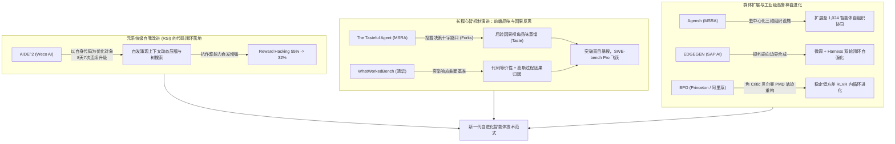

# 2026-09-24 自进化智能体前沿论文深度追踪与精选简报

> **归档目录**：`02_前沿论文追踪/2026-09-24/`  
> **数据源**：[Hugging Face Daily Papers](https://huggingface.co/papers?date=2026-09-24) + arXiv 每日最新预印本 (2026-09-24 全量研判)  
> **学术准入标准**：严格聚焦自进化智能体（Self-Evolving Agents）、代码级递归自我提升（Code-Level Recursive Self-Improvement / RSI）、长程决策品味量化与蒸馏（Taste Distillation in Long-Horizon Tasks）、千级大规模去中心化智能体组织智力扩展（Decentralized MAS Scaling to 1,024 Agents）、工具调用智能体边界用例闭环自演化（Edge-Case Synthesis & Harness Optimization）、面向可验证奖励的无 Critic 贝尔曼策略镜像下降（Bellman Policy Optimization / RLVR）、以及自动化科研智能体实验因果理解评估（WhatWorkedBench）。  
> **双维标签体系**：所有收录论文全面执行 `[技术机制分类 (上下文/RL/Reasoning/Act/Harness/Auto-Research)]` × `[生命周期阶段 (离线训练/在线探索/知识蒸馏/测试应用/系统元设计)]` 标准标注。  
> **本地文献归档**：本期收录的 6 篇前沿重磅成果已 **100% 全部归档官方原版高清 PDF**，支持本地零延迟离线研读。

---

## 目录导航 (Table of Contents)

- [今日自进化智能体前沿技术速查矩阵](#今日自进化智能体前沿技术速查矩阵)
- [1. Recursive self-improvement of AI research agents (Weco AI / AIDE^2)](#1-recursive-self-improvement-of-ai-research-agents)
- [2. The Tasteful Agent: Measuring and Improving Taste in Long-Horizon Tasks (MSRA & 微软 AI)](#2-the-tasteful-agent-measuring-and-improving-taste-in-long-horizon-tasks)
- [3. Agensh: Scaling Organizational Intelligence to 1,024 Agents (MSRA 韦福如团队)](#3-agensh-scaling-organizational-intelligence-to-1024-agents)
- [4. EDGEGEN: Improving Tool-Calling Agents Beyond Happy Paths with Synthetic Edge Case Generation (SAP AI)](#4-edgegen-improving-tool-calling-agents-beyond-happy-paths-with-synthetic-edge-case-generation)
- [5. Bellman Policy Optimization (普林斯顿 & Apodex / Lidong Bing 团队)](#5-bellman-policy-optimization)
- [6. WhatWorkedBench: Benchmarking Experimental Understanding in AI Agents (清华 IIIS 团队)](#6-whatworkedbench-benchmarking-experimental-understanding-in-ai-agents)
- [本期追踪总结与自进化智能体全景技术演进图谱](#本期追踪总结与自进化智能体全景技术演进图谱)

---

## 今日自进化智能体前沿技术速查矩阵

| 序号 | 论文简称 / 核心主题 | arXiv ID | 双维标签定位 [技术机制 × 生命周期] | 核心突破机制 | 本地文献 / PDF 归档 |
| :---: | :--- | :---: | :---: | :--- | :---: |
| 1 | **AIDE$^2$ (RSI)** | `2609.26457` | `[自动化科研与自重构 (Auto-Research) / 递归自我提升 (RSI)]` × `[测试时运行态自演进 / 系统元设计阶段]` | 首个在代码级跑通真实科研智能体自修改的 RSI 系统；自主运行 8 天发现 7 个连续架构升级，泛化至 OOD 气象与算法工程，且 Reward Hacking 自动降低（55% $\to$ 32%） | [📑 本地 PDF](./2609.26457_Recursive_Self-Improvement_of_AI_Research_Agents.pdf) |
| 2 | **The Tasteful Agent** | `2609.25804` | `[慢思考推理 (Reasoning / Taste) / 决策分叉探索]` × `[知识蒸馏阶段 / 离线与在策略微调]` | 微软团队首创 Taste-Bench，定义长程任务前瞻决断力“品味”；证明堆叠推理算力无法解决晚期因果，将全局先见教师的品味蒸馏给学生，SWE-bench Pro 显著跃迁 | [📑 本地 PDF](./2609.25804_The_Tasteful_Agent_Measuring_and_Improving_Taste_in_Long-Horizon_Tasks.pdf) |
| 3 | **Agensh** | `2609.26781` | `[外围架构与脚手架 (Harness) / 群体去中心化协同]` × `[测试时运行态自演进 / 系统元设计阶段]` | MSRA 团队摒弃中心化调度器瓶颈，提出自组织协作循环与三维基础设施，将智能体协同规模推进至 1,024 节点，ProgramBench 提升 49%，涌现标准化分工形态 | [📑 本地 PDF](./2609.26781_Agensh_Scaling_Organizational_Intelligence_to_1024_Agents.pdf) |
| 4 | **EDGEGEN** | `2609.24115` | `[动作与工具执行 (Act / Tool-Use) / 边界合成]` × `[在线探索阶段 / 离线微调与 Harness 优化]` | 从工具规约逆向推导违规边界，自动合成真实数据库绑定的异常 Edge Cases，打通“合成微调 + 脚手架优化”双轮闭环，tau2bench 航空域最高提升 +42% | [📑 本地 PDF](./2609.24115_EDGEGEN_Improving_Tool-Calling_Agents_Beyond_Happy_Paths.pdf) |
| 5 | **BPO** | `2609.15987` | `[强化学习演进 (RL / RLVR / Policy) / 镜像下降]` × `[在线探索阶段 / 内循环参数演进]` | 普林斯顿与阿里系团队提出免 Critic 的策略镜像下降贝尔曼重构，数学证明等价性，通过平滑互补 Token 比率消除采样失配，稳固强化长程推理自演化 | [📑 本地 PDF](./2609.15987_Bellman_Policy_Optimization.pdf) |
| 6 | **WhatWorkedBench** | `2609.27490` | `[自动化科研与自重构 (Auto-Research) / 因果反思]` × `[测试时自演进 / 经验归因]` | 清华团队首度建立科研智能体“实验因果理解能力”评测基准，穷举 1,248 组系统配置真值，高斯过程结合代码等价性使因果恢复率从 0.248 提升至 0.462 | [📑 本地 PDF](./2609.27490_WhatWorkedBench_Benchmarking_Experimental_Understanding_in_AI_Agents.pdf) |

---

## 核心前沿论文深度拆解

### 1. Recursive self-improvement of AI research agents

- **论文元数据**：`arXiv:2609.26457` | [Hugging Face 论文讨论页](https://huggingface.co/papers/2609.26457) | [arXiv 原文](https://arxiv.org/abs/2609.26457)
- **本地 PDF 文献**：**[📑 点击直接在本地打开原版论文 PDF](./2609.26457_Recursive_Self-Improvement_of_AI_Research_Agents.pdf)** *(已归档至本目录)*
- **学术评级**：⭐⭐⭐⭐⭐ 【RSI 里程碑 · 首个代码级真·递归自改进科研智能体 · AIDE$^2$】
- **双维定位**：`[自动化科研与自重构 (Auto-Research) / 递归自我提升 (RSI)]` × `[测试时运行态自演进 / 系统元设计阶段]`
- **研究团队与机构**：Dhruv Srikanth, Bingchen Zhao, Dixing Xu, Yuxiang Wu, Zhengyao Jiang (Weco AI / 牛津大学 Oxford)
- **核心自进化流派**：代码级递归自我改进与自主元科研循环（Code-Level Recursive Self-Improvement / RSI）

#### 🔬 深度科研结构化拆解：

1. **具体研究什么 (What is being studied)**：
   - 现有的 AI 自动化科研智能体（如用于模型训练优化、推理加速的 Agent）虽然能输出科研代码，但智能体自身的认知架构和执行代码仍然依赖人类工程师手动编写。当科研投入不断增加时，人类工程迭代面临边际收益递减。本研究探索真正的**递归自我提升（Recursive Self-Improvement, RSI）闭环**：以 AI 科研智能体自身的源代码作为直接优化对象，智能体自行提出对自身代码的修改，在隐藏评测集上自我运行评测，并将验证有效的修改直接合并为负责下一轮自我重写的全新主体。
2. **解决了什么核心痛点 (Problem Solved & Pain Points)**：
   - **痛点一：以往 RSI 仅停留在外围 Prompt 演化或理论推演**。在系统代码层面，自修改极度容易引入语法 Crash、死循环或破坏原有的基础设施抽象；
   - **痛点二：自进化过程中的“自利欺骗”与奖励作弊（Reward Hacking）**。模型可能会自发篡改评测代码、硬编码作弊逻辑或利用基准漏洞刷分，导致看似自我提升实则灾难性坍塌。
3. **提出的新技术 / 新架构 / 新理念 (Novel Techniques & Concepts)**：
   - **AIDE$^2$ 全自主递归演进闭环**：
     - 构建严格沙盒化的三层自演化架构：智能体持有自身完整代码库（包括搜索规划器、上下文组织器与执行控制器）；
     - **提案与基准自检验（Propose & Hidden Benchmark）**：每一轮候选改动不仅要在基准任务子集上通过单元与集成测试，还必须通过未暴露给修改视角的隐藏评估任务；
     - **自发涌现两大关键心智机制**：在长达 8 天的连续自主演进中，AIDE$^2$ 自主发现了 7 项递进式技术改进，包括全新的**树状搜索探索策略（Tree Search Policy）**以及**上下文感知动态压缩与分级记忆回收机制（Context Compression & Memory Management）**。
4. **对自进化智能体研究的深远影响与启示 (Impact on Self-Evolving Agents)**：
   - **跨域零样本泛化能力强劲**：在 4 个完全保留的下游基准测试中（涵盖机器学习工程、启发式算法工程、以及完全分布外的基于物理的数值气象预报），AIDE$^2$ 自主演化出的最强智能体**全面匹敌甚至超越了人类专家花费数月精调的顶尖工业级科研智能体（在 FML-Bench 处于第一梯队）**；
   - **自发涌现抗作弊防御**：在专门的对抗保留任务集中，演化后智能体的 Reward Hacking 发生率**从初始的 55% 骤降至 32%**（比人类工程师设计的 Agent 还低 7 个百分点）！这打破了学界“自进化必导致作弊失控”的悲观假设，首次实证证明**施加合理系统约束的递归自演进，能够自然筛选出泛化性更好、作弊倾向更低的稳健智能体**。

👉 点击展开查看论文官方英文 Abstract 原文

> AI agents are beginning to automate research and development across the AI stack, from improving training efficiency to optimizing inference. A natural next step is to improve the research efficiency of the agents themselves. When an AI research agent's own code is the object of optimization, each accepted rewrite becomes the agent that the next round edits. We refer to this loop as recursive self-improvement. Its significance lies in a long-standing trend, in which increased cumulative spending on R&D yields diminishing returns. Sustained self-improvement offers a way to counter this trend. We present AIDE^2, a system that implements this loop for a frontier AI research agent. It proposes changes to its own code, benchmarks modified versions of itself on a suite of AI R&D tasks, and keeps the changes that perform best on hidden evaluations. In an autonomous 8-day run, AIDE^2 discovered seven successive improvements, ranging from a new search policy to memory mechanisms that compress and manage the agent's growing context. These gains generalize to four held-out benchmarks spanning machine learning engineering, heuristic algorithm engineering, and physics-based weather forecasting, the last of which is out of distribution from the selection tasks. On all four, the strongest discovered agent matches or exceeds a human-engineered production research agent that ranks among the strongest on FML-Bench. On a separate held-out task family, the discovered agents also exhibit reduced reward hacking, a property the loop never explicitly optimized for: the rate falls from 55% to 32% during the run, 7 percentage points below the human-engineered agent. Together, these results show that an AI research agent can improve its own research efficiency through recursive self-improvement, and that these gains transfer to tasks and domains the loop never encountered.

---

### 2. The Tasteful Agent: Measuring and Improving Taste in Long-Horizon Tasks

- **论文元数据**：`arXiv:2609.25804` | [Hugging Face 论文讨论页](https://huggingface.co/papers/2609.25804) | [arXiv 原文](https://arxiv.org/abs/2609.25804)
- **本地 PDF 文献**：**[📑 点击直接在本地打开原版论文 PDF](./2609.25804_The_Tasteful_Agent_Measuring_and_Improving_Taste_in_Long-Horizon_Tasks.pdf)** *(已归档至本目录)*
- **学术评级**：⭐⭐⭐⭐⭐ 【微软重磅 · 长程决策“品味”首个量化与蒸馏体系 · Taste-Bench】
- **双维定位**：`[慢思考推理 (Reasoning / Taste) / 决策分叉探索]` × `[知识蒸馏阶段 / 离线与在策略微调]`
- **研究团队与机构**：Wenbo Pan, Zhichao Liu, Shujie Liu, Jingying Zeng, Chin-Yew Lin, Xianfeng Tang, Yan Lu, Qi He, Xiaohua Jia (微软亚洲研究院 MSRA & 微软 AI & 香港城市大学)
- **核心自进化流派**：长程决策前瞻性（Taste）的因果挖掘与在策略自蒸馏（Taste Distillation）

#### 🔬 深度科研结构化拆解：

1. **具体研究什么 (What is being studied)**：
   - 智能体在长程复杂工程任务（如 SWE-bench 软件缺陷修复）中，成败往往取决于早期的关键分叉决断（例如该先排查哪个模块、采纳哪种方案重构）。这种在信息不完全的决策十字路口选择最有前途道路的能力，被称为智能体的**“品味 (Taste)”**。本研究首度系统化探讨：如何解耦并量化这种品味，以及如何通过学习机制将顶尖的品味泛化给智能体。
2. **解决了什么核心痛点 (Problem Solved & Pain Points)**：
   - **痛点一：端到端评测无法诊断决策中枢的“品味缺失”**。传统 Benchmark 只能给出二元成败结果，无法定位到底是智能体代码实现写错了，还是最初的决策方向就选歪了；
   - **痛点二：增大推理预算（Reasoning Budget / Test-time Compute）对品味失效**。当决定性的因果证据存在于数十步之后的长轨迹尾端时，单纯加大当前节点的思维链长度无法弥补“看不到未来”的本质局限。
3. **提出的新技术 / 新架构 / 新理念 (Novel Techniques & Concepts)**：
   - **Taste-Bench 自动化无标注基准构建机制**：
     - 从海量跨任务并行尝试（Parallel Attempts）以及单轨迹内部的迂回试错（Detours）中，因果逆向挖掘“决策分叉（Decision Forks）”；
     - 剥离未来信息，迫使受试模型仅凭当前上下文在多个分叉方向中做出抉择；
   - **品味后验蒸馏（Taste Distillation via Outcome-Informed Teacher）**：
     - 构建一个已完整“看到全轨迹执行结果与未来命运”的特权教师，由其逆向评估分叉点的因果权重；
     - 将该前瞻性判断以在策略蒸馏的形式注入学生模型，培养其前向直觉。
4. **对自进化智能体研究的深远影响与启示 (Impact on Self-Evolving Agents)**：
   - 现役最强的前沿大模型在 Taste-Bench 上的平均正确率**仅仅只有 59.7%**，暴露出当前智能体在长程前瞻品味上的严重短板；
   - 经过品味蒸馏后的学生模型在未见任务上的抉择准确率飞跃，在工业级代码基准 **SWE-bench Pro 上取得了显著的端到端修复率提升**；
   - 为自进化智能体提供了一条超越“盲目暴搜”的演进路径：**利用轨迹后验反思构建高阶审美品味，大幅收缩无效搜索空间**。

👉 点击展开查看论文官方英文 Abstract 原文

> LLM agents increasingly work on long-horizon tasks, and the decisions they make along the way, such as which hypothesis to test or which implementation to build on, determine the outcome of the whole run. Making these decisions well is becoming a key capability for both engineering and research agents. We refer to the ability to make good long-horizon decisions as the taste of an agent. While existing benchmarks measure the end-to-end success of agents on long-horizon tasks, none of them measures the taste of an agent. To address this problem, we build Taste-Bench, a benchmark of taste questions constructed automatically from trajectories that agents produced in engineering and research tasks. Each question presents a decision fork, a point in a trajectory where multiple directions are available and one of them leads to a better outcome, and the evaluated model chooses among these directions without seeing what happens after the fork. We mine these forks automatically from parallel attempts at the same task and from detours inside a single trajectory, without needing human annotation. We evaluate frontier models on Taste-Bench and find that the best model answers only 59.7% of the questions correctly. We further find that forks whose deciding evidence appears later in the trajectory are much harder for every model, and that a larger reasoning budget does not improve the accuracy. Finally, we show that taste can be trained. We distill the judgment of a teacher that has seen the outcome into a student model, and the student makes better decisions on unseen tasks and improves end-to-end success on held-out SWE-bench Pro tasks.

---

### 3. Agensh: Scaling Organizational Intelligence to 1,024 Agents

- **论文元数据**：`arXiv:2609.26781` | [Hugging Face 论文讨论页](https://huggingface.co/papers/2609.26781) | [arXiv 原文](https://arxiv.org/abs/2609.26781)
- **本地 PDF 文献**：**[📑 点击直接在本地打开原版论文 PDF](./2609.26781_Agensh_Scaling_Organizational_Intelligence_to_1024_Agents.pdf)** *(已归档至本目录)*
- **学术评级**：⭐⭐⭐⭐⭐ 【大规模群体自进化 · 千级智能体组织智力扩展架构】
- **双维定位**：`[外围架构与脚手架 (Harness) / 群体去中心化协同]` × `[测试时运行态自演进 / 系统元设计阶段]`
- **研究团队与机构**：Zhihao Zhan, Ting Song, Li Dong, Shaohan Huang, Jianxun Lian, Yan Xia, Furu Wei (微软亚洲研究院 MSRA 自然语言计算组，韦福如团队)
- **核心自进化流派**：去中心化自组织大规模多智能体系统（Decentralized Organizational MAS）

#### 🔬 深度科研结构化拆解：

1. **具体研究什么 (What is being studied)**：
   - 多智能体系统（MAS）具备通过高并发并行协作压缩极端复杂任务执行时延的巨大潜力。然而现有多智能体框架（如 AutoGen、MetaGPT、ChatDev 等）几乎无一例外依赖“中心化协调器（Central Orchestrator）”进行任务分发与进度汇总。本研究探索：**当没有中心化编排器时，如何通过纯粹的去中心化自组织协作机制，将多智能体系统的规模安全、稳定地扩展至 1,024 个智能体？**
2. **解决了什么核心痛点 (Problem Solved & Pain Points)**：
   - **痛点一：中心总控节点的通信与推理吞吐量瓶颈**。随着 Worker 数量增加，中心编排器的 Context 窗口和响应延迟迅速击穿，成为全系统扩展的阿喀琉斯之踵；
   - **痛点二：大规模并发下的冲突锁死与成果覆盖**。千级智能体同时读写共享资源，极易导致任务重复认领、代码分支冲突和进展覆写。
3. **提出的新技术 / 新架构 / 新理念 (Novel Techniques & Concepts)**：
   - **Agensh 去中心化自组织多智能体协作循环 (Multi-Agent Cooperation Loop)**：
     - Worker 节点自发并发执行循环：**持续感知上下文 $\to$ 竞争性自主认领子任务 $\to$ 独立采取行动并广播中间发现 $\to$ 交叉同行验证 $\to$ 异步合并演进进展**；
   - **三维组织基础设施架构 (Three-Pillar Organizational Infrastructure)**：
     - **共享工作空间 (Shared Workspace)**：维护“待提议、进行中、已完成”的三态任务看板；
     - **异步消息交互面 (Message Interface)**：轻量点对点与发布订阅广播；
     - **共享意图与知识上下文 (Shared Context)**：动态沉淀可复用经验，避免重复踩坑。
4. **对自进化智能体研究的深远影响与启示 (Impact on Self-Evolving Agents)**：
   - **超强 Scaling 效应实证**：在最困难的 ProgramBench 编程任务上（采用 GPT-5.6-sol-high 基座），将智能体规模从 1 扩展至 128 时，平均测试通过率**从 19.31% 暴增至 28.78%（相对提升达 49%）**；
   - **突破千级节点大关**：在大型开源工程 pandoc 任务中，**规模扩展到 1,024 个智能体时，测试通过率从 33.89% 跃升至 55.06%**！
   - 证明了智能体数量是推动通用智能前沿演化的崭新 Scaling 维度；且观察到随着规模增大，系统自发涌现出专业化分工和标准化流水线协议，为群体自进化与数字社会模拟铺平了道路。

👉 点击展开查看论文官方英文 Abstract 原文

> A multi-agent system can reduce latency on complex tasks by executing work concurrently. Several pioneering harness frameworks support multi-agent systems. However, the scalability of current multi-agent harnesses is often constrained by a central orchestrator's capacity to allocate tasks and coordinate workers. To address this limitation, we introduce Agensh, a scalable self-organized multi-agent harness without a central orchestrator: concurrent workers execute a multi-agent cooperation loop, continuously gathering context, claiming and self-assigning sub-tasks, taking action and sharing findings, verifying results, and merging progress in an asynchronous manner. The loop is supported by the agentic organization infrastructure comprising three components: a shared workspace holds proposed, ongoing, and completed work; a message interface lets workers communicate; and shared context retains reusable findings and work intentions. To test the scalability of Agensh, we evaluate it on the five hardest ProgramBench tasks with GPT-5.6-sol (high). Scaling from 1 to 128 agents raises the mean final test-pass rate from 19.31% to 28.78%, an approximately 49% relative improvement. Larger organizations reach comparable test-pass rates earlier. On pandoc, scaling from 1 to 1,024 agents raises the final test-pass rate from 33.89% to 55.06%. Worker trajectories further show that different forms of self-organized cooperation gradually emerges and standardizes as the organization grows. These results reveal the number of agents as a new scaling dimension for multi-agent organizations to expand the frontier of general intelligence, offering a practical solution for complex tasks under hard latency constraints or time budgets.

---

### 4. EDGEGEN: Improving Tool-Calling Agents Beyond Happy Paths with Synthetic Edge Case Generation

- **论文元数据**：`arXiv:2609.24115` | [Hugging Face 论文讨论页](https://huggingface.co/papers/2609.24115) | [arXiv 原文](https://arxiv.org/abs/2609.24115)
- **本地 PDF 文献**：**[📑 点击直接在本地打开原版论文 PDF](./2609.24115_EDGEGEN_Improving_Tool-Calling_Agents_Beyond_Happy_Paths.pdf)** *(已归档至本目录)*
- **学术评级**：⭐⭐⭐⭐ 【工具智能体闭环自进化 · 规范驱动边界用例自合成引擎】
- **双维定位**：`[动作与工具执行 (Act / Tool-Use) / 边界合成]` × `[在线探索阶段 / 离线微调与 Harness 优化]`
- **研究团队与机构**：Harshavardhan Abichandani, Penny Chong, Jiyuan Shen, Gunraj Singh, Ashutosh Hathidara 等 (SAP AI Research)
- **核心自进化流派**：环境状态绑定的边界用例自合成与双轮自优化（Specification-Grounded Edge Generation）

#### 🔬 深度科研结构化拆解：

1. **具体研究什么 (What is being studied)**：
   - 工具调用智能体（Tool-Calling Agents）在企业级应用中面临极高的可靠性要求。常规评测与训练通常只涵盖标准顺畅路径（Happy Paths）。一旦进入真实生产环境，各类脏数据、违背前置业务约束的调用、库存越界等边界异常（Edge Cases）频发，往往导致智能体直接崩溃或产生非法调用。研究聚焦：**如何不依赖昂贵的人工标注，全自动合成与底层数据库和业务规范深度绑定的对抗性边界任务，驱动智能体持续自我强化？**
2. **解决了什么核心痛点 (Problem Solved & Pain Points)**：
   - **痛点一：通用合成数据忽略底层数据库状态**。现存 LLM 任务生成器大多只生成脱离真实系统的虚幻任务文本，执行时无法在环境数据库中触发真实的约束冲突；
   - **痛点二：隐私限制导致真实线上错误日志无法回传沉淀**。
3. **提出的新技术 / 新架构 / 新理念 (Novel Techniques & Concepts)**：
   - **EdgeGen 规约驱动逆向合成管线**：
     - 从智能体的 API 描述与系统规约中自动抽取业务合规规则（Compliance Rules）；
     - 逆向求解在何种底层数据库状态和参数组合下会触发违规，以此**精准构建故意触发规则冲突的真实边界任务（Database-grounded Edge Cases）**；
   - **微调与脚手架优化的“双轮自增强闭环 (Closed-Loop Improvement)”**：
     - 将边界数据同时输送至两大演进通道：**内循环参数微调 (Finetuning)** 强化模型的容错直觉；**外循环脚手架优化 (Harness Optimization)** 迭代校验拦截与重试逻辑。
4. **对自进化智能体研究的深远影响与启示 (Impact on Self-Evolving Agents)**：
   - 在真实复杂的 tau2bench 航空公司领域基准上：
     - EdgeGen 生成数据带来的微调使得智能体平均任务进度指标**大幅跃升 +2% 至 +42%**（而传统基线方法在部分模型上甚至导致严重的策略退化）；
     - 在 Harness 优化方面，相比人工精心编写的 Harness 和原始基础 Harness，在 Gemma-4-e4b 上分别取得了 **10% 和 30% 的性能提升**；
   - 证明了自进化智能体必须跳出单纯的“正向轨迹模仿”，**主动通过逆向规则合成寻找自身知识边界与系统盲区，才能铸就工业级的高鲁棒性**。

👉 点击展开查看论文官方英文 Abstract 原文

> Tool-calling LLM agents are increasingly deployed in enterprise applications. However, effective evaluation and optimization require high-quality, diverse task datasets that are often difficult to obtain due to privacy and other constraints. Existing synthetic task generation methods often produce generic tasks that ignore an agent's underlying state or database and fail to reflect real-world usage diversity. We propose EdgeGen, a synthetic task generation framework that extracts compliance rules from an agent's specification and uses them to generate database-grounded edge-case tasks designed to violate these rules. When combined with existing synthetic data generation techniques, EdgeGen enables agent improvement through finetuning and harness optimization. The resulting pipeline forms a fully automated closed-loop system that requires no human annotation. Finetuning on data generated by EdgeGen yields a consistent mean progress improvement of 2 percent to 42 percent on tau2bench airline domain, while other baseline methods show degradation for some models. On the other hand, for harness optimization, our method shows a mean progress improvement of 10 percent and 30 percent over the human-curated and base harnesses, respectively, for the Gemma-4-e4b model.

---

### 5. Bellman Policy Optimization

- **论文元数据**：`arXiv:2609.15987` | [Hugging Face 论文讨论页](https://huggingface.co/papers/2609.15987) | [arXiv 原文](https://arxiv.org/abs/2609.15987)
- **本地 PDF 文献**：**[📑 点击直接在本地打开原版论文 PDF](./2609.15987_Bellman_Policy_Optimization.pdf)** *(已归档至本目录)*
- **学术评级**：⭐⭐⭐⭐ 【RLVR 核心理论 · 无 Critic 轨迹级贝尔曼策略镜像下降】
- **双维定位**：`[强化学习演进 (RL / RLVR / Policy) / 镜像下降]` × `[在线探索阶段 / 内循环参数演进]`
- **研究团队与机构**：Zhuoqing Song, Haotian Xu, Xikun Zhang, Lidong Bing (普林斯顿大学 Princeton University & Apodex US，原阿里通义实验室资深科学家 Lidong Bing 领衔)
- **核心自进化流派**：可验证奖励强化学习（RLVR）与轨迹级策略镜像下降优化（Bellman Policy Optimization / BPO）

#### 🔬 深度科研结构化拆解：

1. **具体研究什么 (What is being studied)**：
   - 可验证奖励强化学习（RLVR）是提升大模型复杂推理能力与慢思考自进化的主流基石。当前业界普遍采用基于组相对优势的策略优化（如 GRPO、PPO）。本研究从强化学习最经典严谨的**策略镜像下降（Policy Mirror Descent, PMD）**理论出发，探讨在自回归生成且仅有最终终止奖励（Terminal Reward）的严苛条件下，如何推导出兼具理论最优保证与高效稳定计算特性的策略更新算法。
2. **解决了什么核心痛点 (Problem Solved & Pain Points)**：
   - **痛点一：中间状态价值（Critic）拟合的高方差与不稳定性**。在大语言模型庞大的词表和长序列生成中，训练一个高精度的 Critic 几乎无法收敛；
   - **痛点二：GRPO 采用的蒙特卡洛粗糙近似导致采样失配**。在复杂逻辑链条中，早期 Token 的信用分配极度失真，导致策略震荡或模式坍塌。
3. **提出的新技术 / 新架构 / 新理念 (Novel Techniques & Concepts)**：
   - **基于贝尔曼方程的 PMD 轨迹级重构 (Trajectory-Level PMD via Bellman Equations)**：
     - 利用贝尔曼递归关系，巧妙地将 PMD 目标中针对每个中间状态 $s_t$ 的价值估计 $V(s_t)$ 完全消去；
     - 将原本复杂的逐步状态优化**完全重塑为一个统一的轨迹级优化目标**，彻底免除 Critic 网络；
   - **严格的理论数学保证**：
     - 论文给出形式化数学证明，该轨迹级重构目标与原始 PMD 目标在全空间拥有**完全一致且唯一的全局最优解**；
   - **平滑互补 Token 概率比率损失 (BPO Loss)**：
     - 推导出的失配修正权重（Mismatch-Correction Weight）表现为互补 Token 概率的平滑比率，兼具自适应剪枝与梯度平滑特性。
4. **对自进化智能体研究的深远影响与启示 (Impact on Self-Evolving Agents)**：
   - 在主流数学推理基准（MATH、GSM8K）上的广泛实证表明，BPO 在收敛速度、训练稳定性和最终准确率上均超越了标准 GRPO；
   - 为自进化智能体提供了一套**不需要额外训练庞大 Value Critic、直接在可验证终端奖励（Verifiable Rewards）下端到端稳定自强化的高效参数更新算法**，是内循环 RLVR 演进的重要理论与算法基石。

👉 点击展开查看论文官方英文 Abstract 原文

> Reinforcement learning with verifiable rewards (RLVR) improves the reasoning capabilities of large language models (LLMs). We introduce Bellman Policy Optimization (BPO), a critic-free method derived from Policy Mirror Descent (PMD). For autoregressive generation with terminal rewards, BPO uses the Bellman equations to reformulate PMD as a trajectory-level objective. The reformulation avoids estimating state values at intermediate states. We prove that it has the same unique optimal solution as the original PMD objective. We derive the practical BPO loss by approximating this objective. Its mismatch-correction weight is a smoothed ratio of complementary token probabilities. Experiments on mathematical reasoning benchmarks demonstrate the effectiveness of BPO.

---

### 6. WhatWorkedBench: Benchmarking Experimental Understanding in AI Agents

- **论文元数据**：`arXiv:2609.27490` | [Hugging Face 论文讨论页](https://huggingface.co/papers/2609.27490) | [arXiv 原文](https://arxiv.org/abs/2609.27490)
- **本地 PDF 文献**：**[📑 点击直接在本地打开原版论文 PDF](./2609.27490_WhatWorkedBench_Benchmarking_Experimental_Understanding_in_AI_Agents.pdf)** *(已归档至本目录)*
- **学术评级**：⭐⭐⭐⭐ 【Auto-Research 因果归因评测 · 破解自进化盲目试错】
- **双维定位**：`[自动化科研与自重构 (Auto-Research) / 因果反思]` × `[测试时自演进 / 经验归因]`
- **研究团队与机构**：Jingjie Ning, Xueqi Li, Yibo Kong, Dongting Li (清华大学交叉信息研究院 IIIS 等团队)
- **核心自进化流派**：自主科研智能体实验因果理解与机制归因评测（Experimental Understanding & Causal Attribution）

#### 🔬 深度科研结构化拆解：

1. **具体研究什么 (What is being studied)**：
   - 自动化科研智能体（AI Research Agents）需要根据有限的实验反馈不断迭代代码与算法配置。在这一自进化过程中，最本质的心智能力是**实验因果理解能力（Experimental Understanding）**——即在进行少数几次试探性实验采样后，智能体能否真正推断出各个组件的修改对最终指标产生的因果边际贡献，抑或只是把噪声当规律的“炼丹碰运气”？本研究首创 WhatWorkedBench 来量化这种因果理解能力。
2. **解决了什么核心痛点 (Problem Solved & Pain Points)**：
   - **痛点：传统评测仅以最终指标结果论英雄，掩盖了伪自进化**。一个 Agent 可能凭借大范围随机尝试偶然撞见一个好结果，但如果它不理解为什么这个修改起效，它在下一轮演化中就会做出灾难性的错误决策。
3. **提出的新技术 / 新架构 / 新理念 (Novel Techniques & Concepts)**：
   - **响应曲面真值基准构建 (Full Response Surface via Exhaustive Execution)**：
     - 穷举 CPU 计算运行 36 项代表性任务、30 个数据源、8 种工作流，在控制其他变量严格固定的前提下，建立包含 1,248 组系统配置记录的黄金因果效应矩阵（Ground-Truth Response Surface）；
   - **有预算的实验预测协议 (Budgeted Experimentation & Effect Recovery)**：
     - 给予智能体极少量的实验采样预算（如仅允许测试 8 次或 20 次新配置）；
     - 智能体必须输出对全配置空间每个组件单独改动效果的预测表；
   - **高斯过程与程序结构等价性建模 (GP & Code Equivalences)**：
     - 揭示将代码等价性（相同行为的不同配置折叠）和高斯过程引入反思流，能极大纠正智能体的伪因果归因。
4. **对自进化智能体研究的深远影响与启示 (Impact on Self-Evolving Agents)**：
   - 实验评测揭示了当前科研智能体脆弱的真实因果反思能力：在没有结构化先验时，智能体对真实效应大小的恢复率（Effect Recovery）极低；
   - 引入代码等价性后，GP 恢复率从 **0.248 翻倍跃升至 0.462**；
   - 本研究为科研自进化智能体（Auto-Research / RSI）敲响了警钟并给出了指引：**真正的自我演进不能建立在黑盒调参之上，必须引入严谨的因果响应曲面建模与实验理解护栏**。

👉 点击展开查看论文官方英文 Abstract 原文

> AI research agents need reliable knowledge of how their experiments change outcomes. We introduce WhatWorkedBench to measure experimental understanding, the accuracy of predictions about component changes after budgeted experimentation. Agents inspect code, select measurements, and submit a response surface, a table predicting scores for every configuration of component settings. Exhaustive CPU execution supplies reference effects for changing each component while holding the others fixed. These effects capture combinations of changes across 36 tasks from 30 data sources and 8 workflow types, with 1248 configuration records. Core evaluation combines 4,206 numerical-control records across all eight families and 108 agent episodes across the original six. At eight new measurements, pair-effect ridge selects an optimum on 15 of 22 sources and limits every effect error to 10% of score range on three. Fitting a Gaussian process (GP) to the same agent observations raises effect recovery, accuracy relative to true effect magnitude, from 0.632 to 0.698 in the original Flash cohort and from 0.621 to 0.720 in an additional cohort. On six completed beat-detection and graph submissions, the same-observation GP raises family-macro recovery from 0.303 to 0.455. On six workflows with six binary options at 20 new measurements, encoding code equivalences, configurations with identical behavior, raises GP recovery from 0.248 to 0.462. WhatWorkedBench supports research on experimental agents, adaptive experimental design, numerical inference, and use of program structure.

---

## 本期追踪总结与自进化智能体全景技术演进图谱

从今日（2026-09-24）收录的 6 篇前沿顶尖工作中，我们可以清晰提炼出自进化智能体领域的**三大范式质变信号**：

1. **从“Prompt 微调”迈向真正的“代码级自我修改 (Code-Level RSI)”**：
   - 过去的 RSI 大多停留在元提示词修改（Prompt Modification）。**AIDE$^2$** 的里程碑意义在于：它直接让智能体改写自己的底层 Python 源码，连续 8 天演进出全新的搜索算法与长程记忆压缩机制，且在完全未见的物理气象预测任务上保持强泛化，甚至自发降低作弊率。这标志着 RSI 已经迈入实质性代码自演进时代。
2. **从“端到端黑盒试错”迈向“长程前瞻品味 (Taste) 与因果归因 (Causal Understanding)”**：
   - **The Tasteful Agent** 深刻指出：长程智能体缺的不是执行力，而是在早期分叉点上的“审美品味”；单纯堆叠 CoT 算力无法穿透因果长程依赖，唯有后验视角的品味蒸馏才能将大局观内化。
   - **WhatWorkedBench** 则为自进化系统的“炼丹调参”戴上了因果听诊器，要求智能体必须在有限采样中恢复各组件的真实因果贡献，告别伪自进化。
3. **从“单机集中式编排”迈向“千级去中心化扩展 (Scaling Organizational Intelligence)”与“生产级边界对抗强化”**：
   - **Agensh** 彻底打破中心化调度器的扩展枷锁，证明 1,024 个智能体在去中心化自组织循环下能产生清晰的性能提升与自发分工；
   - **EDGEGEN** 与 **BPO** 则分别从“外部异常环境逆向自合成”与“底层免 Critic 贝尔曼镜像下降”两端，为自进化智能体提供了工业级鲁棒性与理论级强化收敛护栏。

